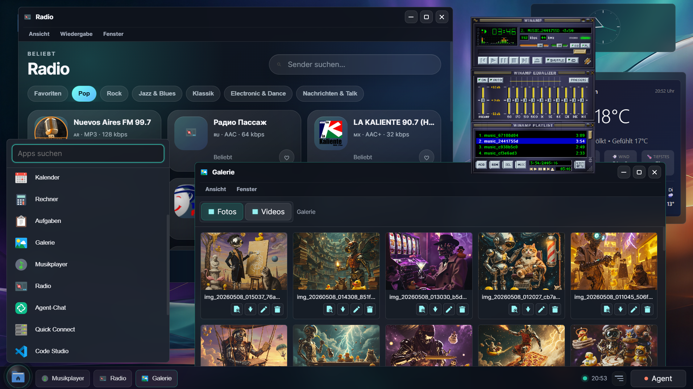

<!-- logo for light mode -->
<picture>
  <source media="(prefers-color-scheme: dark)" srcset="ui/aurago_logo.png">
  <source media="(prefers-color-scheme: light)" srcset="ui/aurago_logo_dark.png">
  
</picture>

# AuraGo - Your Home Lab AI Agent

**Self-hosted AI agent: one Go binary, embedded web UI, local data, 100+ tools for homelab and automation.**

[](https://go.dev)
[](LICENSE)
[](docker-compose.yml)
[](https://antibyte.github.io/aurago-web/)
[](https://github.com/antibyte/agodesk/releases)

> **Work in progress** - Active development. Breaking changes and unfinished features are possible.
>
> **Testing** - Solo-maintained project. Coverage is uneven. Linux is the primary target; Windows and macOS builds exist but are not fully validated in CI.

> **You stay in control** - Shell, Python, filesystem, network, and self-update are separate toggles in **Danger Zone**. For internet-facing installs, use HTTPS, login, and 2FA.

---

## Why AuraGo?

Cloud assistants cannot SSH into your NAS, restart a Docker stack, or read your local logs without sending that context elsewhere. AuraGo runs **on your hardware**, keeps conversations and memory **local**, and can act on your infrastructure through built-in tools.

Typical uses:

- Homelab ops (Docker, Proxmox, TrueNAS, Home Assistant, Fritz!Box, Tailscale)
- Scheduled missions and webhooks
- Chat, voice, and Telegram/Discord bridges
- Document and media workflows with provider-backed generation limits

---

## Quick start

### Option A - Install script (recommended)

```bash
curl -fsSL https://raw.githubusercontent.com/antibyte/AuraGo/main/install.sh | bash
```

The installer checks Docker, can provision HTTPS for public hostnames, generates a first-login password, and can install a systemd unit.

Then:

```bash
cd ~/aurago
source .env
./start.sh
```

Open **http://localhost:8088** (or your HTTPS URL) and sign in with the generated password.

### Option B - Docker Compose

```yaml
services:
  aurago:
    image: ghcr.io/antibyte/aurago:latest
    ports:
      - "8088:8088"
    volumes:
      - ./data:/app/data
      - ./config.yaml:/app/config.yaml
      - ./secrets:/run/optional-secrets:ro
```

Create `./secrets/aurago_master.key` (64 hex characters) or let AuraGo create the vault key in `./data` on first start.

### Option C - Build from source

```bash
git clone https://github.com/antibyte/AuraGo.git
cd AuraGo
go build -o aurago ./cmd/aurago
./aurago
```

---

## First run: setup and configuration

1. **Setup wizard** (`/setup`) - Provider, model, trust level, optional vault and web login. On success you get a clear next step: open chat or jump into key **Config** areas (providers, security, server, backups).
2. **Config UI** (`/config`) - Full settings browser with search, unsaved-change protection when switching sections, sticky save bar, and keyboard-friendly toggles.
3. **Advanced** - Edit `config.yaml` or use env overrides; see [configuration reference](documentation/configuration.md).

No manual YAML is required for a first successful run.

---

## Screenshots

| Dashboard | Chat | Containers | Configuration |
|:---------:|:----:|:----------:|:-------------:|
|  |  |  |  |

| Virtual desktop (experimental) |
|:------------------------------:|
|  |

### Built-in chat themes

| Cyberwar | Retro CRT | Dark Sun | Lollipop |
|:--------:|:---------:|:--------:|:--------:|
|  |  |  |  |

---

## Highlights

| Area | What you get |
|------|----------------|
| **Personality engine** | Profiles and long-term preference learning |
| **LLM Guardian** | Scans tool calls and external content for risky patterns |
| **Adaptive tools** | Context-aware tool subsets to save tokens |
| **Vault** | AES-256-GCM for secrets; bcrypt + TOTP for web login |
| **Memory** | Short-term history, local Granite embeddings by default, RAG, knowledge graph, core memory, journal |
| **Media** | Image, music, and video generation with registry and limits |
| **PWA** | Installable UI; voice features need HTTPS |
| **Integrations** | 100+ tools without third-party "skills" for most homelab tasks |

<details>
<summary><b>Home lab and infrastructure</b> - Docker, Proxmox, Home Assistant, TrueNAS, and more</summary>

- **Docker** - Lifecycle, images, networks, volumes, Compose
- **Proxmox** - VM/LXC control, snapshots, monitoring
- **Home Assistant** - Devices, scenes, automations (read-only guard available)
- **TrueNAS** - ZFS, datasets, snapshots, shares
- **Wake-on-LAN**, **firewall monitor**, **AdGuard**, **Fritz!Box TR-064**, **MeshCentral**
</details>

<details>
<summary><b>System and automation</b> - Shell, Python, SSH, Ansible, missions</summary>

- **Shell and Python** - Host or sandboxed (venv / Docker)
- **SSH inventory** - Routers, NAS, remote hosts
- **Ansible** - Sidecar or remote API
- **Cron / missions** - Scheduled and event-driven work
- **Tailscale** - Node inspection
</details>

<details>
<summary><b>Cloud and APIs</b> - Google, GitHub, S3, webhooks</summary>

- **Google Workspace**, **GitHub**, **S3-compatible storage**, **OneDrive**
- **Netlify**, **Homepage**, **WebDAV/Koofr**, **Cloudflare Tunnel**
- **Incoming and outgoing webhooks**
</details>

<details>
<summary><b>Communication</b> - Telegram, Discord, email, voice</summary>

- **Telegram**, **Discord**, **Rocket.Chat**
- **Email** (IMAP/SMTP, multiple accounts)
- **Telnyx** (SMS/voice), **ntfy**, **Pushover**
</details>

<details>
<summary><b>Development and media</b> - Git, search, vision, TTS, SQL</summary>

- **Git**, **web search**, **VirusTotal**, **vision**, **Whisper**, **TTS**
- **PDF** extract and create, **image/music/video** generation
- **Chromecast**, **network tools**, **web capture**, **SQL** connections
</details>

---

## Memory system

| Type | Role |
|------|------|
| **Short-term** | Sliding conversation window (SQLite) |
| **Long-term (RAG)** | Semantic search over past chats |
| **Knowledge graph** | Entities and relations |
| **Core memory** | Always-on facts in context |

New installations use the multilingual Granite 97M embedding model locally. AuraGo downloads only pinned, checksum-verified model/runtime artifacts into `data/embeddings`, benchmarks the GPU paths available on the machine, and falls back to CPU without taking the rest of the application down. The main AuraGo binary remains CGO-free. Existing OpenAI-compatible, Ollama, and custom embedding provider selections are preserved.
| **Journal** | Timestamped events with importance |
| **Notes and to-dos** | Persistent lists with due dates |

Background jobs can consolidate and analyze memory; see the manuals for tuning.

---

## Security

| Layer | Mechanism |
|-------|-----------|
| **Vault** | AES-256-GCM for API keys and secrets |
| **Web auth** | bcrypt passwords, optional TOTP 2FA |
| **Danger zone** | Per-capability toggles for execution and network |
| **LLM Guardian** | Policy checks on tools and ingested content |
| **Sandbox** | Python isolation (venv or containers) |
| **TLS** | Let's Encrypt; login enforced when HTTPS is on |
| **Prompt boundaries** | External payloads wrapped for injection defense |

---

## Chat commands

| Command | Description |
|---------|-------------|
| `/help` | List commands |
| `/reset` | Clear current conversation |
| `/stop` | Cancel in-flight work |
| `/debug on\|off` | Verbose errors |
| `/budget` | Token cost breakdown |
| `/personality <name>` | Switch profile |
| `/restart` | Restart server process |
| `/voice on\|off` | Voice output |
| `/warnings` | Active system warnings |
| `/sudopwd` | Store or clear sudo password in vault |
| `/addssh` | Add SSH host to inventory |
| `/credits` | OpenRouter balance (if applicable) |

---

## Documentation

| Topic | Link |
|-------|------|
| User guide (DE) | [documentation/manual/de/README.md](documentation/manual/de/README.md) |
| User guide (EN) | [documentation/manual/en/README.md](documentation/manual/en/README.md) |
| Configuration | [documentation/configuration.md](documentation/configuration.md) |
| Realtime Speech | [documentation/realtime_speech.md](documentation/realtime_speech.md) |
| Docker | [documentation/docker_installation.md](documentation/docker_installation.md) |
| Architecture | [documentation/architecture.md](documentation/architecture.md) |
| Telegram | [documentation/telegram_setup.md](documentation/telegram_setup.md) |
| Google OAuth | [documentation/google_setup.md](documentation/google_setup.md) |

Contributors: see [AGENTS.md](AGENTS.md) for build, test, and layout conventions.

---

## Project layout

```
AuraGo/
├── cmd/aurago/       # Main binary
├── internal/         # Agent, memory, tools, HTTP server
├── ui/               # Embedded web UI (go:embed)
├── agent_workspace/  # Skills, sandbox, agent tools
├── prompts/          # System prompts and tool manuals
├── documentation/    # Guides and screenshots
└── config.yaml       # Runtime config (template: config_template.yaml)
```

---

## Development

```bash
go build -o aurago ./cmd/aurago
go test ./...
go test ./ui -count=1    # UI regression tests (config, setup, chat)
```

Use `rtk` prefixed commands in local workflows when [RTK](https://github.com/antibyte/rtk) is installed (see project agent docs).

---

## License

This project is licensed under the [MIT License](LICENSE).

---

<details>
<summary><b>Key dependencies</b></summary>

| Library | Purpose |
|---------|---------|
| [go-openai](https://github.com/sashabaranov/go-openai) | OpenAI-compatible LLM client |
| [chromem-go](https://github.com/philippgille/chromem-go) | Embedded vector database |
| [modernc.org/sqlite](https://pkg.go.dev/modernc.org/sqlite) | Pure Go SQLite |
| [telegram-bot-api](https://github.com/go-telegram-bot-api/telegram-bot-api) | Telegram |
| [discordgo](https://github.com/bwmarrin/discordgo) | Discord |
| [gopsutil](https://github.com/shirou/gopsutil) | System metrics |
| [golang.org/x/crypto](https://pkg.go.dev/golang.org/x/crypto) | SSH, bcrypt, ACME |
| [cron/v3](https://github.com/robfig/cron) | Scheduler |

</details>
