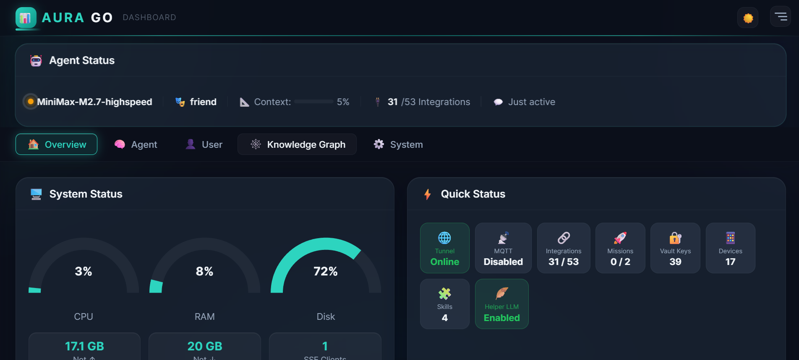
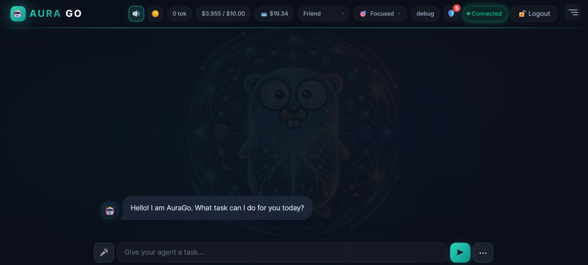
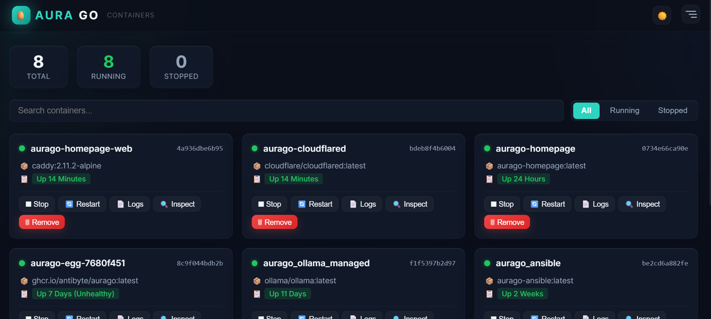
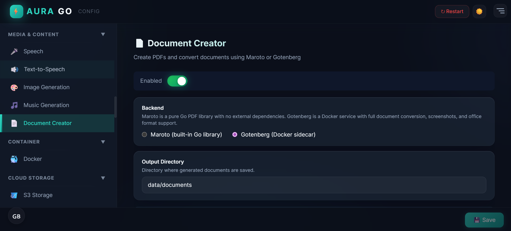
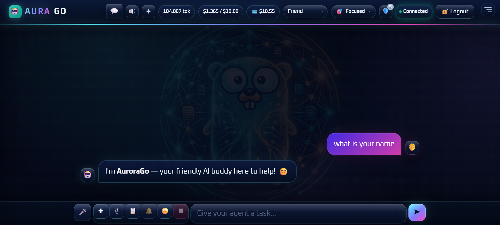
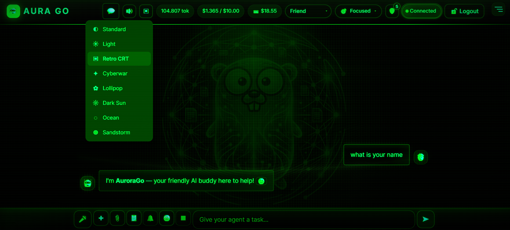
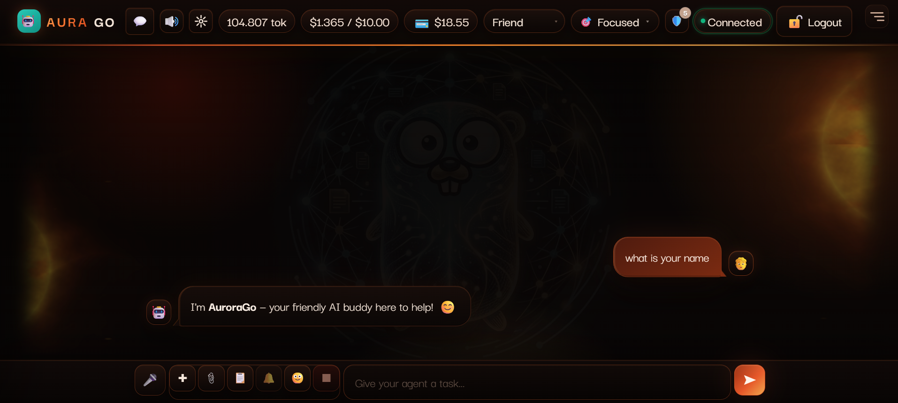
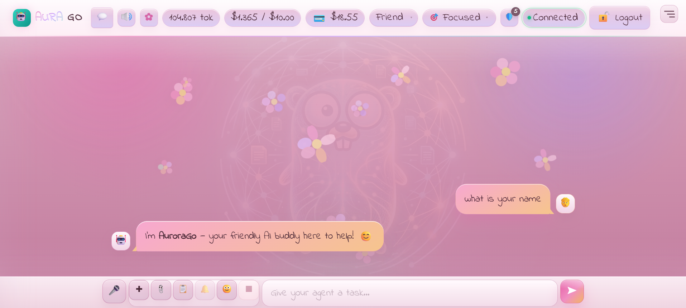

<!-- logo for light mode -->
<picture>
  <source media="(prefers-color-scheme: dark)" srcset="ui/aurago_logo.png">
  <source media="(prefers-color-scheme: light)" srcset="ui/aurago_logo_dark.png">
  
</picture>

# AuraGo — Your Home Lab AI Agent

**A self-contained AI agent for home labs — single binary, zero dependencies, runs on any Linux server or Raspberry Pi.**

[](https://go.dev)
[](LICENSE)
[](docker-compose.yml)

> **🛠️ Work in Progress** — AuraGo is under active development. Expect occasional breaking changes.
>
> **Testing note** — This is a one-man (and his agents) project. Many things are not tested, or only minimally tested. Windows and macOS support is built in *in theory*, but is not regularly tested.

> **🔒 You are in control** — Every feature can be individually disabled: Shell/Python execution, filesystem access, network requests, and self-updates each have their own toggle in the **Danger Zone**. For internet-facing installs, always enable HTTPS, login protection, and 2FA.

---

## Why AuraGo?

Unlike cloud AI services, AuraGo runs **on your hardware**, has **direct access to your infrastructure**, and keeps all data local.

```
┌─────────────────────────────────────────────────────────────┐
│  Your Home Lab                                              │
│  ┌─────────────┐  ┌─────────────┐  ┌─────────────────────┐ │
│  │   Docker    │  │   Proxmox   │  │   Home Assistant    │ │
│  │  Containers │  │  VMs & LXCs │  │   Smart Devices     │ │
│  └──────┬──────┘  └──────┬──────┘  └──────────┬──────────┘ │
│         │                │                    │            │
│         └────────────────┴────────────────────┘            │
│                          │                                 │
│                    ┌─────▼─────┐  ←── AuraGo               │
│                    │  Web UI   │      Telegram             │
│                    │  Chat     │      Discord              │
│                    │  API      │      Email                │
│                    └───────────┘                           │
└─────────────────────────────────────────────────────────────┘
```

### What Makes It Special

| Feature | What It Does |
|---------|--------------|
| **🧠 Personality Engine V2** | Learns your preferences, tech stack, and communication style — adapts to you over time |
| **🛡️ LLM Guardian** | AI-powered security scanner monitors every tool call and external content for threats |
| **⚡ Adaptive Tools** | Intelligently filters 90+ tools based on conversation context — saves tokens, improves accuracy |
| **📄 Document AI** | Create PDFs (invoices, reports) and extract text from documents with LLM analysis |
| **🤖 Native Function Calling** | OpenAI-compatible tool calls with auto-detection for DeepSeek and other models |
| **🔐 AES-256 Vault** | All secrets encrypted; Web UI with bcrypt passwords and TOTP 2FA |

---

## Quick Start

### Option A — One-Liner Install (Recommended)

```bash
curl -fsSL https://raw.githubusercontent.com/antibyte/AuraGo/main/install.sh | bash
```

The script sets up everything: Docker check, auto-HTTPS for public domains, secure first-login password, and optional systemd service.

Then:
```bash
cd ~/aurago
source .env
./start.sh
```

Open **http://localhost:8088** (or your HTTPS domain) and log in with the generated password.

### Option B — Docker Compose

```yaml
services:
  aurago:
    image: ghcr.io/antibyte/aurago:latest
    ports:
      - "8088:8088"
    volumes:
      - ./data:/app/data
      - ./config.yaml:/app/config.yaml
    environment:
      - AURAGO_MASTER_KEY=${AURAGO_MASTER_KEY}
```

### Option C — Build from Source

```bash
git clone https://github.com/antibyte/AuraGo.git
cd AuraGo
go build -o aurago ./cmd/aurago
./aurago
```

---

## Screenshots

| Dashboard | Chat | Containers | Configuration |
|:---------:|:----:|:----------:|:-------------:|
|  |  |  |  |

### Theme Variants

AuraGo supports customizable dark and light themes:

| Theme 1 (Dark) | Theme 2 (Light) |
|:---------------:|:---------------:|
|  |  |

| Theme 3 (Dark Variant) | Theme 4 (Light Variant) |
|:----------------------:|:-----------------------:|
|  |  |

---

## Capabilities at a Glance

AuraGo includes **90+ built-in tools** across these categories:

<details>
<summary><b>🏠 Home Lab & Infrastructure</b> — Docker, Proxmox, Home Assistant, TrueNAS</summary>

- **Docker** — Container lifecycle, images, networks, volumes, Compose support
- **Proxmox** — VM/LXC start/stop, snapshots, resource monitoring
- **Home Assistant** — Device control, scenes, automations (with read-only guard)
- **TrueNAS** — ZFS pools, datasets, snapshots, SMB/NFS shares
- **Wake-on-LAN** — Power on network devices remotely
- **Firewall Monitor** — Linux ufw/iptables monitoring with change alerts
- **AdGuard Home** — DNS filtering and blocking management
- **Fritz!Box** — Router control via TR-064 (devices, bandwidth, reconnect)
- **MeshCentral** — Remote desktop and device management
</details>

<details>
<summary><b>💻 System & Automation</b> — Shell, Python, SSH, Ansible</summary>

- **Shell & Python** — Execute commands in isolated sandbox (venv or Docker)
- **SSH Inventory** — Connect to routers, NAS, remote servers
- **Ansible** — Run playbooks via sidecar or remote API
- **Cron/Missions** — Scheduled tasks and automated workflows
- **Tailscale** — VPN node inspection and management
</details>

<details>
<summary><b>☁️ Cloud & APIs</b> — Google, GitHub, S3, OneDrive, Webhooks</summary>

- **Google Workspace** — Gmail, Calendar, Drive, Docs (OAuth2)
- **GitHub** — Repositories, issues, PRs, projects
- **S3** — Amazon S3, MinIO, Wasabi, DigitalOcean Spaces (read-only option)
- **OneDrive** — Microsoft OneDrive via Microsoft Graph API
- **Netlify** — Static site deployment
- **Homepage** — Personal dashboard/startpage creation and deployment
- **WebDAV/Koofr** — Nextcloud, ownCloud, Synology integration
- **Cloudflare Tunnel** — Secure remote access without public IP
- **Outgoing Webhooks** — HTTP calls to any API
- **Incoming Webhooks** — GitHub, Alertmanager, Home Assistant events
</details>

<details>
<summary><b>📡 Communication</b> — Telegram, Discord, Email, Voice</summary>

- **Telegram Bot** — Text, voice messages, image analysis
- **Discord** — Bot integration with message bridge
- **Rocket.Chat** — Self-hosted chat integration
- **Email** — IMAP monitoring + SMTP sending (multiple accounts)
- **Telnyx** — SMS/voice calls, voicemail, IVR system
- **n8n** — Bidirectional workflow automation (official community node)
- **Notifications** — Push notifications via ntfy and Pushover
</details>

<details>
<summary><b>🔧 Development & Media</b> — Git, Search, Vision, TTS, Network</summary>

- **Git** — Repository operations
- **Web Search** — DuckDuckGo (no API key) or Brave Search
- **VirusTotal** — Malware scanning for URLs and files
- **Vision** — Image analysis via vision-capable LLMs
- **TTS** — Google, ElevenLabs, or Piper (local) text-to-speech
- **Transcription** — Whisper (OpenAI or local)
- **PDF Extractor** — Text extraction with LLM summarization
- **Document Creator** — PDF generation (maroto or Gotenberg)
- **Image Generation** — Multi-provider support (OpenAI, Stability, etc.)
- **Chromecast** — Cast TTS and media to devices
- **Network Tools** — Ping, port scan, mDNS/UPnP discovery
- **Web Capture** — Screenshots and PDF from web pages
- **SQL Connections** — Query PostgreSQL, MySQL, MariaDB, SQLite
</details>

---

## Memory System

AuraGo doesn't just chat — it **remembers**:

| Memory Type | Purpose |
|-------------|---------|
| **Short-Term** | Conversation history (SQLite sliding window) |
| **Long-Term (RAG)** | Semantic search across all past conversations (vector DB) |
| **Knowledge Graph** | Structured facts with entity relationships |
| **Core Memory** | Permanent facts always included in context |
| **Journal** | Chronological event log with importance scoring |
| **Notes & To-Dos** — Persistent, categorized, with due dates |

**Smart Features:**
- **Memory Analysis** — Dedicated LLM extracts facts, preferences, and corrections in real-time
- **Memory Consolidation** — Nightly batch processing archives old conversations
- **Weekly Reflection** — Pattern recognition and insights about your interactions

---

## Security & Safety

AuraGo is designed with security-first principles:

| Layer | Protection |
|-------|------------|
| **Vault** | AES-256-GCM encryption for all API keys |
| **Auth** | bcrypt password hashing + TOTP 2FA |
| **Danger Zone** | Granular toggles for shell, Python, filesystem, network, remote, self-update |
| **LLM Guardian** | AI-powered scanning of tool calls, documents, and emails |
| **Sandbox** | Isolated Python execution (venv or Docker containers) |
| **HTTPS** | Auto-TLS with Let's Encrypt; login enforced when HTTPS active |
| **Prompt Injection Defense** | External data wrapped in `<external_data>` tags |

---

## Chat Commands

| Command | Description |
|---------|-------------|
| `/help` | List available commands |
| `/reset` | Clear conversation history |
| `/stop` | Interrupt current action |
| `/debug on\|off` | Toggle detailed error reporting |
| `/budget` | Show daily token cost breakdown |
| `/personality <name>` | Switch personality profile |
| `/sudo` | Elevate privileges for sensitive operations |
| `/journal` | Open journal management |

---

## Configuration

AuraGo includes a **Web UI Setup Wizard** that runs on first start. Simply open the web interface after starting the agent, and you'll be guided through:

- Setting up your LLM provider (API key, model selection)
- Creating a secure login password (optional for local use)
- Configuring the AES-256 vault encryption
- Enabling desired integrations

**No manual config file editing required!**

For advanced users, all settings can also be configured via `config.yaml` or the Web UI Settings panel after setup.

---

## Documentation

- **[German Manual](documentation/manual/de/README.md)** — Complete user guide
- **[English Manual](documentation/manual/en/README.md)** — Complete user guide
- **[Configuration Reference](documentation/configuration.md)** — All config options
- **[Docker Installation](documentation/docker_installation.md)** — Container setup
- **[Architecture Overview](documentation/architecture.md)** — System architecture diagram
- **[Telegram Setup](documentation/telegram_setup.md)** — Bot configuration
- **[Google Setup](documentation/google_setup.md)** — OAuth2 configuration

---

## Project Structure

```
AuraGo/
├── cmd/aurago/          # Main agent entry point
├── internal/            # Core packages (agent, memory, tools, server)
├── ui/                  # Embedded Web UI (go:embed)
├── agent_workspace/     # Skills, tools, sandbox
├── prompts/             # System prompts & tool manuals
├── documentation/       # User guides & references
└── config.yaml          # Main configuration
```

---

## License

This project is provided as-is for personal and educational use.

---

<details>
<summary><b>Dependencies</b></summary>

| Library | Purpose |
|---------|---------|
| [go-openai](https://github.com/sashabaranov/go-openai) | OpenAI-compatible LLM client |
| [chromem-go](https://github.com/philippgille/chromem-go) | Embedded vector database |
| [modernc.org/sqlite](https://pkg.go.dev/modernc.org/sqlite) | Pure Go SQLite driver |
| [telegram-bot-api](https://github.com/go-telegram-bot-api/telegram-bot-api) | Telegram bot |
| [discordgo](https://github.com/bwmarrin/discordgo) | Discord integration |
| [gopsutil](https://github.com/shirou/gopsutil) | System metrics |
| [golang.org/x/crypto](https://pkg.go.dev/golang.org/x/crypto) | SSH, bcrypt, ACME/TLS |
| [cron/v3](https://github.com/robfig/cron) | Task scheduler |

</details>
