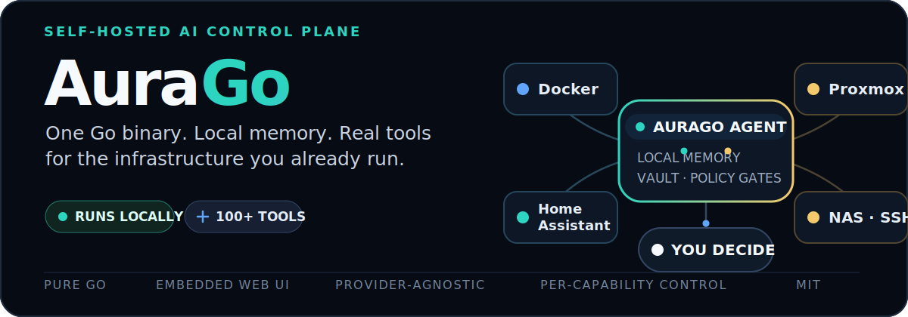
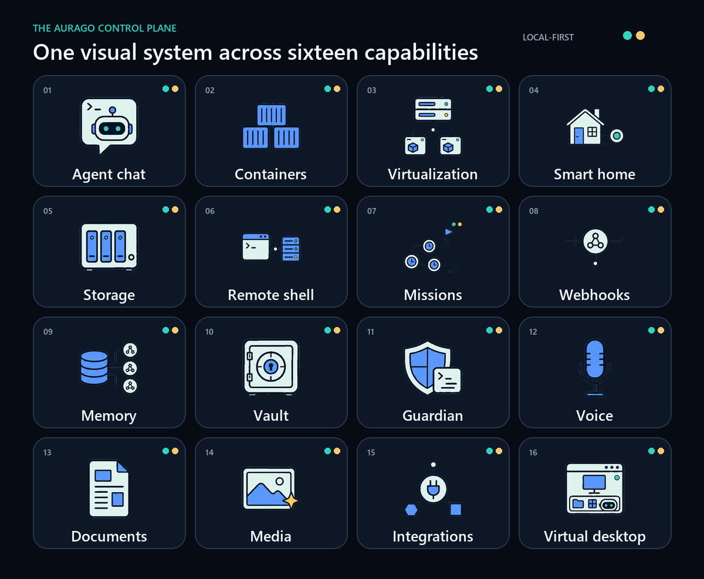

<p align="center">
  
</p>

<h1 align="center">AuraGo</h1>

<p align="center">
  <strong>Your self-hosted AI operator for the home lab.</strong><br>
  Run it on your hardware, connect the model provider you choose, and give it explicit access to the systems you want it to operate.
</p>

<p align="center">
  <a href="https://go.dev"></a>
  <a href="./LICENSE"></a>
  <a href="./docker-compose.yml"></a>
  <a href="https://antibyte.github.io/aurago-web/"></a>
  <a href="https://github.com/antibyte/agodesk/releases"></a>
</p>

> [!WARNING]
> AuraGo is under active development. Breaking changes and unfinished features are possible. It is maintained by one developer, test coverage is uneven, and Linux is the primary target. Windows and macOS builds exist but are not fully validated in CI.

> [!IMPORTANT]
> You stay in control. Shell, Python, filesystem, network, remote access, and self-update capabilities have separate **Danger Zone** gates. Keep unneeded capabilities disabled; use HTTPS, authentication, and 2FA for internet-facing installs.

## See AuraGo in action

The interface is not a mockup: these are real AuraGo screens from the repository.

| Monitor the agent and host | Give the agent a task |
|:---:|:---:|
| [](documentation/screenshots/dashboard.png) | [](documentation/screenshots/chat.png) |
| **Operate containers** | **Configure integrations** |
| [](documentation/screenshots/containers.png) | [](documentation/screenshots/config.png) |

<details>
<summary><strong>Open the experimental virtual desktop</strong></summary>


</details>

## What AuraGo does

AuraGo turns an OpenAI-compatible or local model into an operator for infrastructure you already own. It can inspect a host, work with files, run guarded automation, manage services, talk through the web UI or messenger bridges, and remember useful context across sessions.

It is designed around three practical constraints:

- **Local control plane** — conversations, operational state, memory, and the encrypted vault live with your AuraGo installation.
- **Action with boundaries** — powerful tools are opt-in, dangerous capabilities are gated, and supported integrations can expose read-only modes.
- **One portable core** — the agent, SQLite databases, vector store, API, and web UI ship in a CGO-free Go binary. Optional features can use managed sidecars.

### Built for real home-lab work

| Need | What AuraGo provides |
|---|---|
| **Operate infrastructure** | Docker, Proxmox, TrueNAS, Home Assistant, Fritz!Box, Tailscale, SSH inventory, Wake-on-LAN |
| **Automate recurring work** | Missions, cron schedules, webhooks, remote targets, event-driven runs |
| **Stay reachable** | Web chat, PWA, Telegram, Discord, Rocket.Chat, email, Telnyx, ntfy, Pushover |
| **Remember context** | Short-term history, local embeddings, RAG, knowledge graph, core memory, journal, notes, and to-dos |
| **Create and transform** | Documents, PDFs, images, music, video, speech, transcription, web capture, SQL, and media workflows |
| **Extend the agent** | Python skills, Agent Skills, MCP, custom tools, and provider-backed integrations |

<p align="center">
  
</p>

## Quick start

### Install script — recommended

```bash
curl -fsSL https://raw.githubusercontent.com/antibyte/AuraGo/main/install.sh | bash
cd ~/aurago
source .env
./start.sh
```

Open **http://localhost:8088** or the HTTPS URL created by the installer. The first-run wizard guides you through language, model provider, trust level, web login, and optional integrations—no manual YAML is required.

The installer checks Docker, can provision HTTPS for a public hostname, generates a first-login password, and can install a systemd service.

### Docker Compose

```bash
git clone https://github.com/antibyte/AuraGo.git
cd AuraGo
docker compose up -d
```

The checked-in Compose stack uses the published AuraGo image, persistent named volumes, and a restricted Docker socket proxy. AuraGo can generate and persist its vault key on first start; for a host-managed key, place a 64-character hex key in `./secrets/aurago_master.key`.

### Build from source

Requires Go 1.26 or newer.

```bash
git clone https://github.com/antibyte/AuraGo.git
cd AuraGo
go build -o aurago ./cmd/aurago
./aurago
```

## From first run to first task

1. Open `/setup` and choose a provider and model.
2. Configure web authentication and review the suggested trust level.
3. Open **Config** to connect only the integrations you need.
4. Leave high-impact Danger Zone capabilities disabled until a task requires them.
5. Go to **Chat** and start with a bounded request such as “Show me system information.”

After setup, AuraGo links directly to the most useful configuration areas: providers, security, server, and backup/restore.

## How the system fits together

```text
Web UI · PWA · Telegram · Discord · API
                    │
                    ▼
       Agent loop + provider system
                    │
       ┌────────────┴────────────┐
       ▼                         ▼
Local memory + vault      Permission-gated tools
       │                         │
SQLite · RAG · KG     Docker · SSH · APIs · files
```

- The **provider system** keeps model selection independent from individual UI features.
- The **agent loop** selects tools, streams progress, handles failures, and records activity.
- The **memory system** combines recent context with semantic retrieval, structured facts, and explicit long-term memory.
- The **tool layer** exposes native functions only when both the integration and its relevant permission gates allow them.

For the deeper design, see the [architecture guide](documentation/architecture.md).

## Security model

AuraGo can perform high-impact actions, so security is part of the runtime contract rather than a README promise.

| Layer | Mechanism |
|---|---|
| **Secrets** | AES-256-GCM vault; credentials stay out of normal agent configuration and output |
| **Web access** | bcrypt passwords, optional TOTP 2FA, HTTPS with Let's Encrypt |
| **Capabilities** | Separate gates for shell, Python, filesystem writes, network access, remote execution, self-update, and more |
| **Integrations** | Enable/disable controls and read-only modes where supported |
| **Tool checks** | LLM Guardian and prompt-boundary handling for risky calls and external content |
| **Isolation** | Python venv or container sandbox; hardened Compose defaults and restricted Docker API proxy |

Before exposing AuraGo outside a trusted network, read the [security introduction](documentation/security_introduction.md) and [security manual](documentation/manual/en/14-security.md).

## Memory without a hosted database

| Layer | Role |
|---|---|
| **Short-term** | Sliding conversation context and session state in SQLite |
| **Long-term / RAG** | Semantic retrieval over durable memories and indexed knowledge |
| **Knowledge graph** | Entities, relations, co-occurrence, and focused context expansion |
| **Core memory** | Important facts kept available across conversations |
| **Journal and activity** | Timestamped events, outcomes, rollups, and follow-ups |
| **Notes and plans** | Persistent notes, to-dos, appointments, and session plans |

New installations use the multilingual Granite 97M embedding model locally by default. AuraGo downloads pinned, checksum-verified model and runtime artifacts into `data/embeddings`, benchmarks available GPU paths, and falls back to CPU without taking down the application. Existing OpenAI-compatible, Ollama, and custom embedding provider selections remain supported.

See the [full memory-system diagram](documentation/illustrations/memory-system-overview.svg) and [memory manual](documentation/manual/en/09-memory.md).

## Integration catalog

<details>
<summary><strong>Home lab and infrastructure</strong> — Docker, Proxmox, Home Assistant, TrueNAS, and more</summary>

- Docker lifecycle, images, networks, volumes, and Compose
- Proxmox VM/LXC control, snapshots, and monitoring
- Home Assistant devices, scenes, and automations
- TrueNAS ZFS, datasets, snapshots, and shares
- Wake-on-LAN, firewall monitoring, AdGuard, Fritz!Box TR-064, MeshCentral, and 3D printers

</details>

<details>
<summary><strong>System and automation</strong> — shell, Python, SSH, Ansible, and missions</summary>

- Host or sandboxed shell and Python execution
- SSH inventory for routers, NAS systems, and remote hosts
- Ansible sidecar or remote API
- Scheduled and event-driven missions
- Tailscale node inspection

</details>

<details>
<summary><strong>Cloud and APIs</strong> — Google, GitHub, storage, websites, and webhooks</summary>

- Google Workspace, GitHub, S3-compatible storage, and OneDrive
- Netlify, managed homepages, WebDAV/Koofr, and Cloudflare Tunnel
- Incoming and outgoing webhooks

</details>

<details>
<summary><strong>Communication and media</strong> — messages, voice, vision, and documents</summary>

- Telegram, Discord, Rocket.Chat, email, SMS, voice, ntfy, and Pushover
- Vision, Whisper, text-to-speech, and web capture
- PDF extraction and creation, image/music/video generation, Chromecast, and Linux Bluetooth audio

</details>

The complete list lives in the [tools manual](documentation/manual/en/22-internal-tools.md). Availability depends on configuration, platform, credentials, and Danger Zone permissions.

## Documentation

| Start here | Link |
|---|---|
| **English user guide** | [documentation/manual/en/README.md](documentation/manual/en/README.md) |
| **German user guide** | [documentation/manual/de/README.md](documentation/manual/de/README.md) |
| **Installation** | [documentation/docker_installation.md](documentation/docker_installation.md) |
| **Configuration reference** | [documentation/configuration.md](documentation/configuration.md) |
| **Architecture** | [documentation/architecture.md](documentation/architecture.md) |
| **Realtime speech** | [documentation/realtime_speech.md](documentation/realtime_speech.md) |
| **Bluetooth audio** | [documentation/bluetooth.md](documentation/bluetooth.md) |
| **Telegram setup** | [documentation/telegram_setup.md](documentation/telegram_setup.md) |
| **Google OAuth** | [documentation/google_setup.md](documentation/google_setup.md) |

## Development

```bash
go build -o aurago ./cmd/aurago
go test ./...
go test ./ui -count=1
```

Project layout:

```text
AuraGo/
├── cmd/aurago/       # Main binary
├── internal/         # Agent, memory, tools, HTTP server
├── ui/               # Embedded web UI
├── agent_workspace/  # Skills, sandbox, generated tools
├── prompts/          # System prompts and tool manuals
└── documentation/    # Guides, diagrams, and screenshots
```

Contributors should read [AGENTS.md](AGENTS.md) for repository conventions, security requirements, and the expected test workflow.

<details>
<summary><strong>Key dependencies</strong></summary>

| Library | Purpose |
|---|---|
| [go-openai](https://github.com/sashabaranov/go-openai) | OpenAI-compatible LLM client |
| [chromem-go](https://github.com/philippgille/chromem-go) | Embedded vector database |
| [modernc.org/sqlite](https://pkg.go.dev/modernc.org/sqlite) | Pure Go SQLite |
| [telegram-bot-api](https://github.com/go-telegram-bot-api/telegram-bot-api) | Telegram |
| [discordgo](https://github.com/bwmarrin/discordgo) | Discord |
| [gopsutil](https://github.com/shirou/gopsutil) | System metrics |
| [golang.org/x/crypto](https://pkg.go.dev/golang.org/x/crypto) | SSH, bcrypt, ACME |
| [cron/v3](https://github.com/robfig/cron) | Scheduler |

</details>

## License

AuraGo is available under the [MIT License](LICENSE).
