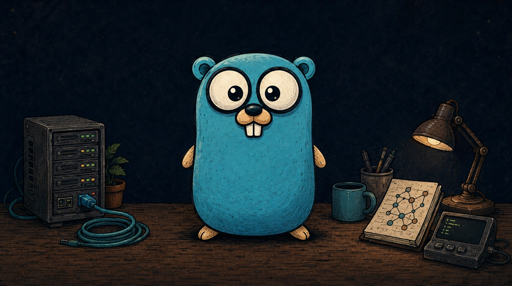
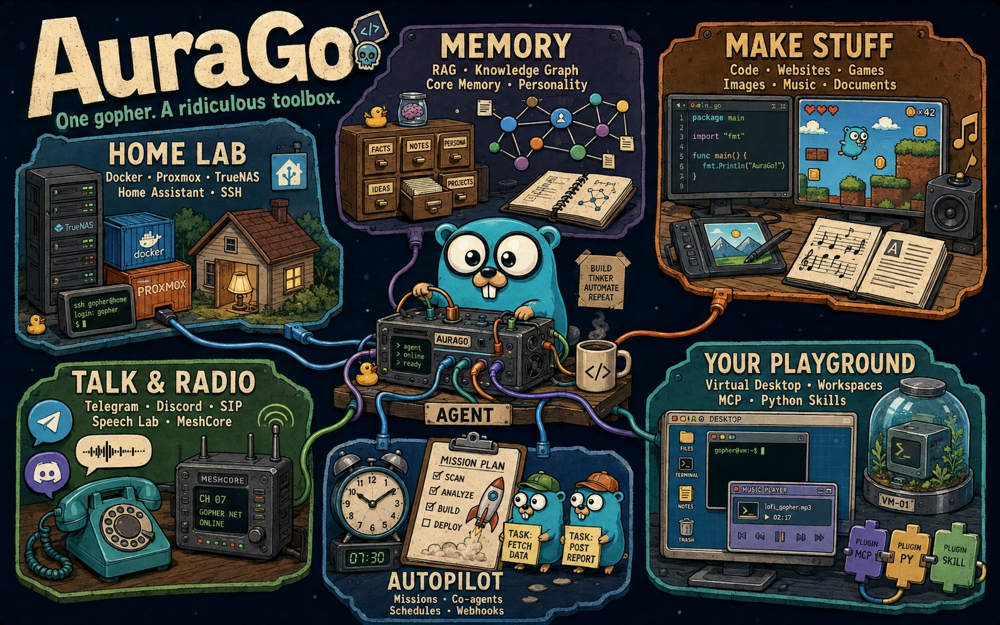
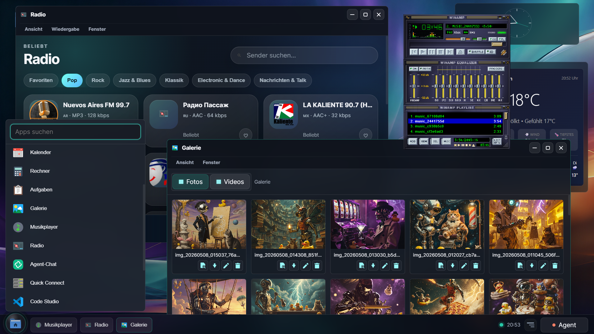
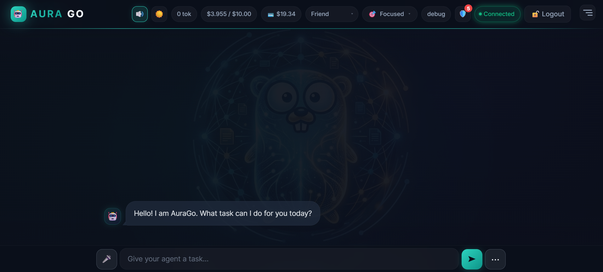
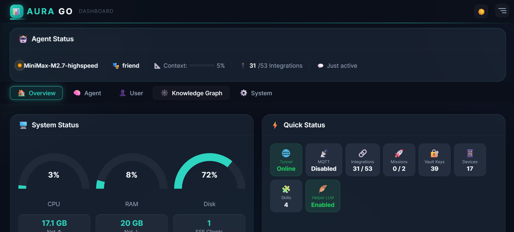
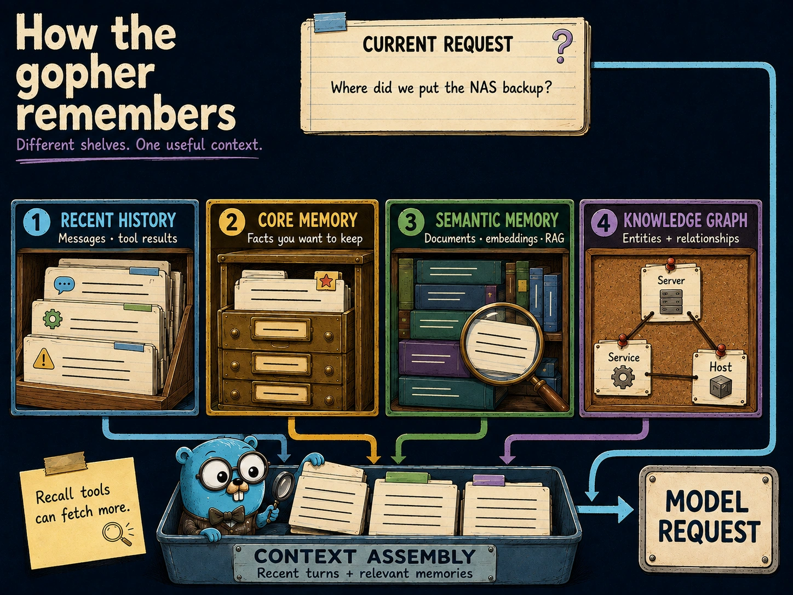

<p align="center">
  <a href="assets/readme/gopher-masthead.webp"></a>
</p>

<h1 align="center">AuraGo</h1>

<p align="center"><strong>One gopher. A ridiculous toolbox.</strong></p>

Your self-hosted AI agent can SSH into your NAS, talk over mesh radio, build a browser game and remember what you were doing yesterday. It has a web desktop, a personality, helper agents and a growing pile of integrations. Written in Go, with the core, web UI and databases bundled together. Bring a local or hosted model. Pick the toys you want to connect.

<p align="center">
  <a href="#the-toy-box">Features</a> · <a href="#under-the-hood">How it connects</a> · <a href="#quick-start">Install</a> · <a href="documentation/manual/en/README.md">English manual</a> · <a href="documentation/manual/de/README.md">Deutsches Handbuch</a>
</p>

[](assets/readme/gopher-feature-map.webp)

## The toy box

- **Your home lab, on speaking terms.** Docker, Proxmox VMs and LXCs, TrueNAS, Home Assistant, MQTT, Fritz!Box, AdGuard, Tailscale, SSH and Wake-on-LAN. Inspect services, work with files, switch things on.
- **A desktop with side quests.** Agent chat, files, terminal, gallery, calendar, radio and a Winamp-style music player. Code Studio for code, Homepage Studio for websites, Game Maker for single-player 2D/3D browser games.
- **It remembers.** Conversation history, core facts, local embeddings, document RAG, a knowledge graph, notes and a journal. Personality traits, moods and an inner voice shape how it talks.
- **Put it on autopilot.** Missions, cron schedules and webhooks start recurring work. Co-agents tackle subtasks. **Invasion Control** hatches worker “Eggs” on remote “Nests” over SSH or Docker. Yes, those are the actual names.
- **Give it a computer.** Agent Workspaces provide disposable Firecracker VMs with a shell, files and a visible Chromium browser. The main agent does the thinking; the VM is its workbench.
- **Give it a voice.** Telegram, Discord, Rocket.Chat, email, realtime speech and SIP telephony. Speech Lab adds local speech recognition and synthesis. **MeshCore** brings trusted direct messages and restricted channel replies over radio.
- **Make things.** Documents, PDFs, images, music, video and websites through configured tools and providers. Connect GitHub, Google Workspace, S3, WebDAV and SQL; play media through Jellyfin or Chromecast.
- **Plug in the weird stuff.** Klipper/Moonraker and Elegoo 3D printers, go2rtc cameras, Linux Bluetooth audio, and an **ESP32 Cheap Yellow Display** for a tiny desk dashboard. Extend further with Python Skills, Agent Skills and MCP.

[All integrations](documentation/manual/en/08-integrations.md) · [Tool catalog](documentation/manual/en/22-internal-tools.md) · [Game Maker](documentation/game-maker-studio.md) · [MeshCore](documentation/meshcore-en.md) · [Agent Workspaces](documentation/virtual_computers.md)

### Yes, there is an actual desktop

[](documentation/screenshots/desktop.png)

*Real screenshot. The desktop is experimental. Click any image to inspect it at full size.*

<details>
<summary>Chat and dashboard screenshots</summary>

[](documentation/screenshots/chat.png)

[](documentation/screenshots/dashboard.png)

</details>

## Under the hood

[](assets/readme/system-wiring.svg)

Messages and mission triggers reach the **agent loop**. It builds context, calls your chosen model, runs allowed tools and reads the results before the next round. **Co-agents** return subtask results. Service clients use the **vault** for credentials; optional sidecars provide things like local inference, speech and browser workspaces.

**Personality changes the tone, not the permissions.** Integrations, channels and workers keep their own access rules. Shell, Python, writes, network access and remote execution have separate Danger Zone gates; Guardian adds checks. Enable what you need.

### The gopher has more than one memory drawer

[](assets/readme/gopher-memory-map.webp)

**History** keeps recent turns; **Core Memory** keeps important facts; **RAG** finds related documents and memories; the **knowledge graph** connects entities and relationships. Relevant pieces go into the next request. Recall tools can fetch more. The illustrations simplify the system; they are not UI screenshots.

[Memory deep dive](documentation/manual/en/09-memory.md) · [Architecture](documentation/architecture.md) · [Co-agents](documentation/manual/en/15-coagents.md) · [Eggs and Nests](documentation/manual/en/12-invasion.md)

## Quick start

> **Still a work in progress.** One maintainer, uneven test coverage, occasional rough edges. Linux comes first; Windows and macOS builds are less tested. Features depend on permissions, providers, hardware and sometimes Docker or extra downloads.

### Linux

```bash
curl -fsSL https://raw.githubusercontent.com/antibyte/AuraGo/main/install.sh | bash
```

The installer starts AuraGo and prints your URL and first-login password. Open that address (usually **http://localhost:8088** on the host), change the password, and finish `/setup`. Pick a model, connect an integration, then try **“Show me system information.”**

<details>
<summary>Docker instead?</summary>

```bash
git clone https://github.com/antibyte/AuraGo.git
cd AuraGo
docker compose up -d
```

Open **http://localhost:8088**. The stack uses persistent volumes and a restricted Docker socket proxy; it creates a vault key if none is supplied. Back up the data and key. [Docker guide](documentation/docker_installation.md).

</details>

<details>
<summary>Build it yourself — Go 1.26.6+</summary>

```bash
git clone https://github.com/antibyte/AuraGo.git
cd AuraGo
go build -o aurago ./cmd/aurago
```

Copy `config_template.yaml` to `config.yaml`. Set a persistent, random 64-character hexadecimal `AURAGO_MASTER_KEY` in your environment or a protected `.env` before running `./aurago`. Keep the key with your backups. [Configuration](documentation/configuration.md).

</details>

Your data is stored with your installation. **Hosted models and external services still receive their request inputs.** Self-hosted does not automatically mean offline. Use login, HTTPS and optional 2FA for internet-facing access; read the [security guide](documentation/security_introduction.md).

## More rabbit holes

[English manual](documentation/manual/en/README.md) · [Deutsches Handbuch](documentation/manual/de/README.md) · [Local models](documentation/local_llm_aurago_qwen.md) · [Speech Lab](documentation/s2s_speech_lab.md) · [SIP](documentation/sip_telephony.md) · [Skills](documentation/manual/en/19-skills.md) · [API](documentation/manual/en/21-api-reference.md) · [Troubleshooting](documentation/manual/en/16-troubleshooting.md)

[Releases](https://github.com/antibyte/AuraGo/releases) · [Website](https://antibyte.github.io/aurago-web/) · [AgoDesk for Windows](https://github.com/antibyte/agodesk/releases)

Want to tinker? Start with [AGENTS.md](AGENTS.md), build with `go build ./cmd/aurago`, and test with `go test ./...`.

**[MIT licensed](LICENSE).** Have fun. Mind the permissions.
