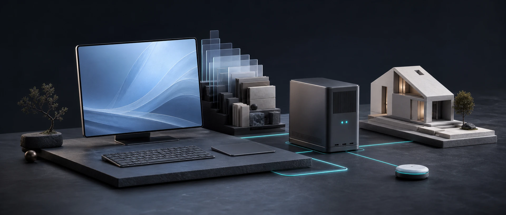
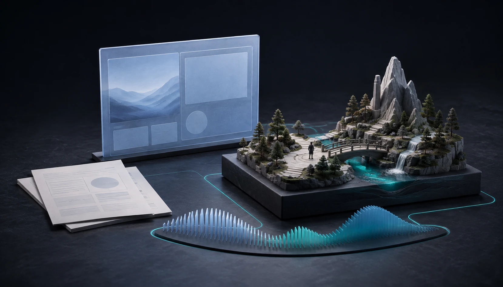

<h1 align="center">AuraGo</h1>

<p align="center">
  <strong>Your personal AI. On your terms.</strong><br>
  A self-hosted AI platform that remembers context, creates with you,<br>
  and operates the systems you connect.
</p>

<p align="center">
  <a href="#quick-start">Quick start</a> ·
  <a href="#showcase">Explore the workspace</a> ·
  <a href="#documentation">Documentation</a>
</p>

<p align="center">
  
</p>

<p align="center">
  <a href="go.mod"></a>
  <a href="docker-compose.yml"></a>
  <a href="LICENSE"></a>
</p>

Run AuraGo on your own hardware and choose a local or hosted model. Start with a conversation, then connect the tools, knowledge and services you want it to work with. The agent, web interface, API and embedded databases share one portable Go core; optional capabilities use additional runtimes or managed sidecars.

## Showcase

### A workspace for your agent and your ideas

[](documentation/screenshots/desktop.png)

**The Virtual Desktop brings apps, media and agent access into one browser workspace.** Open tools alongside your work and move between conversations, files and creative projects. The desktop is experimental; available apps depend on your configuration.

### Give it a task. Follow the work.

[](documentation/screenshots/chat.png)

**Chat is the starting point for agent work.** Describe an outcome, follow streamed responses and tool activity, and continue the conversation with context from earlier work.

<details>
<summary><strong>See the dashboard — agent activity and host status</strong></summary>

[](documentation/screenshots/dashboard.png)

Check the active model, integrations and host resources from one overview. Screenshots show an example installation; counts and enabled services are not product limits.

</details>

*These are real repository screenshots. The two editorial illustrations on this page are conceptual artwork.*

## What you can do

### Delegate work that continues beyond a chat

Ask the agent to inspect a host, organize files or work with a connected service. Missions, schedules and webhooks turn recurring requests into automation. Add reusable Python skills, Agent Skills or MCP connections as your needs grow; access remains subject to configuration and tool permissions.

[Explore missions](documentation/manual/en/11-missions.md) · [Extend with skills](documentation/manual/en/19-skills.md)

### Build knowledge that carries forward

Conversation history, durable memories, indexed documents and a knowledge graph help the agent recover relevant context. Core memory keeps important facts available; notes and the journal organize ongoing work. Local embeddings are available without a hosted vector database, while supported external embedding providers remain an option.

[Explore the memory system](documentation/manual/en/09-memory.md)

### Turn ideas into things you can use

Work across the Virtual Desktop, Code Studio, Homepage Studio and Game Maker. Create documents, websites and browser games; use configured media providers for images, music and other assets. Game Maker supports self-contained, single-player 2D and 3D browser games. Generation quality depends on the selected model and enabled capabilities.

<p align="center">
  
</p>

[Explore Game Maker](documentation/game-maker-studio.md) · [Explore the web interface](documentation/manual/en/04-webui.md)

### Talk through the channels you use

Use web chat, Telegram, Discord or Rocket.Chat. Add transcription, spoken responses and realtime voice through supported providers. The optional Speech Lab supplies local speech recognition and synthesis; SIP telephony has its own setup and permission controls.

[Realtime speech](documentation/realtime_speech.md) · [Local Speech Lab](documentation/s2s_speech_lab.md) · [SIP telephony](documentation/sip_telephony.md)

### Bring your home lab into the conversation

Connect Docker, Proxmox, Home Assistant, TrueNAS, SSH hosts and more. Inspect systems and enable the operations you need, with read-only modes where supported. Cloud services, storage and messaging integrations broaden the workspace; each has its own configuration and prerequisites.

[Browse integrations](documentation/manual/en/08-integrations.md) · [Browse tools](documentation/manual/en/22-internal-tools.md)

## Quick start

> [!NOTE]
> **Actively developed by one maintainer.** Expect breaking changes and unfinished features. Test coverage is uneven. Linux is the primary target; Windows and macOS builds exist but are not fully validated in CI. Optional features may require Docker, additional downloads, suitable hardware or provider credentials.

### Install on Linux

```bash
curl -fsSL https://raw.githubusercontent.com/antibyte/AuraGo/main/install.sh | bash
```

The installer sets up AuraGo in `~/aurago`, creates a first-login password and starts the application. It offers systemd service setup and HTTPS for a public hostname. Follow the URL and login instructions printed at the end.

1. Open **http://localhost:8088** on the host, or the LAN/HTTPS address shown by the installer.
2. Sign in with the generated password and change it. Complete `/setup` to choose your provider, model and trust level.
3. Connect the integrations you need in **Config**. Review permissions before enabling actions.
4. Open **Chat** and try: **“Show me system information.”**

Keep the first task small, then expand access as you learn how the agent behaves with your chosen model.

<details>
<summary><strong>Alternative: Docker Compose</strong></summary>

```bash
git clone https://github.com/antibyte/AuraGo.git
cd AuraGo
docker compose up -d
```

Open **http://localhost:8088** on the Docker host and complete setup. The stack uses the published image, persistent named volumes and a restricted Docker socket proxy. It generates and persists a vault key on first start if none is supplied. Back up persistent data, including the key.

[Docker installation guide](documentation/docker_installation.md)

</details>

<details>
<summary><strong>Alternative: build from source</strong></summary>

Requires **Go 1.26.6+**. From a fresh checkout:

```bash
git clone https://github.com/antibyte/AuraGo.git
cd AuraGo
go build -o aurago ./cmd/aurago
```

Before running `./aurago`, copy `config_template.yaml` to `config.yaml` and configure a persistent, randomly generated 64-character hexadecimal `AURAGO_MASTER_KEY` through the environment or a protected `.env` file. Retain this key with your backups: it protects the vault. Complete the web setup after startup.

[Configuration reference](documentation/configuration.md)

</details>

## How it works — and what stays under your control

**Your request → model and relevant memory → permission-gated tools → results and continued context.**

AuraGo assembles context, asks the selected model for the next step, executes allowed tools and streams results back. Its local memory combines SQLite history with semantic retrieval and structured knowledge. [Read the architecture guide](documentation/architecture.md).

- **Choose your model.** Use a supported hosted provider or local inference. Managed AuraGo-Qwen and AuraGo-Ling are optional experimental models with hardware requirements; see the [local model guide](documentation/local_llm_aurago_qwen.md).
- **Choose its reach.** Danger Zone gates separately control shell, Python, filesystem writes, network requests, remote access and self-updates. Leave unneeded capabilities disabled.
- **Protect access and secrets.** An AES-256-GCM vault stores credentials. Web authentication, optional TOTP 2FA, HTTPS and Guardian checks provide additional controls; they do not eliminate the risks of autonomous actions.
- **Understand the data path.** Stored conversations, memory and operational state live with your installation. Hosted models and external integrations receive the inputs needed for their requests. Self-hosting AuraGo does not automatically make every workflow local or offline.

Before internet-facing use, review the [security introduction](documentation/security_introduction.md) and [security manual](documentation/manual/en/14-security.md).

## Documentation

**[English handbook](documentation/manual/en/README.md)** · **[Deutsches Handbuch](documentation/manual/de/README.md)**

- **Set up:** [Docker](documentation/docker_installation.md) · [Configuration](documentation/configuration.md) · [Troubleshooting](documentation/manual/en/16-troubleshooting.md)
- **Go further:** [Agent workspaces / Virtual Computers](documentation/virtual_computers.md) · [Telegram](documentation/telegram_setup.md) · [API reference](documentation/manual/en/21-api-reference.md)
- **Around the project:** [Website](https://antibyte.github.io/aurago-web/) · [Releases](https://github.com/antibyte/AuraGo/releases) · [AgoDesk Windows companion](https://github.com/antibyte/agodesk/releases)

## Development

The core lives in `cmd/aurago` and `internal`; `ui` contains the embedded web interface. Read [AGENTS.md](AGENTS.md) for repository conventions and security contracts. For changes to the application, build and run the relevant tests:

```bash
go build -o aurago ./cmd/aurago
go test ./...
```

## License

AuraGo is available under the [MIT License](LICENSE).
