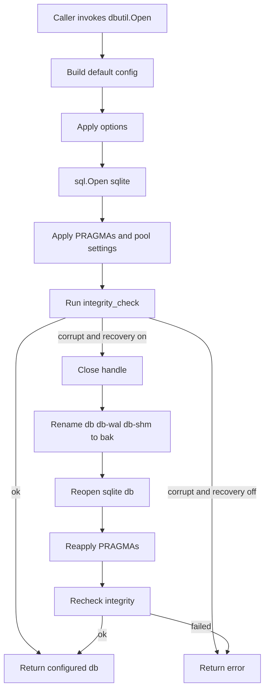

# Architecture Design: Central [`internal/dbutil`](internal/dbutil) Package

## Goal

Create a single, reusable SQLite utility package that removes configuration drift across all 18 AuraGo SQLite databases identified in [`reports/database_audit_2026-04-08.md`](reports/database_audit_2026-04-08.md).

The new package standardizes:

- connection opening via [`dbutil.Open()`](internal/dbutil/open.go:1)
- SQLite PRAGMA configuration
- connection pool sizing
- integrity checking and optional corruption recovery
- common schema migration helpers
- small shared SQLite helper functions currently duplicated across packages

This document is an architecture specification only. It does **not** implement code.

---

## Design Principles

1. **One default path**: most packages should call the same [`dbutil.Open()`](internal/dbutil/open.go:1) with no special configuration.
2. **Explicit exceptions**: deviations such as `knowledge_graph.db` using two connections must be expressed through options instead of local ad-hoc logic.
3. **Fail early on unsafe initialization**: opening a DB must either return a correctly configured handle or an actionable error.
4. **Keep package scope tight**: [`internal/dbutil`](internal/dbutil) should provide SQLite-specific setup and migration helpers, not schema creation logic.
5. **Preserve package ownership of schema**: tables and indexes remain defined in their owning packages such as [`internal/inventory/inventory.go`](internal/inventory/inventory.go:30) or [`internal/tools/skill_manager.go`](internal/tools/skill_manager.go:106).
6. **Minimize future audit drift**: all new SQLite databases should be required to pass through [`dbutil.Open()`](internal/dbutil/open.go:1).

---

## Proposed Package Layout

```text
internal/dbutil/
├── open.go
├── options.go
├── migrate.go
├── helpers.go
└── version.go
```

### Responsibility split

- [`internal/dbutil/open.go`](internal/dbutil/open.go)
  - [`Open()`](internal/dbutil/open.go:1)
  - PRAGMA application
  - integrity check
  - optional corruption recovery
- [`internal/dbutil/options.go`](internal/dbutil/options.go)
  - [`Option`](internal/dbutil/options.go:1) type
  - option constructors such as [`WithMaxOpenConns()`](internal/dbutil/options.go:1)
- [`internal/dbutil/migrate.go`](internal/dbutil/migrate.go)
  - [`MigrateAddColumn()`](internal/dbutil/migrate.go:1)
  - [`MigrateAddColumnChecked()`](internal/dbutil/migrate.go:1)
  - internal column existence helper
- [`internal/dbutil/helpers.go`](internal/dbutil/helpers.go)
  - [`EscapeLike()`](internal/dbutil/helpers.go:1)
  - [`BoolToInt()`](internal/dbutil/helpers.go:1)
  - [`NullStr()`](internal/dbutil/helpers.go:1)
- [`internal/dbutil/version.go`](internal/dbutil/version.go)
  - [`GetUserVersion()`](internal/dbutil/version.go:1)
  - [`SetUserVersion()`](internal/dbutil/version.go:1)

---

## API Surface

## Public functions

```go
func Open(dbPath string, opts ...Option) (*sql.DB, error)

func WithMaxOpenConns(n int) Option
func WithBusyTimeout(ms int) Option
func WithSynchronous(mode string) Option
func WithCorruptionRecovery(logger *slog.Logger) Option

func MigrateAddColumn(db *sql.DB, table, column, definition string, logger *slog.Logger) error
func MigrateAddColumnChecked(db *sql.DB, table, column, definition string, logger *slog.Logger) error

func EscapeLike(s string) string
func BoolToInt(b bool) int
func NullStr(s string) interface{}

func SetUserVersion(db *sql.DB, version int) error
func GetUserVersion(db *sql.DB) (int, error)
```

## Optional internal helpers

The architecture should also include unexported helpers to keep public API small:

```go
type openConfig struct {
    maxOpenConns       int
    busyTimeoutMS      int
    synchronous        string
    enableRecovery     bool
    recoveryLogger     *slog.Logger
}

func defaultOpenConfig() openConfig
func applyPragmas(db *sql.DB, cfg openConfig) error
func runIntegrityCheck(db *sql.DB) error
func recoverCorruptDB(dbPath string, logger *slog.Logger) error
func hasColumn(db *sql.DB, table, column string) (bool, error)
func isDuplicateColumnError(err error) bool
func validateSynchronous(mode string) error
```

---

## Core Open Flow

## Default behavior

[`Open()`](internal/dbutil/open.go:1) should perform the following steps in this order:

1. call [`sql.Open()`](database/sql:1) with driver `sqlite`
2. apply validated options over defaults
3. set [`SetMaxOpenConns()`](database/sql:1)
4. execute PRAGMAs
   - `PRAGMA journal_mode=WAL`
   - `PRAGMA synchronous=NORMAL`
   - `PRAGMA foreign_keys=ON`
   - `PRAGMA busy_timeout=5000`
5. execute `PRAGMA integrity_check(1)`
6. if integrity check fails
   - when recovery is disabled: return error
   - when recovery is enabled: close DB, rotate broken files to `.bak`, reopen, reapply PRAGMAs, rerun integrity check
7. return configured [`*sql.DB`](database/sql:1)

## Why PRAGMAs precede integrity-sensitive runtime use

This matches the target pattern identified in [`internal/memory/short_term_init.go`](internal/memory/short_term_init.go:30), while generalizing the recovery capability the user explicitly requested as an option.

## Default config

| Setting | Default | Reason |
|---|---:|---|
| journal mode | `WAL` | consistent concurrent read/write behavior |
| synchronous | `NORMAL` | audit recommends normalizing on WAL + NORMAL |
| foreign keys | `ON` | safe default even when current schemas have few FK constraints |
| busy timeout | `5000` | avoids avoidable `SQLITE_BUSY` churn |
| max open conns | `1` | safest SQLite default across AuraGo packages |
| integrity check | enabled | catches corruption before schema work |
| corruption recovery | disabled by default | opt-in because not every package should silently rotate DB files |

---

## Options Pattern

## Option type

Use a functional-options model:

```go
type Option func(*openConfig) error
```

This keeps [`Open()`](internal/dbutil/open.go:1) stable and allows future additions without signature churn.

## Required options

### [`WithMaxOpenConns()`](internal/dbutil/options.go:1)

- overrides default of `1`
- validates `n >= 1`
- initial expected use: [`internal/memory/graph_sqlite.go`](internal/memory/graph_sqlite.go:84) with `2`

### [`WithBusyTimeout()`](internal/dbutil/options.go:1)

- overrides `5000`
- validates `ms >= 0`
- intended for special workloads only

### [`WithSynchronous()`](internal/dbutil/options.go:1)

- accepted values should be normalized to uppercase
- allowed values should be restricted to `OFF`, `NORMAL`, `FULL`, `EXTRA`
- current expected default remains `NORMAL`
- keeps future `FULL` opt-in possible for high-durability cases

## Additional architecture option

### [`WithCorruptionRecovery()`](internal/dbutil/options.go:1)

Because the user explicitly requested this direction, the architecture should include a recovery option:

```go
func WithCorruptionRecovery(logger *slog.Logger) Option
```

Behavior:

- enables recovery path on integrity failure
- requires non-nil logger
- recovery flow mirrors existing logic in [`openSQLiteDB()`](internal/memory/short_term_init.go:30)
- rotates these files when present:
  - `dbPath`
  - `dbPath-wal`
  - `dbPath-shm`
- appends `.bak`
- logs recovery attempts and rename failures

This keeps recovery explicit and avoids silently masking corruption in packages where fail-fast is preferred.

---

## Detailed API Documentation

## [`Open(dbPath string, opts ...Option)`](internal/dbutil/open.go:1)

### Input

- `dbPath`: filesystem path to a SQLite file
- `opts`: optional deviations from standard configuration

### Guarantees on success

- driver is `modernc.org/sqlite`
- database handle is open and usable
- default SQLite PRAGMAs are applied
- connection pool sizing is applied
- integrity has been checked
- if recovery was requested and needed, a fresh usable DB is returned

### Failure cases

- DB open failure
- invalid option value
- PRAGMA application failure
- integrity check failure without recovery
- integrity check failure with unsuccessful recovery
- reopen failure after recovery

### Logging policy

- [`Open()`](internal/dbutil/open.go:1) should stay mostly silent on success
- logging should only happen in corruption recovery path because logger is otherwise not mandatory
- normal init logging remains the responsibility of the owning package, for example [`NewSQLiteMemory()`](internal/memory/short_term_init.go:63)

---

## [`MigrateAddColumn()`](internal/dbutil/migrate.go:1)

### Purpose

Replace repeated column-existence checks currently duplicated in packages such as:

- [`internal/inventory/inventory.go`](internal/inventory/inventory.go:57)
- [`internal/services/optimizer/db.go`](internal/services/optimizer/db.go:83)
- [`internal/memory/short_term_init.go`](internal/memory/short_term_init.go:319)

### Contract

1. validate `table`, `column`, and `definition`
2. check existence through `pragma_table_info`
3. if already present, return `nil`
4. log migration intent through provided logger
5. execute `ALTER TABLE ... ADD COLUMN ...`
6. wrap errors with table and column context

### Intended semantics

- deterministic
- idempotent when schema is unchanged
- fails loudly on malformed SQL or DB problems

---

## [`MigrateAddColumnChecked()`](internal/dbutil/migrate.go:1)

### Purpose

Provide the safer pattern requested by the task for migrations that currently rely on duplicate-column-string matching, for example:

- [`internal/invasion/invasion.go`](internal/invasion/invasion.go:186)
- [`internal/tools/skill_manager.go`](internal/tools/skill_manager.go:194)
- [`internal/memory/plans.go`](internal/memory/plans.go:181)

### Proposed semantics

[`MigrateAddColumnChecked()`](internal/dbutil/migrate.go:1) should:

1. run the same pre-check as [`MigrateAddColumn()`](internal/dbutil/migrate.go:1)
2. attempt `ALTER TABLE`
3. if ALTER succeeds, return `nil`
4. if ALTER fails with a duplicate-column style error, re-check via `pragma_table_info`
5. if column now exists, treat migration as successful
6. otherwise return wrapped error

### Why this variant exists

It documents and standardizes the existing AuraGo pattern of being tolerant toward historic schema drift, while still guaranteeing that success means the column truly exists afterward.

---

## [`EscapeLike()`](internal/dbutil/helpers.go:1)

Move the current implementation from [`escapeLike()`](internal/memory/short_term.go:19) into the shared package.

### Behavior

- escapes `\`
- escapes `%`
- escapes `_`

### Usage rule

Consumers must also add `ESCAPE '\\'` to the SQL clause.

### Primary migration targets

- inventory LIKE queries flagged by audit in [`reports/database_audit_2026-04-08.md`](reports/database_audit_2026-04-08.md)
- contacts LIKE queries flagged by audit in [`reports/database_audit_2026-04-08.md`](reports/database_audit_2026-04-08.md)

---

## [`BoolToInt()`](internal/dbutil/helpers.go:1)

Unify duplicated helpers currently found in packages such as:

- [`internal/planner/planner.go`](internal/planner/planner.go:487)
- [`internal/sqlconnections/sqlconnections.go`](internal/sqlconnections/sqlconnections.go:247)
- [`internal/invasion/invasion.go`](internal/invasion/invasion.go:538)
- [`internal/remote/db.go`](internal/remote/db.go:124)
- [`internal/memory/graph_sqlite.go`](internal/memory/graph_sqlite.go:2134)
- [`internal/tools/skill_manager.go`](internal/tools/skill_manager.go:832)

### Behavior

- `true -> 1`
- `false -> 0`

---

## [`NullStr()`](internal/dbutil/helpers.go:1)

The requested signature is:

```go
func NullStr(s string) interface{}
```

### Intended behavior

- return `nil` when `s == ""`
- otherwise return `s`

### Rationale

This is suitable for write paths where empty strings should become SQL `NULL` values.

### Important note

AuraGo currently also has a different pattern in [`nullStr()`](internal/invasion/invasion.go:545) that converts [`sql.NullString`](database/sql:1) to plain `string` on read. That read-helper is semantically different. The migration plan should therefore:

- adopt [`dbutil.NullStr()`](internal/dbutil/helpers.go:1) only for write-side nullable arguments
- leave read-side conversion helpers local, or create a future separate helper like [`StringFromNull()`](internal/dbutil/helpers.go:1) if needed

---

## [`GetUserVersion()`](internal/dbutil/version.go:1) and [`SetUserVersion()`](internal/dbutil/version.go:1)

### [`GetUserVersion()`](internal/dbutil/version.go:1)

- executes `PRAGMA user_version`
- returns wrapped error with DB context

### [`SetUserVersion()`](internal/dbutil/version.go:1)

- validates `version >= 0`
- executes `PRAGMA user_version = N`
- wraps errors with target version context

### Why centralize this

User-version handling is currently inconsistent across packages, including:

- [`internal/inventory/inventory.go`](internal/inventory/inventory.go:107)
- [`internal/tools/cheatsheets.go`](internal/tools/cheatsheets.go:95)
- [`internal/tools/image_generation.go`](internal/tools/image_generation.go:146)
- [`internal/tools/mission_preparation_db.go`](internal/tools/mission_preparation_db.go:51)
- [`internal/memory/short_term_init.go`](internal/memory/short_term_init.go:307)

Centralizing removes repeated `fmt.Sprintf`-based PRAGMA writes and makes version tracking easier to audit.

---

## Open Lifecycle Diagram



---

## Migration Strategy by Database

## Migration categories

### Category A: only replace open/config logic

Packages already have reasonable schema creation and mostly just need the opening logic centralized.

### Category B: replace open/config logic and normalize column migrations

Packages have manual `pragma_table_info` or duplicate-column handling that should move to [`MigrateAddColumn()`](internal/dbutil/migrate.go:1) or [`MigrateAddColumnChecked()`](internal/dbutil/migrate.go:1).

### Category C: special handling

Packages need non-default options, singleton flows, or retained custom logic.

---

## Per-database migration plan

| # | Database | Current initializer | Category | Planned dbutil migration |
|---|---|---|---|---|
| 1 | `short_term.db` | [`NewSQLiteMemory()`](internal/memory/short_term_init.go:63) | C | replace local open path with [`dbutil.Open()`](internal/dbutil/open.go:1) + [`WithCorruptionRecovery()`](internal/dbutil/options.go:1); keep schema and higher-level migrations local |
| 2 | `knowledge_graph.db` | [`NewKnowledgeGraph()`](internal/memory/graph_sqlite.go:84) | C | use [`dbutil.Open()`](internal/dbutil/open.go:1) + [`WithMaxOpenConns(2)`](internal/dbutil/options.go:1); migrate raw ALTER statements to checked helpers where possible |
| 3 | `inventory.db` | [`InitDB()`](internal/inventory/inventory.go:30) | B | replace raw open with [`dbutil.Open()`](internal/dbutil/open.go:1); convert `mac_address` and `credential_id` migrations to [`MigrateAddColumn()`](internal/dbutil/migrate.go:1); replace manual user_version handling |
| 4 | `invasion.db` | [`InitDB()`](internal/invasion/invasion.go:63) | B | replace raw open with [`dbutil.Open()`](internal/dbutil/open.go:1); get WAL automatically; convert duplicate-column loop to [`MigrateAddColumnChecked()`](internal/dbutil/migrate.go:1) |
| 5 | `cheatsheets.db` | [`InitCheatsheetDB()`](internal/tools/cheatsheets.go:51) | B | replace open and explicit FK setup with [`dbutil.Open()`](internal/dbutil/open.go:1); replace version helpers with central version API |
| 6 | `image_gallery.db` | [`InitImageGalleryDB()`](internal/tools/image_generation.go:110) | B | replace open path and direct `user_version` write with dbutil helpers |
| 7 | `media_registry.db` | [`InitMediaRegistryDB()`](internal/tools/media_registry.go:45) | A | replace open path; keep repair logic local |
| 8 | `homepage_registry.db` | [`InitHomepageRegistryDB()`](internal/tools/homepage_registry.go:66) | A | replace open path; rely on dbutil to enable FK enforcement for existing FK schema |
| 9 | `contacts.db` | [`InitDB()`](internal/contacts/contacts.go:30) | A | replace open path; later update LIKE queries to use [`EscapeLike()`](internal/dbutil/helpers.go:1) |
| 10 | `planner.db` | [`InitDB()`](internal/planner/planner.go:50) | A | replace open path; optionally replace local bool helper with [`BoolToInt()`](internal/dbutil/helpers.go:1) |
| 11 | `remote_control.db` | [`InitDB()`](internal/remote/db.go:60) | A | replace open path to gain WAL, busy_timeout and max-open standardization; replace local bool helper |
| 12 | `sql_connections.db` | [`InitDB()`](internal/sqlconnections/sqlconnections.go:41) | A | replace open path to add missing busy_timeout and defaults; replace local bool helper |
| 13 | `skills.db` | [`InitSkillsDB()`](internal/tools/skill_manager.go:106) | B | replace open path; convert duplicate-column migration loop to [`MigrateAddColumnChecked()`](internal/dbutil/migrate.go:1); add centralized version tracking if desired |
| 14 | `optimization.db` | [`InitDB()`](internal/services/optimizer/db.go:35) | B | replace DSN pragma configuration with [`dbutil.Open()`](internal/dbutil/open.go:1); convert `shadow` and `original_hash` migrations to [`MigrateAddColumn()`](internal/dbutil/migrate.go:1) |
| 15 | `push.db` | [`NewManager()`](internal/push/manager.go:32) | A | replace raw open with [`dbutil.Open()`](internal/dbutil/open.go:1) |
| 16 | `site_monitor.db` | [`initSiteMonitorDB()`](internal/tools/site_monitor.go:59) | C | replace singleton-local `sql.Open` with singleton-local [`dbutil.Open()`](internal/dbutil/open.go:1); keep [`sync.Once`](sync:1) behavior |
| 17 | `prepared_missions.db` | [`InitPreparedMissionsDB()`](internal/tools/mission_preparation_db.go:15) | B | replace open path and direct version write with centralized version helpers |
| 18 | TrueNAS registry | [`InitRegistryDB()`](internal/truenas/registry.go:10) | A | replace raw open with [`dbutil.Open()`](internal/dbutil/open.go:1) |

---

## Detailed plan per file

### 1. [`internal/memory/short_term_init.go`](internal/memory/short_term_init.go:63)

- remove private [`openSQLiteDB()`](internal/memory/short_term_init.go:30) after its recovery logic is subsumed by [`WithCorruptionRecovery()`](internal/dbutil/options.go:1)
- keep [`applySQLiteMemoryMigrations()`](internal/memory/short_term_init.go:1) local
- replace local [`migrateAddColumn()`](internal/memory/short_term_init.go:319) with shared helper
- replace direct user_version access with [`GetUserVersion()`](internal/dbutil/version.go:1) and [`SetUserVersion()`](internal/dbutil/version.go:1)

### 2. [`internal/memory/graph_sqlite.go`](internal/memory/graph_sqlite.go:84)

- replace raw open and PRAGMAs with [`dbutil.Open()`](internal/dbutil/open.go:1) and [`WithMaxOpenConns(2)`](internal/dbutil/options.go:1)
- preserve knowledge-graph worker and queue architecture
- replace silent migration loop with explicit calls to [`MigrateAddColumnChecked()`](internal/dbutil/migrate.go:1) for added columns
- keep `kg_meta` FTS version logic local because it is domain-specific, not generic dbutil behavior

### 3. [`internal/inventory/inventory.go`](internal/inventory/inventory.go:30)

- replace raw open with [`dbutil.Open()`](internal/dbutil/open.go:1)
- convert both column migrations to shared helper
- replace direct PRAGMA version code with dbutil version helpers
- update LIKE search call sites later to use [`EscapeLike()`](internal/dbutil/helpers.go:1)

### 4. [`internal/invasion/invasion.go`](internal/invasion/invasion.go:63)

- replace busy-timeout-only setup with standardized open behavior so WAL and max-open are also enforced
- convert each `ALTER TABLE` string into explicit checked helper invocations for clear error attribution
- replace local [`boolToInt()`](internal/invasion/invasion.go:538) with [`BoolToInt()`](internal/dbutil/helpers.go:1)
- do **not** replace local [`nullStr()`](internal/invasion/invasion.go:545) with [`NullStr()`](internal/dbutil/helpers.go:1) because semantics differ

### 5. [`internal/tools/cheatsheets.go`](internal/tools/cheatsheets.go:51)

- remove explicit `WAL` and `foreign_keys` setup because dbutil now owns them
- retain table-creation logic
- use shared version functions for `user_version`

### 6. [`internal/tools/image_generation.go`](internal/tools/image_generation.go:110)

- replace open path
- replace direct `PRAGMA user_version = 1` with [`SetUserVersion()`](internal/dbutil/version.go:1)

### 7. [`internal/tools/media_registry.go`](internal/tools/media_registry.go:45)

- replace open path only
- leave [`repairLegacyMediaTypes()`](internal/tools/media_registry.go:102) untouched

### 8. [`internal/tools/homepage_registry.go`](internal/tools/homepage_registry.go:66)

- replace open path only
- benefit from centralized foreign key enforcement for existing FK relationships

### 9. [`internal/contacts/contacts.go`](internal/contacts/contacts.go:30)

- replace open path only
- later refactor LIKE filters to use [`EscapeLike()`](internal/dbutil/helpers.go:1)

### 10. [`internal/planner/planner.go`](internal/planner/planner.go:50)

- replace open path only
- optionally remove local [`boolToInt()`](internal/planner/planner.go:487)

### 11. [`internal/remote/db.go`](internal/remote/db.go:60)

- replace open path only
- this directly addresses audit finding for missing WAL and connection limit
- remove local [`boolToInt()`](internal/remote/db.go:124)

### 12. [`internal/sqlconnections/sqlconnections.go`](internal/sqlconnections/sqlconnections.go:41)

- replace open path
- use dbutil to add missing `busy_timeout`
- remove local [`boolToInt()`](internal/sqlconnections/sqlconnections.go:247)

### 13. [`internal/tools/skill_manager.go`](internal/tools/skill_manager.go:106)

- replace open path
- change string-matching duplicate-column logic into checked helper calls for each column
- consider adopting `user_version` if future migrations grow beyond additive columns

### 14. [`internal/services/optimizer/db.go`](internal/services/optimizer/db.go:35)

- replace DSN pragma usage with centralized opening logic
- keep directory creation local because it is not DB-specific behavior
- convert `shadow` and `original_hash` migrations to shared helper
- keep table-rebuild logic local because it is more than simple add-column migration

### 15. [`internal/push/manager.go`](internal/push/manager.go:32)

- replace raw open with [`dbutil.Open()`](internal/dbutil/open.go:1)
- preserve vault and VAPID key initialization logic

### 16. [`internal/tools/site_monitor.go`](internal/tools/site_monitor.go:59)

- inside [`sync.Once`](sync:1), call [`dbutil.Open()`](internal/dbutil/open.go:1) instead of [`sql.Open()`](database/sql:1)
- keep one-time singleton semantics identical
- remove duplicate WAL and max-open logic from singleton init

### 17. [`internal/tools/mission_preparation_db.go`](internal/tools/mission_preparation_db.go:15)

- replace open path
- replace direct `user_version` write with shared helper

### 18. [`internal/truenas/registry.go`](internal/truenas/registry.go:10)

- replace raw open path only
- this immediately adds WAL, busy_timeout, foreign keys, and max-open limit to the TrueNAS registry

---

## Non-goals

The first dbutil rollout should **not** attempt to solve these broader issues inside the utility package:

- database consolidation across multiple files
- package-specific cleanup policies such as audit-log trimming
- query/index optimizations unrelated to DB opening
- refactoring higher-level ownership and lifecycle of DB handles
- fixing the direct double-open issue in [`internal/server/embeddings_reset.go`](internal/server/embeddings_reset.go:91), which needs a knowledge-graph API change rather than dbutil alone

---

## Error Handling Rules

## Wrapping

All exported dbutil functions should wrap errors with context, for example table name, column name, or target version.

## Close-on-failure

[`Open()`](internal/dbutil/open.go:1) must close the DB handle on any initialization failure before returning.

## Logging

- migration helpers log only when a migration is actually applied
- checked helper should not silently swallow non-duplicate errors
- recovery option logs corruption and file rotation events

---

## Compatibility Rules

1. All packages continue owning their schema creation SQL.
2. Existing callers returning [`*sql.DB`](database/sql:1) keep that signature.
3. Wrappers like [`NewManager()`](internal/push/manager.go:32) and [`NewSQLiteMemory()`](internal/memory/short_term_init.go:63) still return their domain types.
4. No package should depend on DSN `_pragma=` configuration once dbutil exists.
5. `knowledge_graph.db` remains the only planned initial exception to the `1`-connection default.

---

## Suggested Rollout Order

1. create [`internal/dbutil`](internal/dbutil)
2. migrate [`internal/memory/short_term_init.go`](internal/memory/short_term_init.go:63) because it already defines the strongest baseline pattern
3. migrate [`internal/memory/graph_sqlite.go`](internal/memory/graph_sqlite.go:84) to validate non-default option support
4. migrate highest-risk audit targets
   - [`internal/inventory/inventory.go`](internal/inventory/inventory.go:30)
   - [`internal/remote/db.go`](internal/remote/db.go:60)
   - [`internal/invasion/invasion.go`](internal/invasion/invasion.go:63)
5. migrate remaining simple initializers
6. clean up duplicated helpers and imports

---

## Code Examples for the Migration

## Example A: simple initializer

### Before

Pattern similar to [`InitDB()`](internal/contacts/contacts.go:30):

```go
db, err := sql.Open("sqlite", dbPath)
if err != nil {
    return nil, fmt.Errorf("failed to open contacts database: %w", err)
}
db.SetMaxOpenConns(1)
if _, err := db.Exec("PRAGMA journal_mode=WAL"); err != nil {
    db.Close()
    return nil, fmt.Errorf("failed to set WAL mode: %w", err)
}
```

### After

```go
db, err := dbutil.Open(dbPath)
if err != nil {
    return nil, fmt.Errorf("failed to open contacts database: %w", err)
}
```

---

## Example B: special case with 2 connections

### Before

Pattern similar to [`NewKnowledgeGraph()`](internal/memory/graph_sqlite.go:84):

```go
db, err := sql.Open("sqlite", dbPath)
if err != nil {
    return nil, fmt.Errorf("open knowledge graph db: %w", err)
}
db.SetMaxOpenConns(2)
if _, err := db.Exec("PRAGMA journal_mode=WAL"); err != nil {
    logger.Warn("KG: failed to set WAL mode", "error", err)
}
if _, err := db.Exec("PRAGMA busy_timeout=5000"); err != nil {
    logger.Warn("KG: failed to set busy_timeout", "error", err)
}
```

### After

```go
db, err := dbutil.Open(
    dbPath,
    dbutil.WithMaxOpenConns(2),
)
if err != nil {
    return nil, fmt.Errorf("open knowledge graph db: %w", err)
}
```

---

## Example C: recovery-enabled opener

### After

Suitable for the short-term memory flow currently backed by [`openSQLiteDB()`](internal/memory/short_term_init.go:30):

```go
db, err := dbutil.Open(
    dbPath,
    dbutil.WithCorruptionRecovery(logger),
)
if err != nil {
    return nil, err
}
```

---

## Example D: simple add-column migration

### Before

Pattern similar to [`internal/inventory/inventory.go`](internal/inventory/inventory.go:57):

```go
var hasMACCol bool
_ = db.QueryRow("SELECT count(*) > 0 FROM pragma_table_info('devices') WHERE name='mac_address'").Scan(&hasMACCol)
if !hasMACCol {
    if _, err := db.Exec("ALTER TABLE devices ADD COLUMN mac_address TEXT"); err != nil {
        db.Close()
        return nil, fmt.Errorf("failed to add mac_address column: %w", err)
    }
}
```

### After

```go
if err := dbutil.MigrateAddColumn(db, "devices", "mac_address", "TEXT", logger); err != nil {
    db.Close()
    return nil, fmt.Errorf("inventory schema migration: %w", err)
}
```

---

## Example E: duplicate-column-tolerant checked migration

### Before

Pattern similar to [`internal/tools/skill_manager.go`](internal/tools/skill_manager.go:194):

```go
if _, err := db.Exec(stmt); err != nil && !strings.Contains(strings.ToLower(err.Error()), "duplicate column name") {
    db.Close()
    return nil, fmt.Errorf("failed to migrate skills schema: %w", err)
}
```

### After

```go
if err := dbutil.MigrateAddColumnChecked(db, "skills_registry", "daemon_enabled", "INTEGER DEFAULT 0", logger); err != nil {
    db.Close()
    return nil, fmt.Errorf("failed to migrate skills schema: %w", err)
}
```

---

## Example F: shared helper usage

### LIKE escaping

```go
escaped := dbutil.EscapeLike(name)
rows, err := db.Query(
    "SELECT id, name FROM devices WHERE name LIKE ? ESCAPE '\\'",
    "%"+escaped+"%",
)
```

### Bool conversion

```go
dbutil.BoolToInt(readOnly)
```

### Nullable write conversion

```go
_, err := db.Exec("INSERT INTO table_name optional_note VALUES (?)", dbutil.NullStr(note))
```

### User version

```go
version, err := dbutil.GetUserVersion(db)
if err != nil {
    return err
}
if version < schemaVersion {
    if err := dbutil.SetUserVersion(db, schemaVersion); err != nil {
        return err
    }
}
```

---

## Risks and Mitigations

| Risk | Impact | Mitigation |
|---|---|---|
| recovery option is used too broadly | silent DB replacement may hide root causes | keep recovery opt-in via [`WithCorruptionRecovery()`](internal/dbutil/options.go:1) only |
| migration helper used for complex rebuild migrations | helper becomes over-scoped | limit dbutil migration API to add-column and version helpers |
| `NullStr()` semantics misunderstood | incorrect read-path usage | document clearly that it is write-side only |
| `knowledge_graph.db` still has separate behavioral concerns | false expectation that dbutil solves all KG issues | document that direct reset double-open remains outside dbutil scope |

---

## Recommendation Summary

AuraGo should introduce [`internal/dbutil`](internal/dbutil) as the mandatory entry point for SQLite initialization. The package should standardize PRAGMAs, pooling, integrity checks, version helpers, and additive migration helpers while keeping schema ownership in each domain package. The only initial special-case option required is [`WithMaxOpenConns(2)`](internal/dbutil/options.go:1) for the knowledge graph, plus the user-requested recovery option [`WithCorruptionRecovery()`](internal/dbutil/options.go:1) for packages that want automatic corruption rotation behavior.
