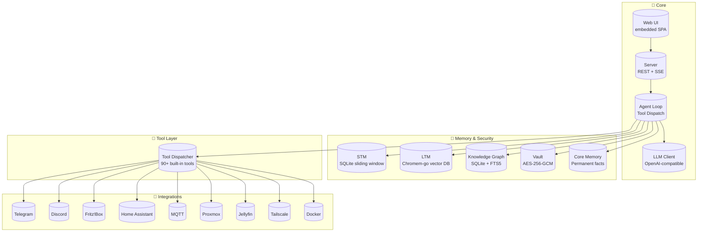

# AuraGo Architecture

> **Note:** This document describes AuraGo v2.x architecture. Diagrams are rendered automatically on GitHub.

## System Overview

## Component Description

### Core Layer
- **Web UI** — Embedded single-page application served via `go:embed`
- **Server** — HTTP/HTTPS server with REST API and SSE streaming
- **Agent Loop** — Core orchestration: message handling, LLM calls, tool dispatch, co-agents
- **LLM Client** — OpenAI-compatible client with failover, retry, and pricing

### Memory & Security
- **STM** — Short-term memory: SQLite sliding-window conversation context
- **LTM** — Long-term memory: Chromem-go vector database for semantic search
- **Knowledge Graph** — Entity-relationship store for structured facts
- **Core Memory** — Permanent facts always included in context
- **Vault** — AES-256-GCM encrypted secret storage

### Tool Layer
- **Tool Dispatcher** — Routes tool calls to 90+ built-in implementations (Shell, Python, Filesystem, HTTP, Docker, SSH, Cron, and more)

### Integrations
- Telegram, Discord, Fritz!Box, Home Assistant, MQTT, Proxmox, Jellyfin, Tailscale, Docker

## Notes

- AuraGo ships as a single Go binary — no external runtime dependencies
- All integrations are optional and configured via `config.yaml`
- See `prompts/tools_manuals/` for detailed tool documentation