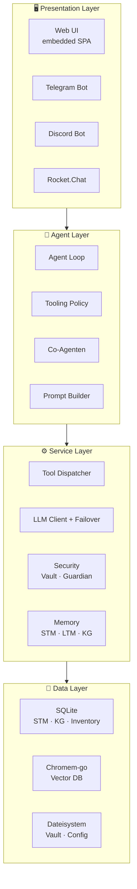
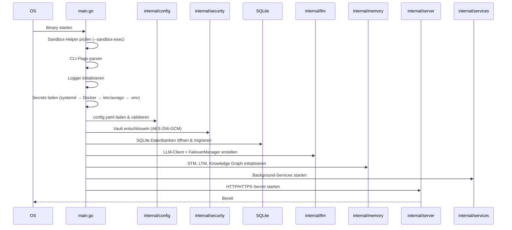
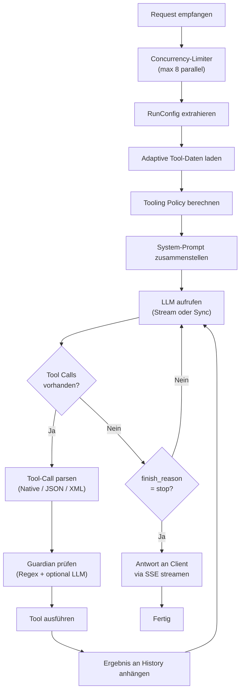
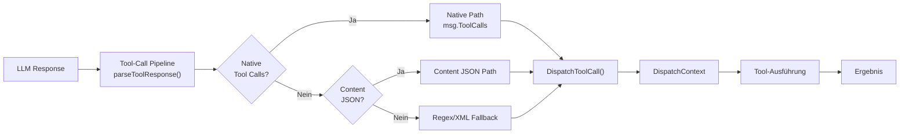
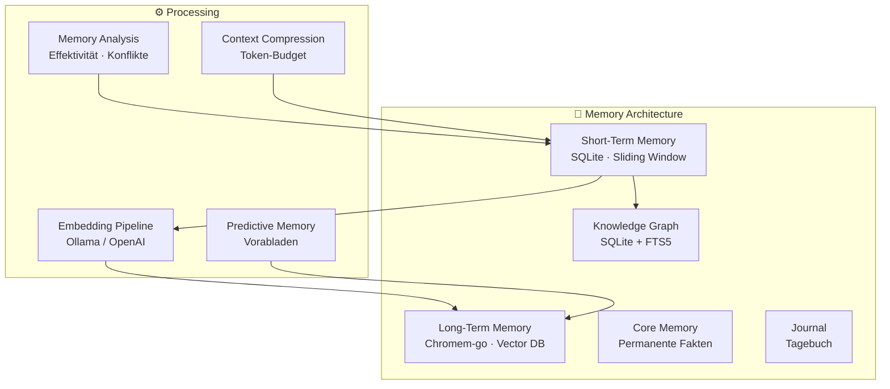
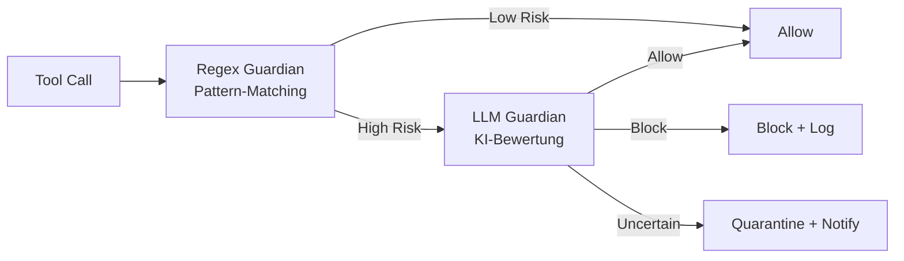
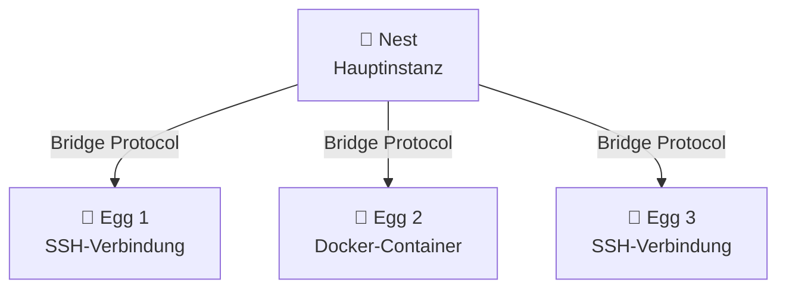
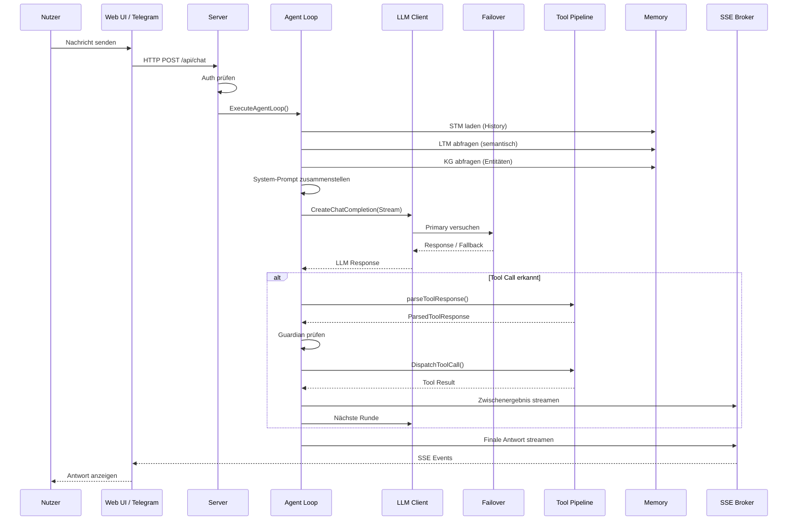
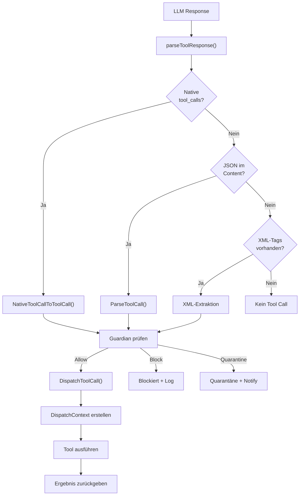
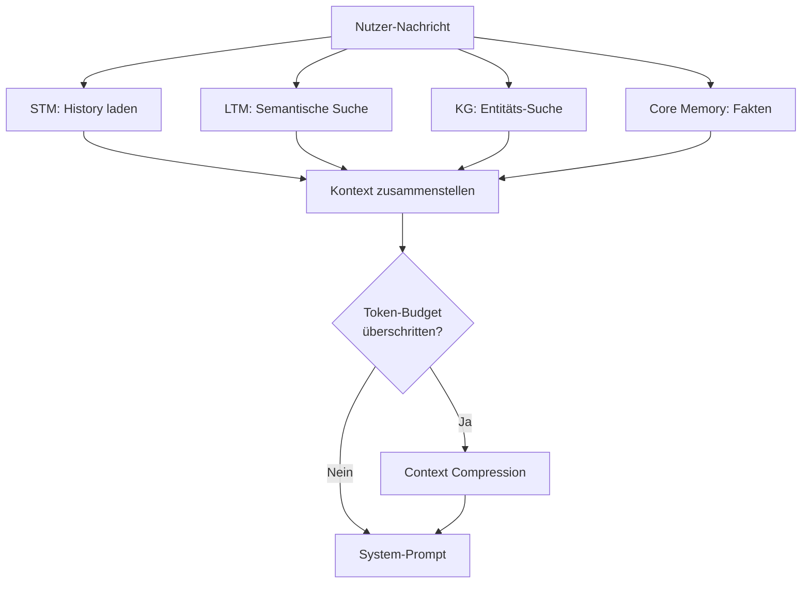

# Kapitel 23: Interna – Die Architektur von AuraGo

> 📅 **Stand:** April 2026  
> 🎯 **Zielgruppe:** Entwickler, Beitragende und fortgeschrittene Nutzer  
> 🔧 **Voraussetzung:** Grundverständnis von Go, SQLite und REST-APIs

Dieses Kapitel beschreibt die interne Arbeitsweise von AuraGo im Detail: alle Module, Komponenten, Datenflüsse und Architektur-Entscheidungen. Es richtet sich an Entwickler, die am Quellcode arbeiten möchten, und an fortgeschrittene Nutzer, die das System tiefgreifend verstehen wollen.

---

## Inhaltsverzeichnis

1. [Systemarchitektur – Überblick](#1-systemarchitektur--überblick)
2. [Startprozess und Initialisierung](#2-startprozess-und-initialisierung)
3. [Der Agent-Loop](#3-der-agent-loop)
4. [Tool-System](#4-tool-system)
5. [Memory-Subsystem](#5-memory-subsystem)
6. [LLM-Client-Schicht](#6-llm-client-schicht)
7. [Prompt-System](#7-prompt-system)
8. [Sicherheitsarchitektur](#8-sicherheitsarchitektur)
9. [Server und API](#9-server-und-api)
10. [Co-Agenten](#10-co-agenten)
11. [Invasion Control](#11-invasion-control)
12. [Remote-Ausführung](#12-remote-ausführung)
13. [Background-Services](#13-background-services)
14. [A2A-Protokoll (Agent-to-Agent)](#14-a2a-protokoll-agent-to-agent)
15. [Budget und Kostenkontrolle](#15-budget-und-kostenkontrolle)
16. [Planner und Automatisierung](#16-planner-und-automatisierung)
17. [Kommunikations-Integrationen](#17-kommunikations-integrationen)
18. [Smart Home und IoT](#18-smart-home-und-iot)
19. [Infrastruktur-Integrationen](#19-infrastruktur-integrationen)
20. [Medien und Content](#20-medien-und-content)
21. [Datenfluss-Diagramme](#21-datenfluss-diagramme)

---

## 1. Systemarchitektur – Überblick

AuraGo folgt einem **Schichtenmodell** mit vier Ebenen:



### Schlüsselprinzipien

| Prinzip | Umsetzung |
|---------|-----------|
| **Single Binary** | Alle Assets via `go:embed` eingebettet, keine externen Abhängigkeiten |
| **Pure Go** | Kein CGO – SQLite via `modernc.org/sqlite`, Cross-Compilation trivial |
| **Goroutine-basiert** | Jeder Request, jeder Co-Agent, jeder Background-Service läuft in eigenen Goroutines |
| **Interface-basiert** | `ChatClient`, `VectorDB`, `FeedbackBroker` – alle Kernkomponenten über Interfaces |
| **Konfigurationsgetrieben** | Alle Features über `config.yaml` aktivierbar/deaktivierbar |

### Nebenläufigkeitsmodell

AuraGo nutzt Go's Concurrency-Primitiven intensiv:

- **`sync.Mutex` / `sync.RWMutex`** – Schutz gemeinsamer Zustände (Vault, History, Caches)
- **`errgroup`** – Parallele Ausführung mit Fehler-Propagation (z.B. Memory-Retrieval)
- **`sync.Once`** – Einmalige Initialisierung (Tool-Category-Map, Tiktoken-Encoder)
- **`sync.Map`** – Concurrent-safe Caches (Tool-Schema-Cache, Prompt-Cache)
- **`singleflight`** – Deduplizierung gleichzeitiger Embedding-Anfragen
- **Channels** – Agent-Loop-Limiter (`maxConcurrentAgentLoops = 8`), Stop-Channels

---

## 2. Startprozess und Initialisierung

Der Startprozess ist in [`cmd/aurago/main.go`](../../cmd/aurago/main.go) implementiert und folgt einer strengen Reihenfolge:



### 2.1 CLI-Flags

| Flag | Beschreibung |
|------|-------------|
| `-debug` | Aktiviert Debug-Logging |
| `-setup` | Ressourcen extrahieren, Service installieren, beenden |
| `-init-only` | Password/HTTPS in Config/Vault setzen, dann beenden |
| `-check-config` | Config-Syntax validieren (für Docker-Entrypoint) |
| `-config <pfad>` | Pfad zur Config-Datei (Standard: `config.yaml`) |
| `-recovery-context` | Base64-Kontext nach Wartung |
| `-https` | HTTPS (Let's Encrypt) aktivieren |
| `-domain` | Domain für Let's Encrypt |
| `-password` | Initiales Login-Passwort setzen |
| `--sandbox-exec` | Sandbox-Helper-Modus (Landlock + exec) |
| `--sandbox-exec-bin` | Sandbox-Exec-Helper-Modus |

### 2.2 Secrets-Ladereihenfolge

Secrets werden in folgender Priorität geladen (jede Stufe setzt nur noch nicht gesetzte Werte):

1. **systemd EnvironmentFile** – bereits in den Umgebungsvariablen
2. **Docker Compose Secret** – `/run/secrets/aurago_master_key`
3. **System Credential File** – `/etc/aurago/master.key`
4. **Lokale `.env`** – `$configDir/.env`

### 2.3 Datenbank-Initialisierung

Alle SQLite-Datenbanken werden über [`internal/dbutil`](../../internal/dbutil/) geöffnet und migriert:

| Datenbank | Zweck |
|-----------|-------|
| `data/aurago.db` | Short-Term Memory, History, Emotionen, Traits |
| `data/inventory.db` | SSH-Geräte-Inventar |
| `data/invasion.db` | Invasion-Control-Knoten |
| `data/cheatsheets.db` | Cheatsheet-Speicher |
| `data/image_gallery.db` | Bildergalerie |
| `data/media_registry.db` | Medien-Registry |
| `data/homepage_registry.db` | Homepage-Projekte |
| `data/contacts.db` | Kontakte/Adressbuch |
| `data/planner.db` | Planner-Aufgaben |
| `data/sql_connections.db` | Externe SQL-Verbindungen |

Migrationen erfolgen automatisch beim Start – das Schema wird bei Bedarf aktualisiert, wobei Änderungen abwärtskompatibel sein müssen.

---

## 3. Der Agent-Loop

Der Agent-Loop ist das Herzstück von AuraGo und in [`internal/agent/agent_loop.go`](../../internal/agent/agent_loop.go) implementiert (~2500 Zeilen). Die zentrale Funktion ist `ExecuteAgentLoop()`.

### 3.1 Ablauf



### 3.2 RunConfig

[`RunConfig`](../../internal/agent/agent_loop.go) bündelt alle Abhängigkeiten, die der Agent-Loop benötigt:

| Feld | Typ | Beschreibung |
|------|-----|-------------|
| `Config` | `*config.Config` | Gesamtkonfiguration |
| `LLMClient` | `llm.ChatClient` | LLM-Client (mit Failover) |
| `ShortTermMem` | `*memory.SQLiteMemory` | Kurzzeitgedächtnis |
| `LongTermMem` | `memory.VectorDB` | Langzeitgedächtnis |
| `KG` | `*memory.KnowledgeGraph` | Wissensgraph |
| `Vault` | `*security.Vault` | Verschlüsselter Tresor |
| `Registry` | `*tools.ProcessRegistry` | Prozess-Registry |
| `CronManager` | `*tools.CronManager` | Cron-Scheduler |
| `CoAgentRegistry` | `*CoAgentRegistry` | Co-Agenten-Registry |
| `BudgetTracker` | `*budget.Tracker` | Kosten-Tracker |
| `Guardian` | `*security.Guardian` | Regex-Guardian |
| `LLMGuardian` | `*security.LLMGuardian` | KI-Guardian |

### 3.3 Multi-Turn-Reasoning

Der Agent-Loop ist ein **Multi-Turn-Reasoning-System**: Er ruft wiederholt das LLM auf, bis eines der folgenden Kriterien erfüllt ist:

- `finish_reason == "stop"` – Das LLM meldet Fertigstellung
- `<done/>`-Tag in der Antwort – Explizites Abschluss-Signal
- Maximale Anzahl von Tool-Call-Runden erreicht
- Kontext abgebrochen (`context.Cancelled`)

### 3.4 Streaming (SSE)

Antworten werden über **Server-Sent Events (SSE)** an den Client gestreamt. Der `FeedbackBroker` abstrahiert den SSE-Mechanismus:

- `broker.Send(event, message)` – Event an Client senden
- `broker.SendJSON(jsonStr)` – JSON-Daten senden
- Unterstützt sowohl synchrone als auch asynchrone Rückgabe

### 3.5 Recovery und Fehlerbehandlung

Das [`RecoveryPolicy`](../../internal/agent/recovery_policy.go)-System steuert das Fehler- und Wiederholungsverhalten:

| Parameter | Standard | Beschreibung |
|-----------|----------|-------------|
| `MaxProvider422Recoveries` | 3 | Max. 422-Fehler-Wiederherstellungen |
| `MinMessagesForEmptyRetry` | 5 | Mindestnachrichten für Empty-Retry |
| `DuplicateConsecutiveHits` | 2 | Max. aufeinanderfolgende Duplikate |
| `DuplicateFrequencyHits` | 3 | Max. Duplikat-Häufigkeit |
| `IdenticalToolErrorHits` | 3 | Max. identische Tool-Fehler |

Zusätzlich gibt es einen `RecoveryClassifier`, der Fehler kategorisiert und entsprechende Gegenmaßnahmen einleitet.

### 3.6 Emotionales Verhalten

Das [`emotionBehavior`](../../internal/agent/emotion_behavior.go)-System passt das Agent-Verhalten basierend auf dem aktuellen emotionalen Zustand an:

- **EmotionState**: Primäre/sekundäre Stimmung, Valenz, Arousal, Konfidenz
- **EmotionSynthesizer**: Berechnet Emotionen aus Konversationsverlauf
- **BehaviorPolicy**: Steuert Prompt-Hinweise und Recovery-Nudges basierend auf Emotionen

---

## 4. Tool-System

Das Tool-System ist die umfangreichste Komponente von AuraGo mit über 100 integrierten Tools.

### 4.1 Architektur



### 4.2 Tool-Kategorien

Tools sind in 7 Kategorien organisiert (definiert in [`tool_categories.go`](../../internal/agent/tool_categories.go)):

| Kategorie | Label | Anzahl Tools |
|-----------|-------|-------------|
| `system` | System & Automation | 16 |
| `files` | Files & Documents | 14 |
| `network` | Network & Web | 15 |
| `media` | Media & Content | 10 |
| `smart_home` | Smart Home & IoT | 13 |
| `infrastructure` | Infrastructure & DevOps | 17 |
| `communication` | Communication & Messaging | 13 |

### 4.3 Native Function Calling

AuraGo verwendet **OpenAI-kompatibles Function Calling** (definiert in [`native_tools.go`](../../internal/agent/native_tools.go)):

- Jedes Tool wird als JSON-Schema mit `name`, `description` und `parameters` definiert
- `ToolFeatureFlags` steuern, welche Tools basierend auf der Konfiguration verfügbar sind
- Tools werden dynamisch gefiltert basierend auf aktivierten Integrationen

### 4.4 Tool-Call-Pipeline

Die [`ToolCallPipeline`](../../internal/agent/tool_call_pipeline.go) verarbeitet LLM-Antworten und extrahiert Tool-Aufrufe:

| Parse-Quelle | Beschreibung |
|-------------|-------------|
| `native` | Standard OpenAI `tool_calls` im API-Response |
| `reasoning_clean_json` | JSON aus Reasoning-Tags extrahiert |
| `content_json` | JSON direkt im Content-Feld |

Die Pipeline erkennt auch:
- **Bare Tool-Call Tags** – Modelle, die nur `<tool_call/>` ohne Body emittieren
- **Incomplete Tool Calls** – Unvollständige JSON-Strukturen
- **Orphaned Tags** – `[TOOL_CALL]` ohne schließendes Tag

### 4.5 Tooling Policy

Die [`ToolingPolicy`](../../internal/agent/tooling_policy.go) bestimmt das Laufzeitverhalten:

- **ModelCapabilities**: Provider-spezifische Eigenheiten (Ollama, DeepSeek, Anthropic, etc.)
- **Adaptive Tools**: Nutzungsbasierte Tool-Filterung spart Tokens
- **Telemetry Profile**: Konservative Profile bei hoher Fehlerrate
- **Structured Outputs**: Modellabhängige Unterstützung

### 4.6 Dispatch Context

Der [`DispatchContext`](../../internal/agent/dispatch_context.go) bündelt alle Abhängigkeiten, die für die Tool-Ausführung benötigt werden. Er ersetzt die früheren 30+ einzelnen Funktionsparameter:

```go
type DispatchContext struct {
    Cfg, Logger, LLMClient, Vault, Registry, Manifest,
    CronManager, MissionManagerV2, LongTermMem, ShortTermMem,
    KG, InventoryDB, InvasionDB, CheatsheetDB, ImageGalleryDB,
    MediaRegistryDB, HomepageRegistryDB, ContactsDB, PlannerDB,
    SQLConnectionsDB, SQLConnectionPool, RemoteHub, HistoryMgr,
    Guardian, LLMGuardian, CoAgentRegistry, BudgetTracker,
    DaemonSupervisor, ...
}
```

### 4.7 Adaptive Tools

Das Adaptive-Tools-System lernt aus der Tool-Nutzung und optimiert den System-Prompt:

1. **Nutzungsdaten sammeln**: Jeder Tool-Aufruf wird gezählt (Erfolg/Misserfolg)
2. **Persistenz**: Daten werden in SQLite gespeichert und beim Neustart geladen
3. **Dynamische Guides**: Tool-Guides werden basierend auf Nutzungshäufigkeit ein-/ausgeblendet
4. **Session-basierte Expansion**: In einer Session verwendete Tools werden immer eingebunden

---

## 5. Memory-Subsystem

Das Memory-Subsystem besteht aus mehreren spezialisierten Speichersystemen:



### 5.1 Short-Term Memory (STM)

Die STM ist in [`internal/memory/short_term.go`](../../internal/memory/short_term.go) implementiert und nutzt SQLite als Speicher-Backend:

- **Sliding Window**: Nur die letzten N Nachrichten werden im Kontext gehalten
- **HistoryManager** ([`history.go`](../../internal/memory/history.go)): Verwaltet die Konversations-Historie mit:
  - `HistoryMessage`: Erweitert `openai.ChatCompletionMessage` um `Pinned`, `IsInternal`, `ID`
  - **Pinned Messages**: Wichtige Nachrichten werden nicht vom Sliding Window entfernt
  - **Ephemeral Mode**: Co-Agenten nutzen einen separaten HistoryManager mit `maxEphemeralMessages = 200`
- **Emotionen**: Aktuelle Emotionen werden in der STM gespeichert
- **Traits**: Persönlichkeitsmerkmale werden persistiert

### 5.2 Long-Term Memory (LTM)

Die LTM nutzt **chromem-go** als eingebettete Vektordatenbank ([`long_term.go`](../../internal/memory/long_term.go)):

- **Collections**: Dokumente werden in benannten Collections gespeichert (`aurago_memories`, `tool_guides`, `documentation`, etc.)
- **Embeddings**: Generiert über Ollama oder OpenAI, mit Batch-Verarbeitung
- **Query Cache**: Embedding-Cache mit TTL für wiederkehrende Suchen
- **Singleflight**: Deduplizierung gleichzeitiger Embedding-Anfragen
- **Cheatsheet-Integration**: Cheatsheets werden mit Auto-Chunking gespeichert

Das `VectorDB`-Interface bietet:
- `StoreDocument` / `StoreDocumentWithEmbedding` – Speichern
- `SearchSimilar` – Semantische Suche
- `SearchMemoriesOnly` – Leichtgewichtige Nur-Memories-Suche
- `StoreBatch` – Batch-Archivierung

### 5.3 Knowledge Graph

Der Knowledge Graph ([`graph_sqlite.go`](../../internal/memory/graph_sqlite.go)) speichert strukturierte Fakten:

- **SQLite + FTS5**: Volltextsuche über Entitäten und Relationen
- **Semantic Graph** ([`graph_semantic.go`](../../internal/memory/graph_semantic.go)): Semantische Beziehungen
- **Explore** ([`graph_explore.go`](../../internal/memory/graph_explore.go)): Graph-Traversierung

### 5.4 Core Memory

Core Memory speichert permanente Fakten, die **immer** im System-Prompt enthalten sind. Diese werden über das `remember`-Tool verwaltet.

### 5.5 Memory Analysis

Das System analysiert kontinuierlich die Memory-Qualität:

- [`memory_effectiveness.go`](../../internal/agent/memory_effectiveness.go) – Misst die Effektivität gespeicherter Erinnerungen
- [`memory_conflicts.go`](../../internal/agent/memory_conflicts.go) – Erkennt widersprüchliche Erinnerungen
- [`memory_priority.go`](../../internal/agent/memory_priority.go) – Priorisiert Erinnerungen nach Wichtigkeit
- [`memory_ranking.go`](../../internal/agent/memory_ranking.go) – Rangordnung mit Ranking-Cache
- [`memory_retrieval_policy.go`](../../internal/agent/memory_retrieval_policy.go) – Steuert die Retrieval-Strategie

### 5.6 Predictive Memory

[`predictive_memory.go`](../../internal/agent/predictive_memory.go) lädt proaktiv relevante Erinnerungen vor, bevor sie benötigt werden – basierend auf dem aktuellen Konversationskontext.

### 5.7 Context Compression

[`context_compression.go`](../../internal/agent/context_compression.go) verdichtet den Konversationskontext, wenn das Token-Budget überschritten wird. Ältere Nachrichten werden zusammengefasst, wichtige beibehalten.

---

## 6. LLM-Client-Schicht

### 6.1 ChatClient-Interface

Das zentrale Interface in [`internal/llm/interface.go`](../../internal/llm/interface.go):

```go
type ChatClient interface {
    CreateChatCompletion(ctx context.Context, 
        request openai.ChatCompletionRequest) (openai.ChatCompletionResponse, error)
    CreateChatCompletionStream(ctx context.Context, 
        request openai.ChatCompletionRequest) (*openai.ChatCompletionStream, error)
}
```

Alle Komponenten, die mit dem LLM kommunizieren, nutzen dieses Interface – so kann der Failover-Layer injiziert werden, ohne Aufrufstellen zu ändern.

### 6.2 FailoverManager

Der [`FailoverManager`](../../internal/llm/failover.go) verwaltet Primary/Fallback-LLM-Verbindungen:

- **Health Probes**: Prüft alle 60 Sekunden die Verfügbarkeit des Primary
- **Error Threshold**: Nach 3 aufeinanderfolgenden Fehlern wird auf Fallback gewechselt
- **Generation-Tracking**: Verhindert veraltete Responses nach Konfigurationsänderungen
- **Automatische Rückkehr**: Wenn der Primary wieder gesund ist, wird automatisch zurückgewechselt

### 6.3 Retry-Logik

Die Retry-Logik in [`retry.go`](../../internal/llm/retry.go) implementiert:

- **Exponential Backoff**: Wachsende Wartezeit zwischen Versuchen
- **Error-Klassifikation**: Unterscheidet zwischen transienten und permanenten Fehlern
- **Per-Attempt Timeout**: Konfigurierbares Timeout pro LLM-Aufruf

### 6.4 Provider-System

AuraGo unterstützt mehrere Provider-Typen:

| Provider | Transport | Besonderheiten |
|----------|-----------|---------------|
| `openrouter` | Standard OpenAI API | Kredit-System, viele Modelle |
| `openai` | OpenAI API direkt | DALL-E, GPT-4, etc. |
| `anthropic` | Eigener Transport | [`anthropic_transport.go`](../../internal/llm/anthropic_transport.go) |
| `ollama` | Lokale API | Embedding-Provider, Modell-Verwaltung |
| `custom` | Beliebige OpenAI-kompatible API | Konfigurierbare Base URL |

### 6.5 Modellfähigkeiten

Die [`ModelCapabilities`](../../internal/agent/tooling_policy.go) zentralisieren provider-spezifische Eigenheiten:

| Fähigkeit | Beschreibung |
|-----------|-------------|
| `AutoEnableNativeFunctions` | Automatisch Function Calling aktivieren |
| `SupportsStructuredOutputs` | Strukturierte JSON-Outputs |
| `SupportsParallelToolCalls` | Parallele Tool-Aufrufe |
| `DisableNativeFunctionCalling` | Erzwingt JSON-Text-Modus (z.B. GLM, MiniMax) |
| `IsOllama` / `IsDeepSeek` / `IsAnthropic` | Provider-spezifische Pfade |

### 6.6 Token-Tracking

- [`token_accounting.go`](../../internal/agent/token_accounting.go) – Token-Verbrauch pro Runde tracken
- [`token_count_cache.go`](../../internal/agent/token_count_cache.go) – Cache für Token-Zählungen
- [`pricing.go`](../../internal/llm/pricing.go) – Kostenberechnung pro Provider/Modell

---

## 7. Prompt-System

### 7.1 Prompt Builder

Der [`PromptBuilder`](../../internal/prompts/builder.go) (~1345 Zeilen) baut den System-Prompt dynamisch zusammen:

1. **Module laden**: Identität, Regeln, Persönlichkeit, Tool-Guides, Kontext
2. **Caching**: Datei-basiertes Cache mit ModTime-Invalidierung
3. **Token-Budget**: Jedes Modul bekommt ein Token-Budget zugewiesen
4. **Dynamische Guides**: Tool-Guides basierend auf Nutzung und Relevanz

### 7.2 Prompt-Module

Das System in [`builder_modules.go`](../../internal/prompts/builder_modules.go) verwaltet einzelne Prompt-Bausteine:

| Modul | Quelle | Beschreibung |
|-------|--------|-------------|
| Identität | `prompts/identity.md` | Kern-Identität des Agenten |
| Regeln | `prompts/rules.md` | Verhaltensregeln |
| Persönlichkeit | `prompts/personalities/` | Aktive Persönlichkeits-Profile |
| Tool-Guides | `prompts/tools_manuals/` | Tool-Dokumentation für RAG |
| Kontext | Dynamisch | Memory, Emotionen, Situativer Kontext |

### 7.3 Token-Zählung

Die Tiktoken-Bibliothek wird für Token-Zählung verwendet:

- **BPE-Encoder**: Wird einmal initialisiert (`sync.Once`)
- **Fallback**: Wenn der Encoder nicht geladen werden kann, wird `len(text) / 4` als Schätzung verwendet
- **Budget-Steuerung**: [`prompt_budget.go`](../../internal/config/prompt_budget.go) verteilt Token-Budgets auf Module

### 7.4 Dynamic Guide Strategy

Tool-Guides werden dynamisch adaptiert:

- **Strategien**: `all` (alle Guides), `adaptive` (nutzungsbasiert), `none` (keine Guides)
- **RAG-Indexierung**: Guides sind in der Vector-DB indiziert für semantische Suche
- **On-Demand Loading**: `get_tool_info` lädt Guides bei Bedarf nach

---

## 8. Sicherheitsarchitektur

### 8.1 Vault

Der [`Vault`](../../internal/security/vault.go) speichert Secrets verschlüsselt:

- **Algorithmus**: AES-256-GCM (Authenticated Encryption)
- **Master Key**: 32 Bytes (64 Hex-Zeichen), geladen aus `AURAGO_MASTER_KEY`
- **Speicherung**: `data/vault.bin` – verschlüsselte JSON-Map
- **File Locking**: `flock` verhindert gleichzeitige Schreibzugriffe
- **Operationen**: `Store()`, `Retrieve()`, `Delete()`, `List()`

### 8.2 LLM Guardian

Der [`LLMGuardian`](../../internal/security/llm_guardian.go) ist eine KI-gestützte Sicherheitsüberwachung:



**GuardianLevel** steuert die Intensität:

| Level | Verhalten |
|-------|-----------|
| `Off` | Keine LLM-Prüfungen |
| `Low` | Nur High-Risk-Tools |
| `Medium` | Alle Tools + externe APIs |
| `High` | Jeder Tool-Call wird geprüft |

**GuardianResult** enthält:
- `Decision`: allow / block / quarantine
- `RiskScore`: 0.0 – 1.0
- `Reason`: Begründung
- `Cached`: Ob das Ergebnis aus dem Cache stammt

### 8.3 Regex Guardian

Der [`Guardian`](../../internal/security/guardian.go) nutzt Pattern-Matching für schnelle Vorab-Prüfungen:

- **ThreatLevel**: Klassifizierung der Bedrohungsstufe
- **PromptSec**: Prompt-Injection-Erkennung (Preset, Spotlight, Canary)
- **MaxScanBytes**: Begrenzung der gescannten Datenmenge

### 8.4 SSRF-Schutz

[`ssrf.go`](../../internal/security/ssrf.go) verhindert Server-Side Request Forgery:

- Interne Netzwerk-Blockliste (127.0.0.0/8, 10.0.0.0/8, 192.168.0.0/16, etc.)
- URL-Validierung vor HTTP-Requests
- Metadata-Endpoint-Blockierung (169.254.169.254)

### 8.5 Scrubber

[`scrubber.go`](../../internal/security/scrubber.go) entfernt sensible Daten aus Logs und LLM-Outputs:

- `RegisterSensitive(value)` – Wert als sensibel markieren
- Automatische Ersetzung in allen Outputs
- Verhindert, dass API-Keys, Passwörter etc. in Logs erscheinen

### 8.6 Sandbox

Die Sandbox in [`internal/sandbox/`](../../internal/sandbox/) isoliert Code-Ausführung:

- **Linux**: Landlock + rlimits für Dateisystem- und Ressourcen-Isolation
- **Andere OS**: Prozess-basierte Isolation mit Timeout
- **Python venv**: Isolierte virtuelle Umgebung für Python-Ausführung
- **Docker-Sandbox**: Optional vollständige Container-Isolation

---

## 9. Server und API

### 9.1 HTTP-Server

Der Server ist in [`internal/server/server.go`](../../internal/server/server.go) implementiert (~1040 Zeilen):

- **Standard Library**: `net/http` mit Gorilla-Mux-Patterns
- **Embedded UI**: Web-UI via `go:embed` direkt ins Binary
- **TLS/HTTPS**: Automatisches Let's Encrypt via `golang.org/x/crypto/acme`
- **Loopback-URL**: `InternalAPIURL()` – einheitliche interne API-URL

### 9.2 REST API

Die API-Handler sind in [`internal/server/`](../../internal/server/) organisiert (~95 Handler-Dateien):

| Handler-Datei | Zuständig für |
|---------------|-------------|
| `handlers.go` | Chat, System-Endpoints |
| `auth_handlers.go` | Login, Session-Management |
| `config_handlers.go` | Konfiguration lesen/schreiben |
| `vault_handlers.go` | Vault-Operationen |
| `sse.go` | Server-Sent Events |
| `invasion_handlers.go` | Invasion Control |
| `mission_v2_handlers.go` | Mission Control |
| `mcp_handlers.go` | MCP-Server |
| `setup_handlers.go` | Setup-Wizard |
| `tool_bridge_handlers.go` | Tool-Status |

### 9.3 SSE (Server-Sent Events)

[`sse.go`](../../internal/server/sse.go) implementiert das Streaming:

- **Broker-Pattern**: Zentraler Broker verteilt Events an alle verbundenen Clients
- **Event-Typen**: `message`, `tool_call`, `tool_result`, `error`, `done`
- **Adapter**: `sse_broker_adapter.go` verbindet Agent-Loop mit SSE-Infrastruktur

### 9.4 i18n

Die Internationalisierung erfolgt über [`internal/i18n/`](../../internal/i18n/):

- 15 Sprachen: cs, da, de, el, en, es, fr, hi, it, ja, nl, no, pl, pt, sv, zh
- JSON-basierte Übersetzungsdateien in `ui/lang/`
- Automatische Spracherkennung und Fallback auf Englisch

---

## 10. Co-Agenten

Co-Agenten ermöglichen parallele Agenten-Ausführung für spezialisierte Aufgaben.

### 10.1 Architektur

Implementiert in [`internal/agent/coagent.go`](../../internal/agent/coagent.go) (~850 Zeilen):

- **CoAgentRegistry**: Verwaltet aktive Co-Agenten
- **CoAgentRequest**: Task-Beschreibung mit Specialist, Priority, ContextHints
- **Eigener LLM-Client**: Co-Agenten können einen separaten Provider/Modell nutzen

### 10.2 Specialist-Rollen

| Specialist | Einsatzgebiet |
|-----------|--------------|
| `researcher` | Recherche, Informationsbeschaffung |
| `coder` | Code-Entwicklung, Debugging |
| `designer` | UI/UX, visuelle Gestaltung |
| `security` | Sicherheitsanalyse |
| `writer` | Texterstellung, Dokumentation |

### 10.3 Broker-System

Jeder Co-Agent hat einen eigenen `coAgentBroker`, der Events an die Registry weiterleitet. Die Registry zeichnet alle Events auf und macht sie für das Dashboard verfügbar.

---

## 11. Invasion Control

Invasion Control ist das System für verteiltes Deployment von AuraGo-Instanzen.

### 11.1 Architektur



### 11.2 Komponenten

| Datei | Zweck |
|-------|-------|
| [`invasion.go`](../../internal/invasion/invasion.go) | Kernlogik |
| [`connector.go`](../../internal/invasion/connector.go) | Connector-Interface |
| [`connector_ssh.go`](../../internal/invasion/connector_ssh.go) | SSH-Connector |
| [`connector_docker.go`](../../internal/invasion/connector_docker.go) | Docker-Connector |
| [`eggconfig.go`](../../internal/invasion/eggconfig.go) | Egg-Konfiguration |
| [`vault_export.go`](../../internal/invasion/vault_export.go) | Sichere Vault-Übertragung |
| [`bridge/hub.go`](../../internal/invasion/bridge/hub.go) | Kommunikations-Hub |
| [`bridge/protocol.go`](../../internal/invasion/bridge/protocol.go) | Bridge-Protokoll |

### 11.3 Bridge-Protokoll

Das Bridge-Protokoll ermöglicht die Kommunikation zwischen Nest und Eggs:

- **Hub**: Zentraler Kommunikationsknoten
- **Protocol**: Nachrichtenformat für Befehle und Responses
- **Client**: Egg-seitiger Client

---

## 12. Remote-Ausführung

### 12.1 RemoteHub

[`internal/remote/`](../../internal/remote/) verwaltet SSH-Verbindungen zu Remote-Geräten:

- **RemoteHub**: Zentrale Verwaltung aller SSH-Verbindungen
- **Protocol**: Binäres Protokoll für Remote-Kommandos
- **Inventory**: SQLite-basierte Geräteverwaltung in `data/inventory.db`

### 12.2 Remote Agent

[`cmd/remote/`](../../cmd/remote/) ist ein eigenständiger Remote-Execution-Agent:

- Empfängt Befehle über SSH
- Führt sie isoliert aus
- Sendet Ergebnisse zurück
- Plattform-spezifische Service-Integration (Linux, macOS, Windows)

---

## 13. Background-Services

### 13.1 File Indexer

[`internal/services/indexer.go`](../../internal/services/indexer.go) indiziert Dateien für die semantische Suche:

- Durchsucht konfigurierte Verzeichnisse
- Erstellt Embeddings und speichert sie in der Vector-DB
- Trackt Änderungen via File-ModTime

### 13.2 Knowledge Graph Extraction

[`internal/kgextraction/`](../../internal/kgextraction/) extrahiert automatisch Entitäten und Beziehungen:

- **Confidence Scoring**: Konfidenzbewertung für extrahierte Fakten
- **File KG Sync**: Synchronisiert Dateiänderungen in den Knowledge Graph

### 13.3 Mission Preparation

[`internal/services/mission_preparation.go`](../../internal/services/mission_preparation.go) bereitet langlaufende Missionen vor:

- Datenbank-Schema für Missionen
- Typ-Definitionen für Mission-Parameter

### 13.4 Optimizer

[`internal/services/optimizer/`](../../internal/services/optimizer/) optimiert kontinuierlich:

- Index-Qualität
- Embedding-Effizienz
- Speicherplatz

---

## 14. A2A-Protokoll (Agent-to-Agent)

Das A2A-Protokoll in [`internal/a2a/`](../../internal/a2a/) ermöglicht Inter-Agent-Kommunikation:

| Komponente | Datei | Beschreibung |
|-----------|-------|-------------|
| **Server** | `server.go` | A2A-Server-Implementierung |
| **Client** | `client.go` | A2A-Client für ausgehende Verbindungen |
| **gRPC** | `grpc.go` | Binäres Protokoll für A2A |
| **Auth** | `auth.go` | Authentifizierung zwischen Agenten |
| **Tasks** | `tasks.go` | Aufgabenverteilung und -verfolgung |
| **Card** | `card.go` | Agent-Karten (Fähigkeiten, Endpunkte) |
| **Executor** | `executor.go` | Aufgabenausführung |
| **Bridge** | `bridge.go` | Integration in den Agent-Loop |

---

## 15. Budget und Kostenkontrolle

### 15.1 Budget Tracker

[`internal/budget/tracker.go`](../../internal/budget/tracker.go) verfolgt Token-Verbrauch und Kosten:

- Pro-Session-Tracking
- Kumulierte Kosten über alle Sessions
- Provider-spezifische Preisberechnung

### 15.2 OpenRouter Credits

[`openrouter_credits.go`](../../internal/llm/openrouter_credits.go) fragt den aktuellen Kreditstand bei OpenRouter ab.

---

## 16. Planner und Automatisierung

### 16.1 Planner

[`internal/planner/planner.go`](../../internal/planner/planner.go) verwaltet mehrstufige Ausführungspläne:

- Pläne mit einzelnen Schritten
- Abhängigkeiten zwischen Schritten
- Persistenz in `data/planner.db`
- Benachrichtigungen bei Abschluss ([`notifier.go`](../../internal/planner/notifier.go))

### 16.2 Cron Manager

[`internal/tools/cron.go`](../../internal/tools/cron.go) verwaltet zeitgesteuerte Aufgaben:

- Erstellt mit `github.com/robfig/cron/v3`
- CRUD-Operationen für Cron-Jobs
- Pause/Resume-Funktionalität
- Loopback-HTTP-Ausführung

### 16.3 Daemon Supervisor

[`internal/tools/daemon_supervisor.go`](../../internal/tools/daemon_supervisor.go) verwaltet Hintergrundprozesse:

- Starten/Stoppen von Daemonen
- Automatischer Neustart bei Absturz
- Wakeup-Gate für kontrollierte Aktivierung

### 16.4 Follow-Up & Wait-for-Event

- **Follow-Up** ([`background_tasks.go`](../../internal/tools/background_tasks.go)): Plant autonome Hintergrundaufgaben
- **Wait-for-Event** ([`background_process_supervisor.go`](../../internal/tools/background_process_supervisor.go)): Wartet auf Prozessende, HTTP-Endpoint oder Datei-Event

---

## 17. Kommunikations-Integrationen

### 17.1 Telegram Bot

[`internal/telegram/`](../../internal/telegram/) – Vollständige Telegram-Integration:

- Text, Voice, Vision (Bildanalyse)
- Bot-API via `github.com/go-telegram-bot-api/telegram-bot-api/v5`
- Long-Polling für Nachrichtenempfang

### 17.2 Discord Bot

[`internal/discord/bot.go`](../../internal/discord/bot.go) – Discord-Integration:

- Gateway-Verbindung via `github.com/bwmarrin/discordgo`
- Text-Nachrichten senden/empfangen

### 17.3 Rocket.Chat

[`internal/rocketchat/`](../../internal/rocketchat/) – Rocket.Chat-Integration für Team-Chat.

### 17.4 Telnyx

[`internal/telnyx/`](../../internal/telnyx/) – SMS und Voice über Telnyx-API:

- SMS senden/empfangen
- Anrufe tätigen/verwalten
- Telefonnummern-Verwaltung

### 17.5 Push Notifications

[`internal/push/manager.go`](../../internal/push/manager.go) – Push-Benachrichtigungen an mobile Geräte.

---

## 18. Smart Home und IoT

### 18.1 Fritz!Box

[`internal/fritzbox/`](../../internal/fritzbox/) – Umfassende Fritz!Box-Integration:

| Service | Datei | Beschreibung |
|---------|-------|-------------|
| System | `service_system.go` | Systeminfo, Logs, Reboot |
| Netzwerk | `service_network.go` | Geräte, Port-Forwarding, WLAN |
| Telefonie | `service_telephony.go` | Anrufliste, Telefonbuch, DECT |
| Smart Home | `service_smarthome.go` | Thermostate, Schalter, Sensoren |
| Storage | `service_storage.go` | NAS/USB-Speicher |
| TV | `service_tv.go` | TV-Streaming, EPG |
| Auth | `digest_auth.go`, `sid_auth.go` | Digest- und SID-Authentifizierung |

### 18.2 Home Assistant

[`internal/tools/homeassistant.go`](../../internal/tools/homeassistant.go) – Home Assistant Integration:

- Poller-basiert: Regelmäßiges Abrufen von Gerätezuständen
- Steuerung von Lights, Switches, Sensors, etc.

### 18.3 MQTT

[`internal/mqtt/client.go`](../../internal/mqtt/client.go) – MQTT Publish/Subscribe:

- Verbindungsmanagement mit automatischem Reconnect
- Topic-Abonnements verwalten
- Nachrichtencache für abgerufene Messages

### 18.4 Wyoming

[`internal/tools/wyoming.go`](../../internal/tools/wyoming.go) – Wyoming Voice Assistant Protokoll für lokale Sprachassistenten.

---

## 19. Infrastruktur-Integrationen

### 19.1 Docker

[`internal/tools/docker.go`](../../internal/tools/docker.go) + [`docker_management.go`](../../internal/tools/docker_management.go):

- Container-Verwaltung (List, Start, Stop, Logs, Exec)
- Docker Compose-Unterstützung
- Plattform-spezifische Named-Pipe-Anbindung (Windows vs. Unix)

### 19.2 Proxmox

[`internal/tools/proxmox.go`](../../internal/tools/proxmox.go) – Proxmox VE Integration:

- VMs und Container verwalten
- Start, Stop, Clone, Snapshot

### 19.3 Tailscale

[`internal/tsnetnode/tsnetnode.go`](../../internal/tsnetnode/tsnetnode.go) – Eingebetteter Tailscale-Node:

- tsnet-basierte VPN-Integration
- Kein separater Tailscale-Client nötig

### 19.4 Cloudflare Tunnel

[`internal/tools/cloudflare_tunnel.go`](../../internal/tools/cloudflare_tunnel.go) – Sicherer Remote-Zugriff ohne öffentliche IP.

### 19.5 Homepage

[`internal/tools/homepage.go`](../../internal/tools/homepage.go) – Homepage Dashboard Builder:

- Projekt-Erstellung und -Verwaltung
- Git-Integration für Deployment
- Proxy für lokale Entwicklung
- Revision-Management

### 19.6 Weitere Infrastruktur-Tools

| Tool | Datei | Beschreibung |
|------|-------|-------------|
| Ansible | `ansible.go` | Ansible Playbooks ausführen |
| GitHub | `github.go` | Repos, Issues, PRs, Actions |
| S3 | `s3.go` | AWS S3 Buckets und Objekte |
| TrueNAS | `truenas.go` | Pools, Datasets, Snapshots |
| Netlify | `netlify.go` | Sites deployen und verwalten |
| MeshCentral | `meshcentral.go` | Remote Desktop |
| Ollama | `ollama.go` | Lokale LLM-Modelle verwalten |

---

## 20. Medien und Content

### 20.1 Jellyfin

[`internal/jellyfin/`](../../internal/jellyfin/) – Jellyfin Media Server:

- Client-Verbindung (`client.go`)
- Medien-Bibliotheken (`media.go`)
- Sitzungs-Verwaltung (`sessions.go`)
- System-Info (`system.go`)

### 20.2 Chromecast

[`internal/tools/chromecast.go`](../../internal/tools/chromecast.go) – Medien an Cast-Geräte senden.

### 20.3 TTS / Piper

[`internal/tools/tts.go`](../../internal/tools/tts.go) + [`piper_tts.go`](../../internal/tools/piper_tts.go):

- Text-to-Speech mit mehreren Backends
- Piper als lokaler TTS-Provider
- Audio-Datei-Erstellung und Versand

### 20.4 Image Generation

[`internal/tools/image_generation.go`](../../internal/tools/image_generation.go) – Multi-Provider Bildgenerierung:

| Provider | Datei |
|----------|-------|
| OpenAI DALL-E | `image_gen_openai.go` |
| OpenRouter | `image_gen_openrouter.go` |
| Google Imagen | `image_gen_google.go` |
| Ideogram | `image_gen_ideogram.go` |
| MiniMax | `image_gen_minimax.go` |
| Stable Diffusion | `image_gen_stability.go` |

### 20.5 Music Generation

[`internal/tools/music_generation.go`](../../internal/tools/music_generation.go) – KI-basierte Musikgenerierung.

### 20.6 Media Registry

[`internal/tools/media_registry.go`](../../internal/tools/media_registry.go) – Verwaltung lokaler Mediendateien mit Suche und Metadaten.

---

## 21. Datenfluss-Diagramme

### 21.1 Kompletter Request-Lebenszyklus



### 21.2 Tool-Call-Dispatch-Flow



### 21.3 Memory-Retrieval-Flow



---

## Zusammenfassung

AuraGo ist ein modular aufgebautes System, bei dem jede Komponente eine klar definierte Verantwortung hat:

| Schicht | Kernmodule | Primäre Aufgabe |
|---------|-----------|----------------|
| **Presentation** | Server, Telegram, Discord | Nutzer-Interaktion |
| **Agent** | Agent Loop, Tooling Policy, Co-Agenten | Orchestrierung und Reasoning |
| **Service** | Tool Dispatcher, LLM Client, Security | Ausführung und Schutz |
| **Data** | SQLite, Chromem-go, Vault | Persistenz und Speicher |

Das System ist darauf ausgelegt, **vollständig autonom** zu operieren, während es durch mehrschichtige Sicherheitsmechanismen (Vault, Guardian, SSRF-Schutz, Sandbox) vor Fehlverhalten geschützt wird.

---

*Dieses Kapitel wird mit dem Code-Stand synchronisiert. Bei Fragen oder Unstimmigkeiten sollte immer der Quellcode in `internal/` als Referenz dienen.*
