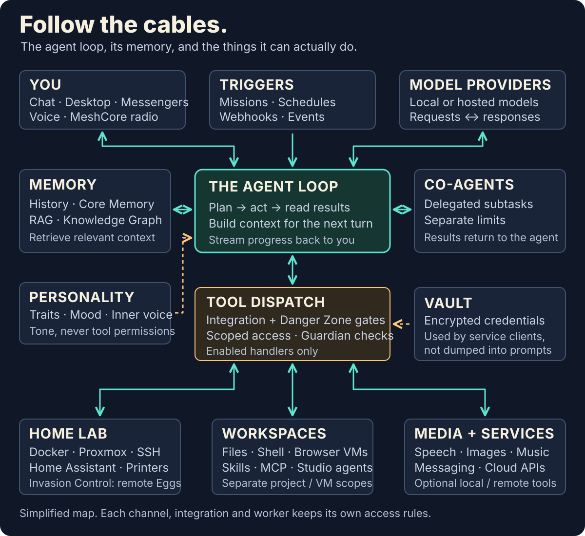

# Chapter 1: Introduction

<p align="center">
  <a href="../images/manual-hero.webp"></a>
</p>

AuraGo is not a chat box with plugins. It is a self-hosted Go agent that lives on your machine, runs tools and remembers what you already talked about.

The executable is portable. The **full web UI** sits beside it as a matching local resource set. The binary keeps a small recovery/login page. A plain `go build` without asset flags is recovery on purpose — not the whole app. Details: [web assets](../../web-assets.md).

Connect an OpenAI-compatible model (hosted or local). Enable the integrations you actually want. Leave the rest off.

## What it can do

- **Think and follow through** — several tool rounds, read the error, try again
- **Run code** — Python and shell, if you open the Danger Zone
- **Files in the workspace** — read, write, search. Not `config.yaml` or `data/`
- **Touch the home lab** — Docker, Proxmox, SSH, Home Assistant, cameras, printers
- **Talk** — web chat, Telegram, Discord, email, SIP, Speech Lab, MeshCore
- **Remember** — history, core facts, RAG, knowledge graph, notes
- **Autopilot** — missions, co-agents, eggs on nests
- **Make things** — documents, images, music, sites, offline games in Game Maker

It does not “improve its own source code” because it is friendly. Self-update and workspace writes are separate, switchable capabilities.

## Who it is for

A home lab, a NAS closet, someone who wants an agent next to Docker and Home Assistant. Developers who will hand reviews and automation to a machine with permissions. Less so: a hosted SaaS product or a research framework.

The UI speaks 16 languages. Personalities change the attitude, not the permissions.

<p align="center">
  <a href="../../../assets/readme/persona-party.webp"></a>
</p>

[Personalities](10-personality.md) · [AgoDesk](https://github.com/antibyte/agodesk) if you want to skip the browser.

## The wiring

[](../../../assets/readme/system-wiring.svg)

```
Channels / missions
        │
        ▼
   Agent loop  ──  model (provider or local)
        │
        ├── memory (STM, core, RAG, graph)
        ├── co-agents
        └── tools (only what Config allows)
                │
                └── vault for secrets, never as prompt fodder
```

Personality sits on tone. Guardian and the Danger Zone sit on the tools.

## Safety before you start

> AuraGo runs code on **your** system. A VM, Docker or a dedicated box is the sensible default. A misunderstood prompt plus an open shell is not a theoretical risk.

> Do not hang the web UI naked on the internet. Use a VPN (Tailscale, WireGuard), a reverse proxy with auth, or the built-in login plus 2FA.

File tools stay inside `agent_workspace`. `../../config.yaml` and `data/` fail on purpose. More: [Chapter 14](14-security.md).

## Next steps

1. **[Installation](02-installation.md)** — binary, Docker or source, plus the resource set
2. **[Quick start](03-quickstart.md)** — setup, first chat, harmless commands
3. **[Web UI](04-webui.md)** — chat, desktop, Config

> Tip: start with the web UI. Ask for system information, not for the config file.
