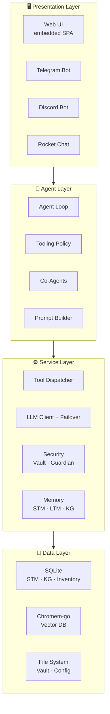
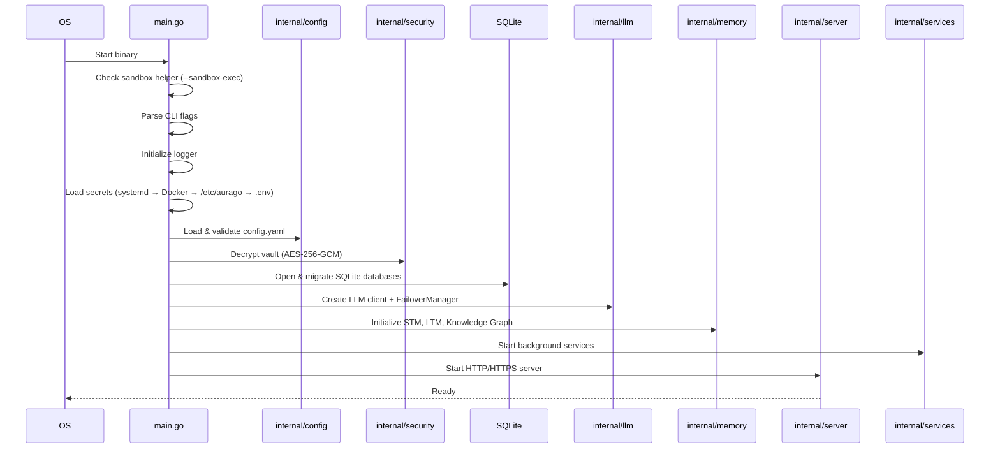
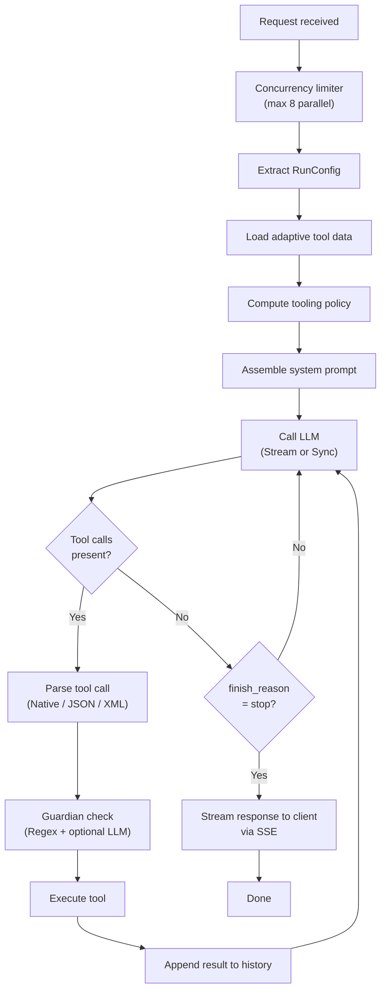
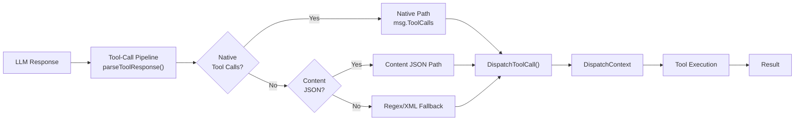
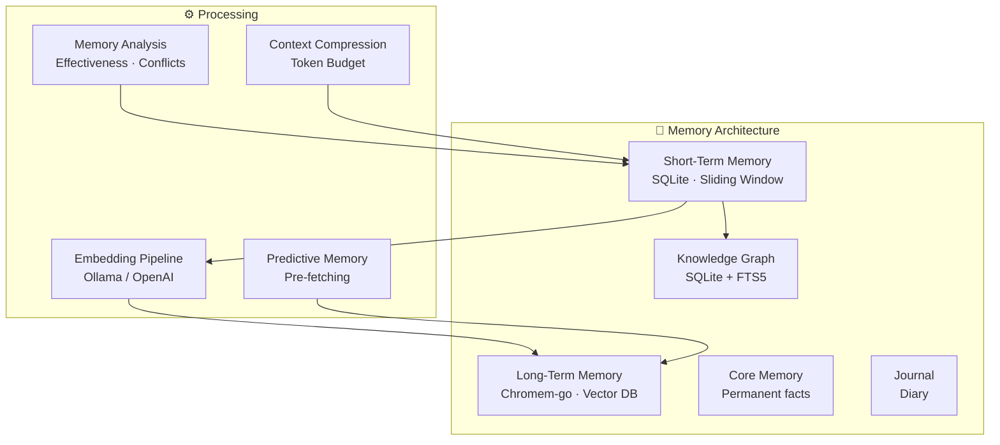
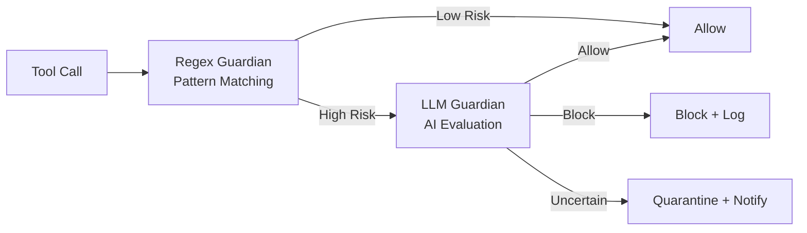
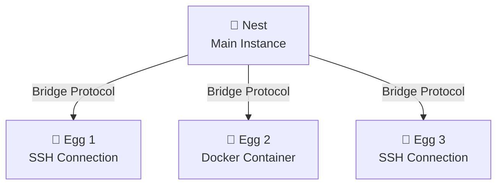
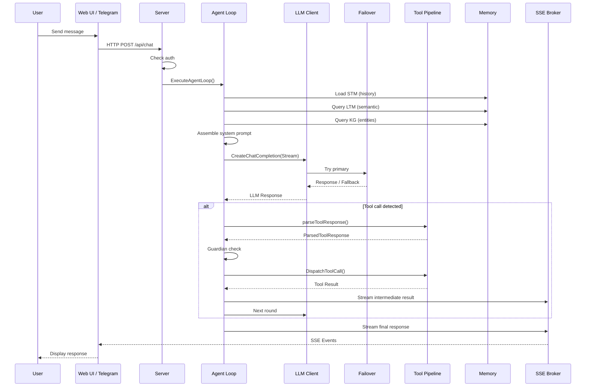
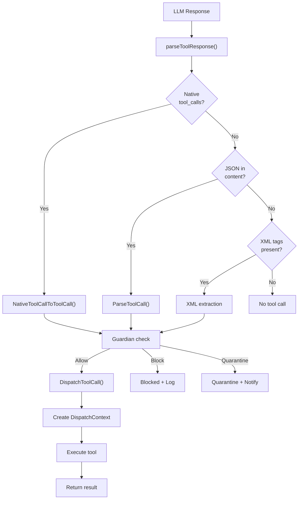
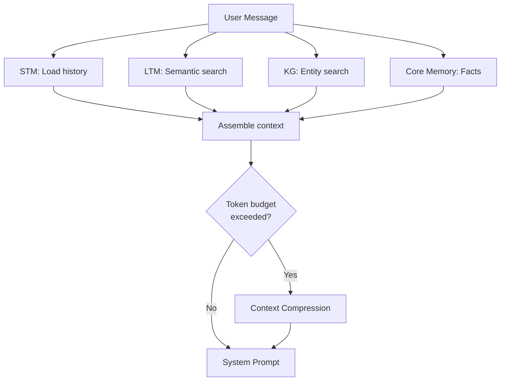

# Chapter 23: Internals – The Architecture of AuraGo

> 📅 **Updated:** April 2026  
> 🎯 **Audience:** Developers, contributors, and advanced users  
> 🔧 **Prerequisites:** Basic understanding of Go, SQLite, and REST APIs

This chapter describes the internal workings of AuraGo in detail: all modules, components, data flows, and architectural decisions. It is aimed at developers who want to work with the source code and advanced users who want a deep understanding of the system.

---

## Table of Contents

1. [System Architecture – Overview](#1-system-architecture--overview)
2. [Startup Process and Initialization](#2-startup-process-and-initialization)
3. [The Agent Loop](#3-the-agent-loop)
4. [Tool System](#4-tool-system)
5. [Memory Subsystem](#5-memory-subsystem)
6. [LLM Client Layer](#6-llm-client-layer)
7. [Prompt System](#7-prompt-system)
8. [Security Architecture](#8-security-architecture)
9. [Server and API](#9-server-and-api)
10. [Co-Agents](#10-co-agents)
11. [Invasion Control](#11-invasion-control)
12. [Remote Execution](#12-remote-execution)
13. [Background Services](#13-background-services)
14. [A2A Protocol (Agent-to-Agent)](#14-a2a-protocol-agent-to-agent)
15. [Budget and Cost Control](#15-budget-and-cost-control)
16. [Planner and Automation](#16-planner-and-automation)
17. [Communication Integrations](#17-communication-integrations)
18. [Smart Home and IoT](#18-smart-home-and-iot)
19. [Infrastructure Integrations](#19-infrastructure-integrations)
20. [Media and Content](#20-media-and-content)
21. [Data Flow Diagrams](#21-data-flow-diagrams)

---

## 1. System Architecture – Overview

AuraGo follows a **layered architecture** with four tiers:



### Key Principles

| Principle | Implementation |
|-----------|---------------|
| **Single Binary** | All assets embedded via `go:embed`, no external dependencies |
| **Pure Go** | No CGO – SQLite via `modernc.org/sqlite`, cross-compilation is trivial |
| **Goroutine-based** | Every request, co-agent, and background service runs in its own goroutine |
| **Interface-based** | `ChatClient`, `VectorDB`, `FeedbackBroker` – all core components via interfaces |
| **Configuration-driven** | All features can be enabled/disabled via `config.yaml` |

### Concurrency Model

AuraGo makes extensive use of Go's concurrency primitives:

- **`sync.Mutex` / `sync.RWMutex`** – Protecting shared state (Vault, History, Caches)
- **`errgroup`** – Parallel execution with error propagation (e.g., memory retrieval)
- **`sync.Once`** – One-time initialization (tool category map, tiktoken encoder)
- **`sync.Map`** – Concurrent-safe caches (tool schema cache, prompt cache)
- **`singleflight`** – Deduplication of concurrent embedding requests
- **Channels** – Agent loop limiter (`maxConcurrentAgentLoops = 8`), stop channels

---

## 2. Startup Process and Initialization

The startup process is implemented in [`cmd/aurago/main.go`](../../cmd/aurago/main.go) and follows a strict sequence:



### 2.1 CLI Flags

| Flag | Description |
|------|-------------|
| `-debug` | Enable debug logging |
| `-setup` | Extract resources, install service, exit |
| `-init-only` | Set password/HTTPS in config/vault, then exit |
| `-check-config` | Validate config syntax (for Docker entrypoint) |
| `-config <path>` | Path to config file (default: `config.yaml`) |
| `-recovery-context` | Base64 context after maintenance |
| `-https` | Enable HTTPS (Let's Encrypt) |
| `-domain` | Domain for Let's Encrypt |
| `-password` | Set initial login password |
| `--sandbox-exec` | Sandbox helper mode (Landlock + exec) |
| `--sandbox-exec-bin` | Sandbox exec helper mode |

### 2.2 Secrets Loading Order

Secrets are loaded in the following priority order (each step only sets values not already present):

1. **systemd EnvironmentFile** – already in environment variables
2. **Docker Compose Secret** – `/run/secrets/aurago_master_key`
3. **System Credential File** – `/etc/aurago/master.key`
4. **Local `.env`** – `$configDir/.env`

### 2.3 Database Initialization

All SQLite databases are opened and migrated via [`internal/dbutil`](../../internal/dbutil/):

| Database | Purpose |
|----------|---------|
| `data/aurago.db` | Short-term memory, history, emotions, traits |
| `data/inventory.db` | SSH device inventory |
| `data/invasion.db` | Invasion control nodes |
| `data/cheatsheets.db` | Cheatsheet storage |
| `data/image_gallery.db` | Image gallery |
| `data/media_registry.db` | Media registry |
| `data/homepage_registry.db` | Homepage projects |
| `data/contacts.db` | Contacts / address book |
| `data/planner.db` | Planner tasks |
| `data/sql_connections.db` | External SQL connections |

Migrations run automatically on startup – the schema is updated as needed, with changes required to be backward-compatible.

---

## 3. The Agent Loop

The agent loop is the heart of AuraGo, implemented in [`internal/agent/agent_loop.go`](../../internal/agent/agent_loop.go) (~2500 lines). The central function is `ExecuteAgentLoop()`.

### 3.1 Flow



### 3.2 RunConfig

[`RunConfig`](../../internal/agent/agent_loop.go) bundles all dependencies the agent loop needs:

| Field | Type | Description |
|-------|------|-------------|
| `Config` | `*config.Config` | Full configuration |
| `LLMClient` | `llm.ChatClient` | LLM client (with failover) |
| `ShortTermMem` | `*memory.SQLiteMemory` | Short-term memory |
| `LongTermMem` | `memory.VectorDB` | Long-term memory |
| `KG` | `*memory.KnowledgeGraph` | Knowledge graph |
| `Vault` | `*security.Vault` | Encrypted vault |
| `Registry` | `*tools.ProcessRegistry` | Process registry |
| `CronManager` | `*tools.CronManager` | Cron scheduler |
| `CoAgentRegistry` | `*CoAgentRegistry` | Co-agent registry |
| `BudgetTracker` | `*budget.Tracker` | Cost tracker |
| `Guardian` | `*security.Guardian` | Regex guardian |
| `LLMGuardian` | `*security.LLMGuardian` | AI guardian |

### 3.3 Multi-Turn Reasoning

The agent loop is a **multi-turn reasoning system**: it repeatedly calls the LLM until one of the following conditions is met:

- `finish_reason == "stop"` – The LLM signals completion
- `<done/>` tag in the response – Explicit completion signal
- Maximum number of tool call rounds reached
- Context cancelled (`context.Cancelled`)

### 3.4 Streaming (SSE)

Responses are streamed to the client via **Server-Sent Events (SSE)**. The `FeedbackBroker` abstracts the SSE mechanism:

- `broker.Send(event, message)` – Send event to client
- `broker.SendJSON(jsonStr)` – Send JSON data
- Supports both synchronous and asynchronous return

### 3.5 Recovery and Error Handling

The [`RecoveryPolicy`](../../internal/agent/recovery_policy.go) system controls error and retry behavior:

| Parameter | Default | Description |
|-----------|---------|-------------|
| `MaxProvider422Recoveries` | 3 | Max 422 error recoveries |
| `MinMessagesForEmptyRetry` | 5 | Minimum messages for empty retry |
| `DuplicateConsecutiveHits` | 2 | Max consecutive duplicates |
| `DuplicateFrequencyHits` | 3 | Max duplicate frequency |
| `IdenticalToolErrorHits` | 3 | Max identical tool errors |

Additionally, a `RecoveryClassifier` categorizes errors and initiates appropriate countermeasures.

### 3.6 Emotional Behavior

The [`emotionBehavior`](../../internal/agent/emotion_behavior.go) system adjusts agent behavior based on the current emotional state:

- **EmotionState**: Primary/secondary mood, valence, arousal, confidence
- **EmotionSynthesizer**: Computes emotions from conversation history
- **BehaviorPolicy**: Controls prompt hints and recovery nudges based on emotions

---

## 4. Tool System

The tool system is the most extensive component of AuraGo with over 100 built-in tools.

### 4.1 Architecture



### 4.2 Tool Categories

Tools are organized into 7 categories (defined in [`tool_categories.go`](../../internal/agent/tool_categories.go)):

| Category | Label | Tool Count |
|----------|-------|-----------|
| `system` | System & Automation | 16 |
| `files` | Files & Documents | 14 |
| `network` | Network & Web | 15 |
| `media` | Media & Content | 10 |
| `smart_home` | Smart Home & IoT | 13 |
| `infrastructure` | Infrastructure & DevOps | 17 |
| `communication` | Communication & Messaging | 13 |

### 4.3 Native Function Calling

AuraGo uses **OpenAI-compatible function calling** (defined in [`native_tools.go`](../../internal/agent/native_tools.go)):

- Each tool is defined as a JSON schema with `name`, `description`, and `parameters`
- `ToolFeatureFlags` control which tools are available based on configuration
- Tools are dynamically filtered based on enabled integrations

### 4.4 Tool-Call Pipeline

The [`ToolCallPipeline`](../../internal/agent/tool_call_pipeline.go) processes LLM responses and extracts tool calls:

| Parse Source | Description |
|-------------|-------------|
| `native` | Standard OpenAI `tool_calls` in API response |
| `reasoning_clean_json` | JSON extracted from reasoning tags |
| `content_json` | JSON directly in the content field |

The pipeline also detects:
- **Bare tool-call tags** – Models that emit only `<tool_call/>` without a body
- **Incomplete tool calls** – Incomplete JSON structures
- **Orphaned tags** – `[TOOL_CALL]` without closing tag

### 4.5 Tooling Policy

The [`ToolingPolicy`](../../internal/agent/tooling_policy.go) determines runtime behavior:

- **ModelCapabilities**: Provider-specific quirks (Ollama, DeepSeek, Anthropic, etc.)
- **Adaptive Tools**: Usage-based tool filtering saves tokens
- **Telemetry Profile**: Conservative profiles when error rate is high
- **Structured Outputs**: Model-dependent support

### 4.6 Dispatch Context

The [`DispatchContext`](../../internal/agent/dispatch_context.go) bundles all dependencies needed for tool execution. It replaces the previous 30+ individual function parameters:

```go
type DispatchContext struct {
    Cfg, Logger, LLMClient, Vault, Registry, Manifest,
    CronManager, MissionManagerV2, LongTermMem, ShortTermMem,
    KG, InventoryDB, InvasionDB, CheatsheetDB, ImageGalleryDB,
    MediaRegistryDB, HomepageRegistryDB, ContactsDB, PlannerDB,
    SQLConnectionsDB, SQLConnectionPool, RemoteHub, HistoryMgr,
    Guardian, LLMGuardian, CoAgentRegistry, BudgetTracker,
    DaemonSupervisor, ...
}
```

### 4.7 Adaptive Tools

The adaptive tools system learns from tool usage and optimizes the system prompt:

1. **Collect usage data**: Each tool call is counted (success/failure)
2. **Persistence**: Data is stored in SQLite and loaded on restart
3. **Dynamic guides**: Tool guides are shown/hidden based on usage frequency
4. **Session-based expansion**: Tools used in a session are always included

---

## 5. Memory Subsystem

The memory subsystem consists of several specialized storage systems:



### 5.1 Short-Term Memory (STM)

STM is implemented in [`internal/memory/short_term.go`](../../internal/memory/short_term.go) and uses SQLite as its storage backend:

- **Sliding Window**: Only the last N messages are kept in context
- **HistoryManager** ([`history.go`](../../internal/memory/history.go)): Manages conversation history with:
  - `HistoryMessage`: Extends `openai.ChatCompletionMessage` with `Pinned`, `IsInternal`, `ID`
  - **Pinned Messages**: Important messages are not removed by the sliding window
  - **Ephemeral Mode**: Co-agents use a separate HistoryManager with `maxEphemeralMessages = 200`
- **Emotions**: Current emotions are stored in STM
- **Traits**: Personality traits are persisted

### 5.2 Long-Term Memory (LTM)

LTM uses **chromem-go** as an embedded vector database ([`long_term.go`](../../internal/memory/long_term.go)):

- **Collections**: Documents are stored in named collections (`aurago_memories`, `tool_guides`, `documentation`, etc.)
- **Embeddings**: Generated via Ollama or OpenAI, with batch processing
- **Query Cache**: Embedding cache with TTL for recurring searches
- **Singleflight**: Deduplication of concurrent embedding requests
- **Cheatsheet Integration**: Cheatsheets are stored with auto-chunking

The `VectorDB` interface provides:
- `StoreDocument` / `StoreDocumentWithEmbedding` – Storage
- `SearchSimilar` – Semantic search
- `SearchMemoriesOnly` – Lightweight memories-only search
- `StoreBatch` – Batch archiving

### 5.3 Knowledge Graph

The Knowledge Graph ([`graph_sqlite.go`](../../internal/memory/graph_sqlite.go)) stores structured facts:

- **SQLite + FTS5**: Full-text search over entities and relations
- **Semantic Graph** ([`graph_semantic.go`](../../internal/memory/graph_semantic.go)): Semantic relationships
- **Explore** ([`graph_explore.go`](../../internal/memory/graph_explore.go)): Graph traversal

### 5.4 Core Memory

Core Memory stores permanent facts that are **always** included in the system prompt. These are managed via the `remember` tool.

### 5.5 Memory Analysis

The system continuously analyzes memory quality:

- [`memory_effectiveness.go`](../../internal/agent/memory_effectiveness.go) – Measures effectiveness of stored memories
- [`memory_conflicts.go`](../../internal/agent/memory_conflicts.go) – Detects contradictory memories
- [`memory_priority.go`](../../internal/agent/memory_priority.go) – Prioritizes memories by importance
- [`memory_ranking.go`](../../internal/agent/memory_ranking.go) – Ranking with ranking cache
- [`memory_retrieval_policy.go`](../../internal/agent/memory_retrieval_policy.go) – Controls retrieval strategy

### 5.6 Predictive Memory

[`predictive_memory.go`](../../internal/agent/predictive_memory.go) proactively pre-loads relevant memories before they are needed – based on the current conversation context.

### 5.7 Context Compression

[`context_compression.go`](../../internal/agent/context_compression.go) compresses the conversation context when the token budget is exceeded. Older messages are summarized while important ones are retained.

---

## 6. LLM Client Layer

### 6.1 ChatClient Interface

The central interface in [`internal/llm/interface.go`](../../internal/llm/interface.go):

```go
type ChatClient interface {
    CreateChatCompletion(ctx context.Context, 
        request openai.ChatCompletionRequest) (openai.ChatCompletionResponse, error)
    CreateChatCompletionStream(ctx context.Context, 
        request openai.ChatCompletionRequest) (*openai.ChatCompletionStream, error)
}
```

All components that communicate with the LLM use this interface – allowing the failover layer to be injected without changing call sites.

### 6.2 FailoverManager

The [`FailoverManager`](../../internal/llm/failover.go) manages primary/fallback LLM connections:

- **Health Probes**: Checks primary availability every 60 seconds
- **Error Threshold**: Switches to fallback after 3 consecutive errors
- **Generation Tracking**: Prevents stale responses after configuration changes
- **Automatic Return**: Automatically switches back when primary is healthy again

### 6.3 Retry Logic

The retry logic in [`retry.go`](../../internal/llm/retry.go) implements:

- **Exponential Backoff**: Growing wait time between attempts
- **Error Classification**: Distinguishes between transient and permanent errors
- **Per-Attempt Timeout**: Configurable timeout per LLM call

### 6.4 Provider System

AuraGo supports multiple provider types:

| Provider | Transport | Special Features |
|----------|-----------|-----------------|
| `openrouter` | Standard OpenAI API | Credit system, many models |
| `openai` | OpenAI API directly | DALL-E, GPT-4, etc. |
| `anthropic` | Custom transport | [`anthropic_transport.go`](../../internal/llm/anthropic_transport.go) |
| `ollama` | Local API | Embedding provider, model management |
| `custom` | Any OpenAI-compatible API | Configurable base URL |

### 6.5 Model Capabilities

[`ModelCapabilities`](../../internal/agent/tooling_policy.go) centralizes provider-specific quirks:

| Capability | Description |
|-----------|-------------|
| `AutoEnableNativeFunctions` | Automatically enable function calling |
| `SupportsStructuredOutputs` | Structured JSON outputs |
| `SupportsParallelToolCalls` | Parallel tool calls |
| `DisableNativeFunctionCalling` | Force JSON text mode (e.g., GLM, MiniMax) |
| `IsOllama` / `IsDeepSeek` / `IsAnthropic` | Provider-specific paths |

### 6.6 Token Tracking

- [`token_accounting.go`](../../internal/agent/token_accounting.go) – Track token consumption per round
- [`token_count_cache.go`](../../internal/agent/token_count_cache.go) – Cache for token counts
- [`pricing.go`](../../internal/llm/pricing.go) – Cost calculation per provider/model

---

## 7. Prompt System

### 7.1 Prompt Builder

The [`PromptBuilder`](../../internal/prompts/builder.go) (~1345 lines) dynamically assembles the system prompt:

1. **Load modules**: Identity, rules, personality, tool guides, context
2. **Caching**: File-based cache with ModTime invalidation
3. **Token Budget**: Each module is allocated a token budget
4. **Dynamic Guides**: Tool guides based on usage and relevance

### 7.2 Prompt Modules

The system in [`builder_modules.go`](../../internal/prompts/builder_modules.go) manages individual prompt building blocks:

| Module | Source | Description |
|--------|--------|-------------|
| Identity | `prompts/identity.md` | Core agent identity |
| Rules | `prompts/rules.md` | Behavior rules |
| Personality | `prompts/personalities/` | Active personality profiles |
| Tool Guides | `prompts/tools_manuals/` | Tool documentation for RAG |
| Context | Dynamic | Memory, emotions, situational context |

### 7.3 Token Counting

The tiktoken library is used for token counting:

- **BPE Encoder**: Initialized once (`sync.Once`)
- **Fallback**: If the encoder cannot be loaded, `len(text) / 4` is used as an estimate
- **Budget Control**: [`prompt_budget.go`](../../internal/config/prompt_budget.go) distributes token budgets across modules

### 7.4 Dynamic Guide Strategy

Tool guides are dynamically adapted:

- **Strategies**: `all` (all guides), `adaptive` (usage-based), `none` (no guides)
- **RAG Indexing**: Guides are indexed in the vector DB for semantic search
- **On-Demand Loading**: `get_tool_info` loads guides on demand

---

## 8. Security Architecture

### 8.1 Vault

The [`Vault`](../../internal/security/vault.go) stores secrets in encrypted form:

- **Algorithm**: AES-256-GCM (Authenticated Encryption)
- **Master Key**: 32 bytes (64 hex characters), loaded from `AURAGO_MASTER_KEY`
- **Storage**: `data/vault.bin` – encrypted JSON map
- **File Locking**: `flock` prevents concurrent write access
- **Operations**: `Store()`, `Retrieve()`, `Delete()`, `List()`

### 8.2 LLM Guardian

The [`LLMGuardian`](../../internal/security/llm_guardian.go) is an AI-powered security monitor:



**GuardianLevel** controls the intensity:

| Level | Behavior |
|-------|----------|
| `Off` | No LLM checks |
| `Low` | Only high-risk tools |
| `Medium` | All tools + external APIs |
| `High` | Every tool call is checked |

**GuardianResult** contains:
- `Decision`: allow / block / quarantine
- `RiskScore`: 0.0 – 1.0
- `Reason`: Justification
- `Cached`: Whether the result came from cache

### 8.3 Regex Guardian

The [`Guardian`](../../internal/security/guardian.go) uses pattern matching for fast pre-checks:

- **ThreatLevel**: Classification of threat level
- **PromptSec**: Prompt injection detection (Preset, Spotlight, Canary)
- **MaxScanBytes**: Limit on scanned data volume

### 8.4 SSRF Protection

[`ssrf.go`](../../internal/security/ssrf.go) prevents Server-Side Request Forgery:

- Internal network blocklist (127.0.0.0/8, 10.0.0.0/8, 192.168.0.0/16, etc.)
- URL validation before HTTP requests
- Metadata endpoint blocking (169.254.169.254)

### 8.5 Scrubber

[`scrubber.go`](../../internal/security/scrubber.go) removes sensitive data from logs and LLM outputs:

- `RegisterSensitive(value)` – Mark a value as sensitive
- Automatic replacement in all outputs
- Prevents API keys, passwords, etc. from appearing in logs

### 8.6 Sandbox

The sandbox in [`internal/sandbox/`](../../internal/sandbox/) isolates code execution:

- **Linux**: Landlock + rlimits for filesystem and resource isolation
- **Other OS**: Process-based isolation with timeout
- **Python venv**: Isolated virtual environment for Python execution
- **Docker Sandbox**: Optional full container isolation

---

## 9. Server and API

### 9.1 HTTP Server

The server is implemented in [`internal/server/server.go`](../../internal/server/server.go) (~1040 lines):

- **Standard Library**: `net/http` with Gorilla mux patterns
- **Embedded UI**: Web UI via `go:embed` directly into the binary
- **TLS/HTTPS**: Automatic Let's Encrypt via `golang.org/x/crypto/acme`
- **Loopback URL**: `InternalAPIURL()` – unified internal API URL

### 9.2 REST API

API handlers are organized in [`internal/server/`](../../internal/server/) (~95 handler files):

| Handler File | Responsible for |
|-------------|----------------|
| `handlers.go` | Chat, system endpoints |
| `auth_handlers.go` | Login, session management |
| `config_handlers.go` | Read/write configuration |
| `vault_handlers.go` | Vault operations |
| `sse.go` | Server-Sent Events |
| `invasion_handlers.go` | Invasion Control |
| `mission_v2_handlers.go` | Mission Control |
| `mcp_handlers.go` | MCP servers |
| `setup_handlers.go` | Setup wizard |
| `tool_bridge_handlers.go` | Tool status |

### 9.3 SSE (Server-Sent Events)

[`sse.go`](../../internal/server/sse.go) implements streaming:

- **Broker Pattern**: Central broker distributes events to all connected clients
- **Event Types**: `message`, `tool_call`, `tool_result`, `error`, `done`
- **Adapter**: `sse_broker_adapter.go` connects the agent loop to SSE infrastructure

### 9.4 i18n

Internationalization is handled via [`internal/i18n/`](../../internal/i18n/):

- 15 languages: cs, da, de, el, en, es, fr, hi, it, ja, nl, no, pl, pt, sv, zh
- JSON-based translation files in `ui/lang/`
- Automatic language detection with fallback to English

---

## 10. Co-Agents

Co-agents enable parallel agent execution for specialized tasks.

### 10.1 Architecture

Implemented in [`internal/agent/coagent.go`](../../internal/agent/coagent.go) (~850 lines):

- **CoAgentRegistry**: Manages active co-agents
- **CoAgentRequest**: Task description with Specialist, Priority, ContextHints
- **Dedicated LLM Client**: Co-agents can use a separate provider/model

### 10.2 Specialist Roles

| Specialist | Use Case |
|-----------|----------|
| `researcher` | Research, information gathering |
| `coder` | Code development, debugging |
| `designer` | UI/UX, visual design |
| `security` | Security analysis |
| `writer` | Text creation, documentation |

### 10.3 Broker System

Each co-agent has its own `coAgentBroker` that forwards events to the registry. The registry records all events and makes them available for the dashboard.

---

## 11. Invasion Control

Invasion Control is the system for distributed deployment of AuraGo instances.

### 11.1 Architecture



### 11.2 Components

| File | Purpose |
|------|---------|
| [`invasion.go`](../../internal/invasion/invasion.go) | Core logic |
| [`connector.go`](../../internal/invasion/connector.go) | Connector interface |
| [`connector_ssh.go`](../../internal/invasion/connector_ssh.go) | SSH connector |
| [`connector_docker.go`](../../internal/invasion/connector_docker.go) | Docker connector |
| [`eggconfig.go`](../../internal/invasion/eggconfig.go) | Egg configuration |
| [`vault_export.go`](../../internal/invasion/vault_export.go) | Secure vault transfer |
| [`bridge/hub.go`](../../internal/invasion/bridge/hub.go) | Communication hub |
| [`bridge/protocol.go`](../../internal/invasion/bridge/protocol.go) | Bridge protocol |

### 11.3 Bridge Protocol

The bridge protocol enables communication between nest and eggs:

- **Hub**: Central communication node
- **Protocol**: Message format for commands and responses
- **Client**: Egg-side client

---

## 12. Remote Execution

### 12.1 RemoteHub

[`internal/remote/`](../../internal/remote/) manages SSH connections to remote devices:

- **RemoteHub**: Central management of all SSH connections
- **Protocol**: Binary protocol for remote commands
- **Inventory**: SQLite-based device management in `data/inventory.db`

### 12.2 Remote Agent

[`cmd/remote/`](../../cmd/remote/) is a standalone remote execution agent:

- Receives commands via SSH
- Executes them in isolation
- Sends results back
- Platform-specific service integration (Linux, macOS, Windows)

---

## 13. Background Services

### 13.1 File Indexer

[`internal/services/indexer.go`](../../internal/services/indexer.go) indexes files for semantic search:

- Scans configured directories
- Creates embeddings and stores them in the vector DB
- Tracks changes via file ModTime

### 13.2 Knowledge Graph Extraction

[`internal/kgextraction/`](../../internal/kgextraction/) automatically extracts entities and relationships:

- **Confidence Scoring**: Confidence rating for extracted facts
- **File KG Sync**: Synchronizes file changes into the knowledge graph

### 13.3 Mission Preparation

[`internal/services/mission_preparation.go`](../../internal/services/mission_preparation.go) prepares long-running missions:

- Database schema for missions
- Type definitions for mission parameters

### 13.4 Optimizer

[`internal/services/optimizer/`](../../internal/services/optimizer/) continuously optimizes:

- Index quality
- Embedding efficiency
- Storage space

---

## 14. A2A Protocol (Agent-to-Agent)

The A2A protocol in [`internal/a2a/`](../../internal/a2a/) enables inter-agent communication:

| Component | File | Description |
|-----------|------|-------------|
| **Server** | `server.go` | A2A server implementation |
| **Client** | `client.go` | A2A client for outbound connections |
| **gRPC** | `grpc.go` | Binary protocol for A2A |
| **Auth** | `auth.go` | Authentication between agents |
| **Tasks** | `tasks.go` | Task distribution and tracking |
| **Card** | `card.go` | Agent cards (capabilities, endpoints) |
| **Executor** | `executor.go` | Task execution |
| **Bridge** | `bridge.go` | Integration into the agent loop |

---

## 15. Budget and Cost Control

### 15.1 Budget Tracker

[`internal/budget/tracker.go`](../../internal/budget/tracker.go) tracks token consumption and costs:

- Per-session tracking
- Cumulative costs across all sessions
- Provider-specific price calculation

### 15.2 OpenRouter Credits

[`openrouter_credits.go`](../../internal/llm/openrouter_credits.go) queries the current credit balance at OpenRouter.

---

## 16. Planner and Automation

### 16.1 Planner

[`internal/planner/planner.go`](../../internal/planner/planner.go) manages multi-step execution plans:

- Plans with individual steps
- Dependencies between steps
- Persistence in `data/planner.db`
- Completion notifications ([`notifier.go`](../../internal/planner/notifier.go))

### 16.2 Cron Manager

[`internal/tools/cron.go`](../../internal/tools/cron.go) manages scheduled tasks:

- Built with `github.com/robfig/cron/v3`
- CRUD operations for cron jobs
- Pause/resume functionality
- Loopback HTTP execution

### 16.3 Daemon Supervisor

[`internal/tools/daemon_supervisor.go`](../../internal/tools/daemon_supervisor.go) manages background processes:

- Start/stop daemons
- Automatic restart on crash
- Wakeup gate for controlled activation

### 16.4 Follow-Up & Wait-for-Event

- **Follow-Up** ([`background_tasks.go`](../../internal/tools/background_tasks.go)): Schedules autonomous background tasks
- **Wait-for-Event** ([`background_process_supervisor.go`](../../internal/tools/background_process_supervisor.go)): Waits for process completion, HTTP endpoint, or file event

---

## 17. Communication Integrations

### 17.1 Telegram Bot

[`internal/telegram/`](../../internal/telegram/) – Full Telegram integration:

- Text, voice, vision (image analysis)
- Bot API via `github.com/go-telegram-bot-api/telegram-bot-api/v5`
- Long polling for message reception

### 17.2 Discord Bot

[`internal/discord/bot.go`](../../internal/discord/bot.go) – Discord integration:

- Gateway connection via `github.com/bwmarrin/discordgo`
- Send/receive text messages

### 17.3 Rocket.Chat

[`internal/rocketchat/`](../../internal/rocketchat/) – Rocket.Chat integration for team chat.

### 17.4 Telnyx

[`internal/telnyx/`](../../internal/telnyx/) – SMS and voice via Telnyx API:

- Send/receive SMS
- Make/manage calls
- Phone number management

### 17.5 Push Notifications

[`internal/push/manager.go`](../../internal/push/manager.go) – Push notifications to mobile devices.

---

## 18. Smart Home and IoT

### 18.1 Fritz!Box

[`internal/fritzbox/`](../../internal/fritzbox/) – Comprehensive Fritz!Box integration:

| Service | File | Description |
|---------|------|-------------|
| System | `service_system.go` | System info, logs, reboot |
| Network | `service_network.go` | Devices, port forwarding, WiFi |
| Telephony | `service_telephony.go` | Call list, phonebook, DECT |
| Smart Home | `service_smarthome.go` | Thermostats, switches, sensors |
| Storage | `service_storage.go` | NAS/USB storage |
| TV | `service_tv.go` | TV streaming, EPG |
| Auth | `digest_auth.go`, `sid_auth.go` | Digest and SID authentication |

### 18.2 Home Assistant

[`internal/tools/homeassistant.go`](../../internal/tools/homeassistant.go) – Home Assistant integration:

- Poller-based: Regular polling of device states
- Control of lights, switches, sensors, etc.

### 18.3 MQTT

[`internal/mqtt/client.go`](../../internal/mqtt/client.go) – MQTT publish/subscribe:

- Connection management with automatic reconnect
- Manage topic subscriptions
- Message cache for retrieved messages

### 18.4 Wyoming

[`internal/tools/wyoming.go`](../../internal/tools/wyoming.go) – Wyoming voice assistant protocol for local voice assistants.

---

## 19. Infrastructure Integrations

### 19.1 Docker

[`internal/tools/docker.go`](../../internal/tools/docker.go) + [`docker_management.go`](../../internal/tools/docker_management.go):

- Container management (list, start, stop, logs, exec)
- Docker Compose support
- Platform-specific named pipe connection (Windows vs. Unix)

### 19.2 Proxmox

[`internal/tools/proxmox.go`](../../internal/tools/proxmox.go) – Proxmox VE integration:

- Manage VMs and containers
- Start, stop, clone, snapshot

### 19.3 Tailscale

[`internal/tsnetnode/tsnetnode.go`](../../internal/tsnetnode/tsnetnode.go) – Embedded Tailscale node:

- tsnet-based VPN integration
- No separate Tailscale client needed

### 19.4 Cloudflare Tunnel

[`internal/tools/cloudflare_tunnel.go`](../../internal/tools/cloudflare_tunnel.go) – Secure remote access without public IP.

### 19.5 Homepage

[`internal/tools/homepage.go`](../../internal/tools/homepage.go) – Homepage dashboard builder:

- Project creation and management
- Git integration for deployment
- Proxy for local development
- Revision management

### 19.6 Other Infrastructure Tools

| Tool | File | Description |
|------|------|-------------|
| Ansible | `ansible.go` | Run Ansible playbooks |
| GitHub | `github.go` | Repos, issues, PRs, actions |
| S3 | `s3.go` | AWS S3 buckets and objects |
| TrueNAS | `truenas.go` | Pools, datasets, snapshots |
| Netlify | `netlify.go` | Deploy and manage sites |
| MeshCentral | `meshcentral.go` | Remote desktop |
| Ollama | `ollama.go` | Manage local LLM models |

---

## 20. Media and Content

### 20.1 Jellyfin

[`internal/jellyfin/`](../../internal/jellyfin/) – Jellyfin media server:

- Client connection (`client.go`)
- Media libraries (`media.go`)
- Session management (`sessions.go`)
- System info (`system.go`)

### 20.2 Chromecast

[`internal/tools/chromecast.go`](../../internal/tools/chromecast.go) – Send media to Cast devices.

### 20.3 TTS / Piper

[`internal/tools/tts.go`](../../internal/tools/tts.go) + [`piper_tts.go`](../../internal/tools/piper_tts.go):

- Text-to-speech with multiple backends
- Piper as local TTS provider
- Audio file creation and delivery

### 20.4 Image Generation

[`internal/tools/image_generation.go`](../../internal/tools/image_generation.go) – Multi-provider image generation:

| Provider | File |
|----------|------|
| OpenAI DALL-E | `image_gen_openai.go` |
| OpenRouter | `image_gen_openrouter.go` |
| Google Imagen | `image_gen_google.go` |
| Ideogram | `image_gen_ideogram.go` |
| MiniMax | `image_gen_minimax.go` |
| Stable Diffusion | `image_gen_stability.go` |

### 20.5 Music Generation

[`internal/tools/music_generation.go`](../../internal/tools/music_generation.go) – AI-powered music generation.

### 20.6 Media Registry

[`internal/tools/media_registry.go`](../../internal/tools/media_registry.go) – Local media file management with search and metadata.

---

## 21. Data Flow Diagrams

### 21.1 Complete Request Lifecycle



### 21.2 Tool-Call Dispatch Flow



### 21.3 Memory Retrieval Flow



---

## Summary

AuraGo is a modular system where each component has a clearly defined responsibility:

| Layer | Core Modules | Primary Task |
|-------|-------------|-------------|
| **Presentation** | Server, Telegram, Discord | User interaction |
| **Agent** | Agent Loop, Tooling Policy, Co-Agents | Orchestration and reasoning |
| **Service** | Tool Dispatcher, LLM Client, Security | Execution and protection |
| **Data** | SQLite, Chromem-go, Vault | Persistence and storage |

The system is designed to operate **fully autonomously** while being protected from misbehavior through multi-layered security mechanisms (Vault, Guardian, SSRF protection, Sandbox).

---

*This chapter is kept in sync with the codebase. For any questions or discrepancies, the source code in `internal/` should always serve as the authoritative reference.*
