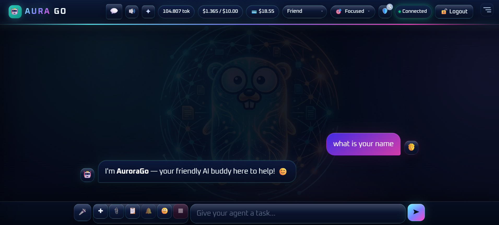
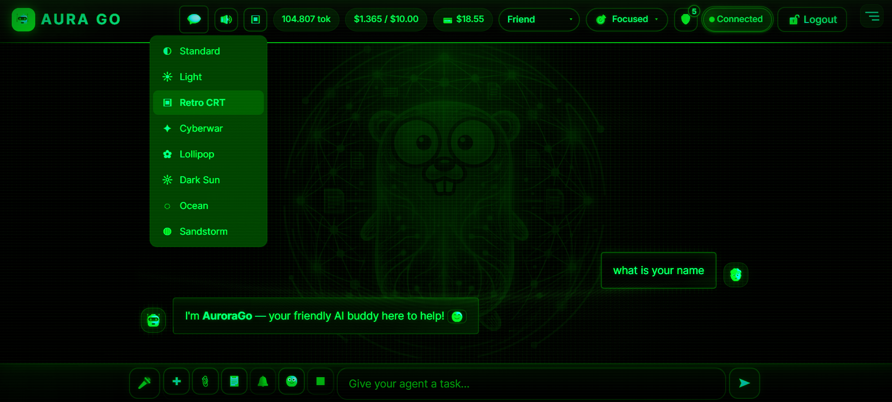
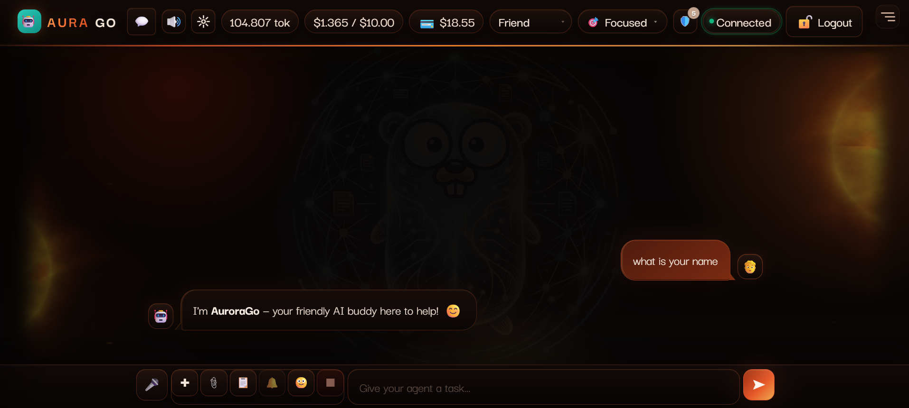
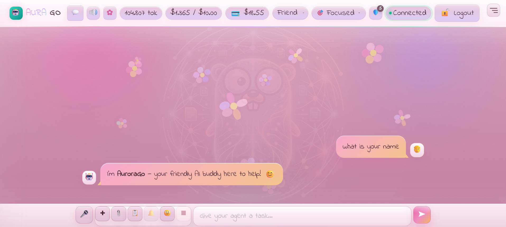
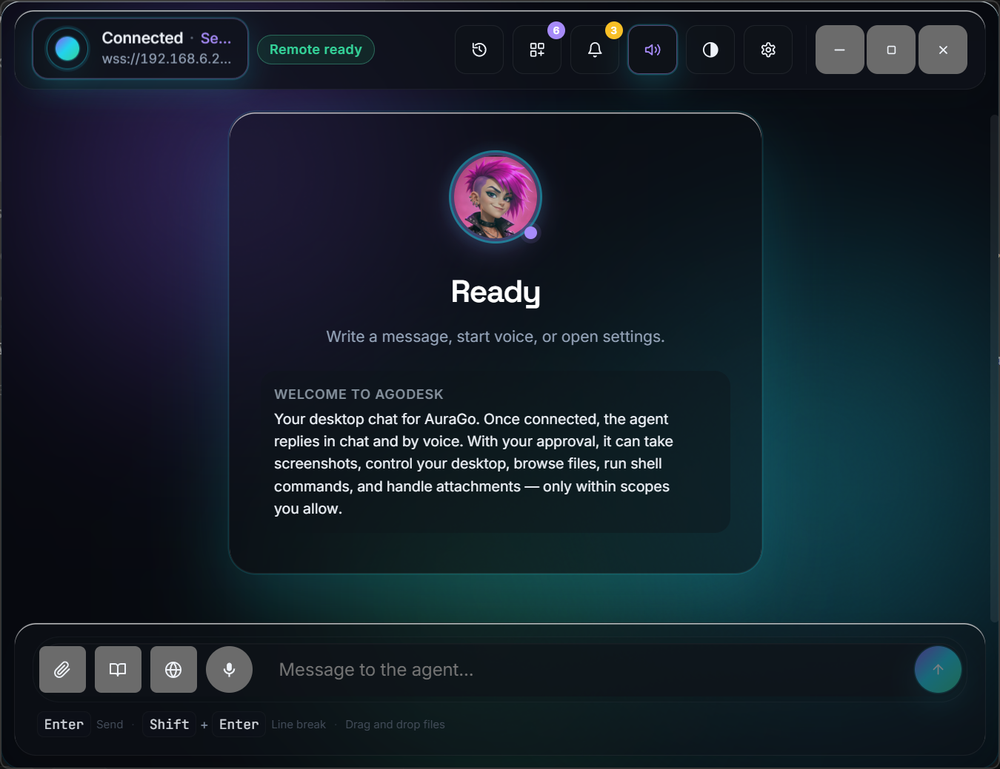

<p align="center">
  <a href="../images/manual-hero.webp"></a>
</p>

<h1 align="center">AuraGo User Manual</h1>

<p align="center"><strong>One gopher. A ridiculous toolbox. Now with page numbers.</strong></p>

Your self-hosted agent can SSH into a NAS, answer over mesh radio, build a browser game and remember what you were doing yesterday. This handbook is how you install it, talk to it and switch the toys on — without leaving the Danger Zone wide open.

<p align="center">
  <a href="#the-toy-box">Chapters</a> · <a href="03-quickstart.md">Quick start</a> · <a href="faq.md">FAQ</a> · <a href="../de/README.md">Deutsch</a>
</p>

[](../../../assets/readme/gopher-feature-map.webp)

The drawings are instruction-booklet art, not UI screenshots. Click any image for full size.

## The toy box

- **Your home lab, on speaking terms.** Docker, Proxmox, TrueNAS, Home Assistant, MQTT, Fritz!Box, AdGuard, Tailscale, SSH and Wake-on-LAN.
- **A desktop with side quests.** Chat, files, terminal, gallery, calendar, radio, a Winamp-style player. Plus Code Studio, Homepage Studio and Game Maker.
- **It remembers.** History, core facts, local embeddings, document RAG, a knowledge graph, notes, a journal. Personality changes the tone, not the permissions.
- **Autopilot.** Missions, cron, webhooks, co-agents. **Invasion Control** hatches worker “Eggs” on remote “Nests”. Yes, those are the actual names.
- **Voice and radio.** Telegram, Discord, Rocket.Chat, email, realtime speech, SIP, Speech Lab. **MeshCore** for trusted direct messages and restricted channel replies.
- **The weird stuff.** 3D printers, go2rtc cameras, Bluetooth audio, an ESP32 Cheap Yellow Display, here.now, local models (Qwen, Ling, experimental Spark). Skills and MCP if that still is not enough.

[All integrations](08-integrations.md) · [Tool catalog](22-internal-tools.md) · [Personalities](10-personality.md) · [AgoDesk](https://github.com/antibyte/agodesk)

### Yes, there is an actual desktop

[](../../screenshots/desktop.png)

*Real screenshot. The desktop is experimental.*

<details>
<summary>Chat themes</summary>

| Cyberwar | Retro CRT | Dark Sun | Lollipop |
|:--------:|:---------:|:--------:|:--------:|
| [](../../screenshots/theme1.png) | [](../../screenshots/theme2.png) | [](../../screenshots/theme3.png) | [](../../screenshots/theme4.png) |

There are 13 chat themes, including Standard and Light. Virtual Desktop has **Fruity** and **Standard**.

</details>

### AgoDesk — the same agent, on your machine

<p align="center">
  <a href="../../../assets/readme/agodesk.png"></a>
</p>

**[AgoDesk for Windows and Linux](https://github.com/antibyte/agodesk)** gives you chat, voice and uploads without a browser. Computer and browser use stay inside the access you approve.

## How it connects

[](../../../assets/readme/system-wiring.svg)

Messages and mission triggers reach the **agent loop**. It builds context, calls your model, runs allowed tools and reads the results. **Co-agents** return subtasks. Service clients take credentials from the **vault**. The full web UI is a **versioned local resource set**; the binary keeps a small recovery/login page.

Personality changes the tone, not the permissions. Shell, Python, writes, network and remote execution have their own Danger Zone gates. Guardian adds checks. Enable what you need.

[Memory](09-memory.md) · [Security](14-security.md) · [Web assets](../../web-assets.md) · [Architecture](../../architecture.md)

## Quick start

> **Still a work in progress.** One maintainer, uneven tests, occasional rough edges. Linux comes first; Windows and macOS are less tested. Features depend on permissions, providers, hardware and often Docker.

```bash
curl -fsSL https://raw.githubusercontent.com/antibyte/AuraGo/main/install.sh | bash
```

The installer starts AuraGo and prints your URL and first-login password. Usually **http://localhost:8088**. Change the password, finish `/setup`, pick a model, then try something harmless like **“Show me system information.”**

Your data stays with the installation. **Hosted models still see their request inputs.** Self-hosted does not automatically mean offline. For internet-facing access use login, HTTPS and optional 2FA. More in [Chapter 14](14-security.md).

[Chapter 2: Installation](02-installation.md) · [Chapter 3: Quick start](03-quickstart.md) · [Docker guide](../../docker_installation.md)

## Manual map

### Part 1 — Arrive
1. [Introduction](01-introduction.md) — What it is, and what it is not
2. [Installation](02-installation.md) — Binary, Docker, build, resource set
3. [Quick start](03-quickstart.md) — The first five minutes
4. [Web UI](04-webui.md) — Chat, desktop, Config, themes
5. [Chat basics](05-chat-basics.md) — How to talk to the agent

### Part 2 — The toys
6. [Tools](06-tools.md) — The big toolbox
7. [Configuration](07-configuration.md) — Provider system and fine-tuning
8. [Integrations](08-integrations.md) — From NAS boxes to radios
9. [Memory](09-memory.md) — History, core facts, RAG, graph
10. [Personality](10-personality.md) — Same toolbox, different attitude

### Part 3 — Autopilot
11. [Mission Control](11-missions.md) — Scheduled work
12. [Invasion Control](12-invasion.md) — Eggs and nests
13. [Dashboard](13-dashboard.md) — Numbers, issues, affect, 3D graph

### Part 4 — Care and depth
14. [Security](14-security.md) — Vault, jail, Guardian, 2FA
15. [Co-agents](15-coagents.md) — Helpers for subtasks
16. [Troubleshooting](16-troubleshooting.md) — When you only get the recovery page
17. [Glossary](17-glossary.md) — Terms
18. [Appendix](18-appendix.md) — Short reference
19. [Skills](19-skills.md) — Python skills and Agent Skills

### Part 5 — Look up
20. [Chat commands](20-chat-commands.md)
21. [API reference](21-api-reference.md)
22. [Internal tools](22-internal-tools.md)
23. [Internals](23-internals.md)

[FAQ](faq.md) · [Handbook hub](../README.md)

## Chat shortcuts

```
/help          All commands
/reset         Clear chat history
/stop          Cancel the current action
/restart       Restart AuraGo
/debug on/off  Debug mode
/budget        Cost overview
/personality   Switch personality
/voice         Voice output
/warnings      System warnings
/sudopwd       Store a sudo password in the vault
/addssh        Remember an SSH host
/credits       OpenRouter credits
```

The native tool list is large and feature-gated — not every install advertises the same 100+ names. [Chapter 22](22-internal-tools.md) and whatever Config currently allows are the source of truth.

## Important notes

**Web UI first.** Mission Control and Invasion Control live in the UI and the REST API, not as extra CLI commands.

**Workspace jail.** File tools stay inside `agent_workspace`. `config.yaml` and `data/` are not readable from there. Ask for system information, not for the config file.

**Expose it on purpose.** AuraGo can touch a shell and files. Facing the internet: VPN, a reverse proxy, or built-in auth plus 2FA.

The UI speaks **16 languages**. Pick your company in **Config → Personality**.

[](../../../assets/readme/language-flags.webp)

*Updated 9 September 2026. German edition [here](../de/README.md).*
