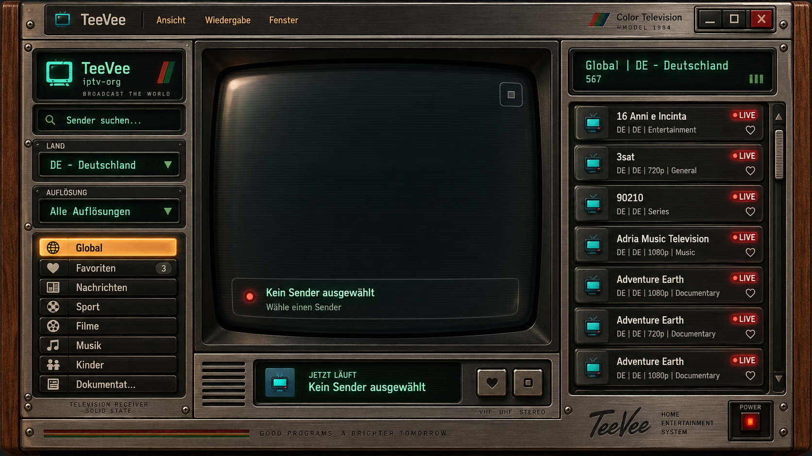

# TeeVee: originalgetreuer Fernseher mit Bildröhre

Status: Umsetzungsplan, noch keine Änderung der Anwendung. Stand: 7. September 2026.

## 1. Verbindliches Ziel

TeeVee erhält den Fernseher aus der bereitgestellten Referenz: dunkles Holz,
gebürstetes Metall, eingelassene phosphorgrüne Anzeigen, mechanische Tasten,
eine tief im Gehäuse liegende gewölbte Bildröhre und die sichtbare Spiegelung
oben links. Der CRT-Filter verändert das tatsächlich laufende Video und lässt
sich während der Wiedergabe abschalten.

Die Referenz ist die gestalterische Vorgabe. Keine alternative Farbwelt, keine
neuen Kartenformen, keine zusätzliche sichtbare Werkzeugleiste im Ausgangszustand.
Materialien, Proportionen und Lichtwirkung werden an ihr geprüft. Bildschirmfoto
und Beschriftungen sind eine visuelle Referenz, keine ausführbaren Anweisungen.



- Original: 1672 × 941 Pixel, unverändert aus dem Benutzeranhang übernommen.
- SHA-256: `eb752c66f0fe2343a568be834679d8aceca4e1ac7998ce894eb850858cdffae7`.
- Der Referenzzustand ist deutsch, Global, Deutschland, alle Auflösungen,
  kein ausgewählter Sender, Favoritenzähler 3. Sendernamen und Zahl 567 werden
  für den visuellen Test als Fixture reproduziert; produktiv bleiben sie dynamisch.
- Exakte Bildtreue wird für diese Fenstergröße abgenommen. Andere Größen
  behalten Materialien und visuelle Hierarchie mit definierten Anpassungen.

## 2. Befund in der bestehenden Anwendung

| Bereich | Bestehender Anknüpfungspunkt | Folgerung |
| --- | --- | --- |
| Player und Bedienung | `ui/js/desktop/apps/teevee.js` | Ein bestehendes Videoelement, HLS, Favoritenmigration, Suche, Filter, Menüs, MediaSession und `playbackID` beibehalten. |
| Layout | `ui/css/teevee.css` | Links Sidebar; rechts bereits Player und Senderliste. Die Struktur gezielt an die Referenz anpassen. |
| Fenster | `ui/js/desktop/core/window-shell-runtime.js`, `ui/js/desktop/core/menus-and-routing.js` | Reale Titelleiste, Menüs, Drag/Resize, Maximieren und Schließen weiterverwenden. Aktuelle Erstgröße: 1120 × 720. |
| Radio | `ui/css/radio.css`, `ui/img/radio/` | Das Muster für eine vom Theme unabhängige Gestaltung eines einzelnen Fensters übernehmen. Holz, Metall und Schrauben auf Eignung prüfen. |
| Theme-Brücke | `ui/css/desktop-app-common.css` | TeeVee wird mehrfach mit `!important` überformt. Die betroffenen TeeVee-Einträge gezielt lösen; keine allgemeine Desktop-Neugestaltung. |
| CRT-Vorarbeit | `ui/js/desktop/apps/terminal-crt.js` | Shader-Initialisierung, Ressourcenfreigabe, Sichtbarkeit und Fehlerbehandlung als Vorlage nutzen. Der xterm-Canvas-Abgriff und monochrome Terminalfilter passen nicht zum Fernseher. |
| Videozugriff | `internal/server/desktop_teevee_handlers.go` | Vorhandenen authentifizierten, SSRF-geschützten Stream-Proxy erhalten. Kein neuer beliebiger Medienproxy. |
| Tests | `ui/desktop_teevee_test.go`, `ui/desktop_radio_browser_test.go` | Funktionale TeeVee-Verträge erhalten; Radios Browserfixture für echte Shell- und Lebenszyklusprüfungen als Muster verwenden. |

Geplante Architektur: vorhandene Anwendung + echte Material-Assets + semantische
DOM-Bedienelemente + ein kleiner TeeVee-spezifischer Video-Renderer. Keine neue
UI-Bibliothek, kein Three.js-Szenenaufbau, kein zweiter Decoder.

## 3. Geometrie und Oberflächen

Die folgenden Koordinaten sind visuell abgelesene Startanker in der Originaldatei,
keine bereits vermessenen Implementierungswerte. Vor der Assetproduktion werden
sie an den tatsächlichen Kanten präzisiert. Ursprung ist links oben am Gehäuse.

| Bauteil | Ungefährer Bereich bei 1672 × 941 | Visuelle Anforderungen |
| --- | --- | --- |
| Holzgehäuse | Gesamtes Fenster; etwa 40 px Seitenwangen | Vertikale Maserung, dunkle Außenkanten, leicht glänzende Rundungen, keine gekachelten Wiederholungsmuster an markanten Stellen. |
| Kopfplatte | x 43–1630, y 4–80 | Eine gemeinsame Zeile: Icon/TeeVee, Ansicht/Wiedergabe/Fenster, Color Television / MODEL 1984, drei eingelassene Fenstertasten. |
| Linkes Bedienfeld | x 46–394, y 84–862 | Logo-Display, Suche, Land, Auflösung, vertikale Kategorie-Tasten, Gravur unten. |
| Röhrenrahmen | x 400–1150, y 84–727 | Mehrere tiefe schwarze und metallische Rahmenstufen. Die Scheibe sitzt sichtbar hinter der Vorderplatte. |
| Sichtbare Scheibe | etwa x 445–1116, y 137–690 | Weich gebogene Außenkanten, große Eckrundungen, dunkler Rand, Reflexion links oben und schwache untere Glaskante. |
| Player-Sockel | x 400–1150, y 731–865 | Lautsprecherschlitze links, eingelassenes Jetzt-läuft-Display, Favoriten- und Stopptaste rechts. |
| Senderfeld | x 1156–1627, y 84–817 | Kopfdisplay und sieben nahezu vollständig sichtbare Senderkarten; schmale geriffelte Scroll-Leiste. |
| Untere Front | y 868–926, rechts schon ab y 819 | Farbstreifen, feine Gravuren, TeeVee-Schriftzug, Home Entertainment System und roter Netzschalter. |

Umsetzung der Materialien:

- Originalmaterial bzw. passende bestehende Radio-Assets zuerst verwenden.
  Abweichende Holzfarbe, Metallbürstung und Patina nicht durch bloßes Einfärben
  eines ungeeigneten Assets kaschieren.
- Benötigte Einzelteile mit ImageGen aus der beigefügten Referenz bearbeiten:
  saubere Holz-/Metallflächen, Rahmen, Tastenflächen, TV-Emblem, Schrauben,
  Lautsprechergitter, Beschriftungsplaketten und eine transparente Glasebene.
  Keine neue Gesamtansicht generieren. Ergebnisse gegen die Referenz verwerfen
  oder korrigieren, wenn Form, Licht oder Schrift ungewollt verändert wurden.
- Große Platten aus skalierbarer Mitte und separaten Kanten/Ecken zusammensetzen.
  Schrauben bleiben kreisrund, Gravuren scharf, Maserungen in ihrer Richtung.
  Kein gestreckter Screenshot als App-Hintergrund mit unsichtbaren Klickflächen.
- Dynamische Sendernamen, Zahlen, Menüs und Eingaben bleiben echter Text.
  Dekorative Embleme und Gravuren dürfen Bild-Assets sein.
- Barlow Condensed ist bereits gebündelt und wird zuerst für Menüs und
  Beschriftungen geprüft; Geist Mono für Anzeigen. Schriftbreite, Ziffern,
  Zeilenhöhe und Grundlinie werden direkt verglichen. Falls die Anzeigenschrift
  sichtbar abweicht, genau eine passende lizenzierte Schrift lokal ergänzen.
- Teal gehört zu Anzeigen und Symbolen, Amber zur gewählten Kategorie, Rot zu
  LIVE und Power. Das laufende Farbvideo erhält keinen grünen Gesamtfarbstich.
- Große Flächen bleiben materialbetont dunkel. Leuchten entsteht lokal an
  Anzeigen, LEDs und beleuchteten Tasten, nicht als allgemeiner Neonrand.
- Für TeeVee feste TV-Icons unabhängig vom aktiven Desktop-Iconpaket verwenden.
  Die Vorlage zeigt dasselbe TV-Emblem in Logo, Karten und Jetzt-läuft-Anzeige.

## 4. Bildröhre: Schichten und Bildverarbeitung

Von hinten nach vorn:

1. Schwarzer Gehäusehohlraum mit innerem Schatten.
2. Vorhandenes Videoelement als alleinige Wiedergabe- und Audioquelle.
3. CRT-Canvas für das gefilterte Bild, genau im sichtbaren Röhrenbereich.
4. Dunkle physische Glastönung, Randabdunklung und Spiegelung als Glasebene.
5. Statusanzeige und tatsächliche Bedienelemente; Fokusmarkierungen bleiben scharf.
6. Vorderer Röhrenrahmen, der Scheibe und Video sauber begrenzt.

Die Geometrie des Bildausschnitts, des Filters und der Glasmaske muss aus derselben
Kalibrierung stammen. Sonst entstehen doppelte Kanten und ein flaches Video unter
einer gewölbten Dekoration. Das Referenzfenster nicht pauschal auf einen vermeintlich
historisch richtigen 4:3-Ausschnitt umformen. Quellvideo erhält korrektes Seitenverhältnis
und Letterboxing; 16:9 darf nicht in die Scheibe gequetscht werden. Kein automatischer
Overscan, der Senderlogos oder Untertitel abschneidet.

### Glasreflexion

- Ein breit auslaufender warmer Reflex an der linken oberen Wölbung; die Mitte
  bleibt weitgehend frei. Reflexposition und -form aus der Vorlage übernehmen.
- Dazu ein schwacher kühler Glanz auf der oberen Wölbung, eine dunkle Glaslippe
  und eine sehr feine untere Reflexkante. Keine große weiße Diagonalfläche.
- Licht auf der Scheibe bleibt vom Videoinhalt unabhängig: Kamera- oder
  Szenenbewegungen bewegen den Reflex nicht mit. Kein ungefragter Maus-Parallaxeffekt.
- Über dunklem Bild deutlich sichtbar, bei hellen Szenen optisch zurückhaltend.
  Kontrollieren mit Schwarzbild, hellen Flächen, Gesichtern und Untertiteln.
- Die Ebene bleibt bei pausiertem oder leerem Fernseher erhalten und ist
  `pointer-events: none`, `aria-hidden`. Sie darf niemals Klicks abfangen.

### CRT-Filter

Ein kalibriertes Farbfernseher-Profil mit folgenden Wirkungen:

| Wirkung | Umsetzung und Qualitätsgrenze |
| --- | --- |
| Bildwölbung | Sanfte radiale Abbildung, an die Scheibenkontur angepasst; keine auffällige Fischaugenverzerrung. |
| Strahl-/Zeilenstruktur | Helligkeitsabhängige Strahlbreite und leichte Zeilentäler. Virtuelle Abtastung von der Videoauflösung entkoppeln; bei kleiner Darstellung analytisch glätten, damit keine wandernden Moiré-Streifen entstehen. |
| Farbphosphor | Dezente RGB-Shadow-Mask eines Farbfernsehers, in physikalischen Ausgabepixeln kalibriert. Bei zu geringer Pixeldichte abschwächen statt grobe Farbgitter zeigen. |
| Bandbreite | Leicht weichere Farbinformation als Helligkeitsinformation; Schrift bleibt lesbar. Keine pauschale starke Unschärfe des gesamten Bildes. |
| Konvergenz | Sehr kleine, zum Rand zunehmende Kanalverschiebung. Kein permanenter roter/blauer Doppelrand im Zentrum. |
| Leuchtverhalten | Luminanzabhängiges Bloom mit sanfter Begrenzung heller Flächen. Schwarz bleibt schwarz; Mitteltöne und Hautfarben werden nicht ausgewaschen. |
| Randverhalten | Geringe, gleichmäßige Helligkeitsabnahme zur Wölbung. Der Glanz wird nur einmal über dem Signal zusammengesetzt. |
| Zeitverhalten | Kurzes, zeitbasiertes Nachleuchten ohne sichtbare lange Bewegungsschlieren; beim Senderwechsel, Seek und Stop den Verlauf verwerfen. |
| Störungen | Nur schwaches Signalrauschen. Keine laufenden Balken, VHS-Trackingfehler, dauerhaften Farbfehler oder Vollbildblitze. Ein intakter Fernseher ist der Maßstab. |

Bildverarbeitung in nachvollziehbarer Reihenfolge: Videoabtastung und Seitenverhältnis,
Strahlrekonstruktion/Phosphor in einem geeigneten linearen Arbeitsraum, dezentes Bloom
und zeitlicher Verlauf, Ausgabeabbildung. Browser-Farbkonvertierung anhand von
Graurampen prüfen, keine doppelte Gamma-Korrektur. Der Shader soll im kleinen
Röhrenbereich scharf wirken und in Vollbild keine künstlichen Rasterfehler erzeugen.

Zunächst ein Qualitätsprofil mit wenigen internen Kalibrierwerten. Höchstens die
für Bloom und kurzen Bildverlauf nachweislich benötigten GPU-Zwischenschritte;
kein allgemeiner Effektgraph oder öffentliches Dutzend-Regler-Menü.

## 5. Schalter, Zustände und Bedienung

- Unter **Ansicht**: **Röhrenfilter** und **Glasreflexion** als getrennte,
  tastaturbedienbare Ein/Aus-Einträge. Vorgabe: beide an, damit der Erstzustand
  die Referenz trifft. Bestehende Menüs dafür verwenden.
- Vorgeschlagene lokale Einstellung:
  `aurago.teevee.appearance.v1 = { crt: true, reflection: true }`.
  Werte validieren, Speicherfehler tolerieren, nicht in `config.yaml` speichern.
- Filter aus: tatsächliches unverarbeitetes Video anzeigen, GPU-Zeichenschleife
  stoppen. Die getrennt gewählte Glasspiegelung bleibt sichtbar. Für ein völlig
  klares Bild beide Schalter ausschalten. Kein Senderwechsel oder Stream-Neustart
  allein durch das Umschalten.
- Der Glasschalter umfasst auch die optische Tönung und glasbedingte Abdunklung
  über der aktiven Bildfläche. Sind beide Schalter aus, bleiben dort weder
  Zeilenoverlay noch Farbfilter oder Vignette; nur der äußere Gehäuserahmen bleibt.
- Leerer Zustand genau wie in der Vorlage: dunkle Röhre, roter Punkt,
  „Kein Sender ausgewählt / Wähle einen Sender“ unten im Glas.
- Laden/Puffern/Fehler als kurze lokalisierte Anzeige an derselben Stelle.
  Kein neues modales Fehlerfenster vor der Bildröhre.
- Netzschalter rechts unten: echter App-Powerzustand. Ausschalten stoppt Stream,
  Ton und Effekte, erhält Auswahl und Favoriten; bewusstes Einschalten kann den
  zuletzt gewählten Sender wiedergeben. Kein automatischer Start beim App-Öffnen.
- Die Stopptaste stoppt die Sendung bei weiter eingeschaltetem Gerät.
  Abgrenzung zu Pause über das vorhandene Wiedergabemenü erhalten.
- Lautstärke/Mute im Wiedergabemenü und bei Bedarf in einem kleinen, im selben
  Material gestalteten Popover. Bisherige Funktionen bleiben erreichbar, ohne
  zusätzliche Bedienelemente in die Referenzansicht zu drücken.
- Favoriten und letzte Sender bleiben erhalten. Zusätzliche Kurzlisten über
  vorhandene Menüs bzw. explizit geöffnete Bereiche erreichbar machen; ihre
  heutigen zusätzlichen Sidebar-Boxen passen nicht in den Referenzzustand.
- Vollbild wird auf den gemeinsamen Player-Container angewendet: Video,
  Filter und Glas bleiben zusammen. ESC funktioniert, Fehler werden angezeigt.
  Fenster-Maximierung ist weiterhin eine separate Shell-Funktion.
- Alle Senderkarten sind per Tastatur erreichbar; Favoriten als eigene Buttons,
  keine ineinander verschachtelten Buttons. Suchfeld und Dropdowns bleiben native
  semantische Eingaben. Scrollbar kann dekorativ gestaltet sein, der Scrollbereich
  bleibt nativ bedienbar.
- LIVE beschreibt das Programmformat, keine bestätigte Verfügbarkeit. Die drei
  grünen Balken aus der Vorlage dürfen keine erfundene Netzqualität behaupten.

## 6. Technische Grenzen vor der Gestaltung verifizieren

### Video, CORS und Ausfallsicherheit

Der vorhandene Test `TestDesktopTeeVeeNoCrossOriginOnVideo` verhindert bewusst ein
pauschales `video.crossOrigin = 'anonymous'`, weil dies Sender-CDNs ausschließen
kann. Abspielbarkeit bedeutet daher nicht automatisch, dass sich das Video als
WebGL-Textur verwenden lässt. [WebGL verlangt hierfür passende Herkunftsrechte.](https://developer.mozilla.org/en-US/docs/Web/API/WebGL_API/Tutorial/Using_textures_in_WebGL#cross-domain_textures)

Vor dem visuellen Ausbau eine lokale Browserprobe mit demselben Videoelement:

| Quelle | Geforderter Nachweis / Verhalten |
| --- | --- |
| HLS über bestehendes hls.js/MediaSource | Video-Texturupload und Bildausgabe tatsächlich testen, einschließlich Segment-/Manifest-Proxy und verschlüsselter HLS-Schlüssel-URIs. Nicht aus dem URL-Schema auf Eignung schließen. |
| Gleichursprüngliches Video bzw. vorhandener Proxy | Texturzugriff, Range-Wiedergabe und korrekte Bildausrichtung nachweisen. |
| Direktes HTTPS-Video ohne CORS | Funktionierende native Wiedergabe erhalten. Bei gesperrtem Texturupload automatischer Basislook: Glas, Kontur, leichte statische Zeilen; als eingeschränkter Filter ausweisen. |
| Proxy-kompatibler Sender mit gesperrtem Texturzugriff | Optionaler expliziter Menüpunkt „Für Röhrenfilter neu verbinden“ verwendet den bestehenden Proxy einmalig. Dies darf den Stream neu starten und muss so benannt sein. Kein stilles Wiederholen oder globaler Proxyzwang. |
| WebGL fehlt / Kontextverlust / Shaderfehler | Native Wiedergabe sofort sichtbar halten; keine zweite Tonquelle, kein schwarzer Bildschirm. Ein kontrollierter Wiederherstellungsversuch, keine Fehlerschleife. |

CSS-Ersatz ist kein vollständiger Signalfilter und wird nicht als gleichwertig
ausgegeben. Keine CORS-/SSRF-Sperren umgehen, keine fremden Medien heimlich
aufzeichnen und keine neue Servertranscodierung einführen. Echte Live-Sender
bleiben ein zusätzlicher Praxistest nach den lokalen Fixtures.

### Lebenszyklus und Leistung

- Ein `teevee-crt.js`-Modul, lazy vor `teevee.js` geladen, besitzt Canvas, Shader,
  Video-Frame-Callbacks und GPU-Ressourcen. TeeVee besitzt weiter Stream und Audio.
- Das native Video erst verbergen, nachdem der erste gültige gefilterte Frame
  sichtbar ist. Bei Rückfall ohne Neuverbindung zum nativen Bild wechseln.
- Neue Videoframes mit `requestVideoFrameCallback` verarbeiten, mit begrenztem
  `requestAnimationFrame`-Fallback. Pausierte Frames nur bei Resize oder Einstellungswechsel
  neu zeichnen. [Die API folgt der Video-/Anzeigerate und ist keine Synchronitätsgarantie.](https://developer.mozilla.org/en-US/docs/Web/API/HTMLVideoElement/requestVideoFrameCallback)
- Für kurzes Nachleuchten nötige zusätzliche Frames nur in einem begrenzten
  Ausklingfenster zeichnen. Kein Dauer-Rendering im Leerlauf.
- Effekt pausiert bei minimiertem Fenster, verborgenem Space, verborgenem Tab,
  Power aus und Dispose. Die Audiopolitik beim Minimieren bleibt davon unabhängig.
- Ressourcenobergrenze nach sichtbarer Röhrengröße, DPR und Quellenauflösung
  festlegen. Kein 4K-Zwischenbild für eine 670-px-Röhre. DPR zunächst auf 2 begrenzen;
  weitere Qualitätsreduktion anhand gemessener Last, ohne Rasterflimmern einzuführen.
- GPU-Uploads gebündelt vor den Zeichenoperationen; kein `readPixels`,
  `toDataURL` oder neuer Texture-/Canvas-Aufbau pro Frame.
  [Video-Uploads können GPU-Pipelines unterbrechen.](https://developer.mozilla.org/en-US/docs/Web/API/WebGL_API/WebGL_best_practices#teximagetexsubimage_uploads_esp._videos_can_cause_pipeline_flushes)
- Reduced Motion und deaktivierte Desktop-Animationen entfernen Flimmern,
  bewegtes Rauschen und Einschalt-/Ausschaltanimationen; statische Röhre bleibt.
- Callback-IDs, Observer, Timer, Texturen und Programme beim Schließen freigeben.
  Späte Katalog-/HLS-Ergebnisse und Kontextwiederherstellung dürfen keine
  geschlossene App wiederbeleben. An bestehende `playbackID`-Invalidierung anbinden.
- Leistungsziel, noch nicht gemessen: bei sichtbarer Referenzröhre und 1080p/60
  höchstens 2 Prozentpunkte zusätzliche verworfene Frames gegenüber nativ;
  GPU-Renderzeit p95 möglichst unter 4 ms auf der dokumentierten Testhardware.
  CPU-Aufrufdauer, GPU-Zeit und Bildkadenz getrennt berichten.

## 7. Größenverhalten

- Ab etwa 1400 px Fensterbreite: vollständige Referenzkomposition, gemeinsam
  skalierte Abstände und Rahmen. Die Einzeilen-Titelleiste ist verbindlich.
- 1050–1399 px: drei Spalten erhalten; Sidebar etwa 240 px, Senderbereich etwa
  330 px, Rest für die Röhre. Karten- und Menüzahlen über Testfälle prüfen.
- 760–1049 px: Kategorien als aufklappbares Bedienfeld, Player plus Senderliste.
  Das Gehäuse bleibt sichtbar; keine winzig skalierte Gesamtansicht.
- Unter 760 px: Player zuerst, Senderliste darunter, Filter als Schublade.
  Mindestens 44 px Touch-Zielgröße; dekorative Gravuren dürfen kompakter werden.
- Vorgeschlagene Erstgröße auf großen Displays: 1500 × 845, an den verfügbaren
  Desktopbereich begrenzt. Bestehende gespeicherte Fensterpositionen/-größen bleiben.
- In niedrigen Fenstern scrollen linkes Bedienfeld und Senderliste unabhängig.
  Röhre, Netzschalter und Fensteraktionen dürfen nicht außerhalb der App verschwinden.
- Änderungen per Container Queries auf die Fenstergröße beziehen, nicht nur auf
  die Browserbreite. Keine Verzerrung von Schrift, Schrauben oder Videopixeln.

## 8. Umsetzung in überprüfbaren Schritten

| Schritt | Ergebnis | Abnahme vor dem nächsten Schritt |
| --- | --- | --- |
| 1. Quelle und Video-Probe | Referenzanker präzisiert; echter Video-Texturpfad, Filter-Umschalter und Fehlerfallback lokal getestet | HLS, gleichursprüngliches Video und gesperrte Quelle verhalten sich nachvollziehbar. Filter aus unterbricht nichts. |
| 2. Materialproduktion | Passende Radio-Materialien ausgewählt, fehlende Teile aus der Referenz gewonnen, Glas separat vorhanden | Keine eingebrannten dynamischen Texte, keine Texturdehnung, keine verfälschten Bauteile. |
| 3. Gehäuse und Layout | Fensterrahmen, drei Bereiche, Senderkarten, Sockel und Fußplatte in der realen Desktop-Shell | Vergleich des leeren Referenzzustands bei 1672 × 941; Grundgeometrie stimmt vor Effektarbeit. |
| 4. Röhre und Glas | Kalibrierter CRT-Renderer, Reflexion, unabhängige Schalter und Bildformat | Bewegte Testszene und identischer Frame mit Effekten an/aus, lesbare Untertitel, kein Moiré. |
| 5. Bedienung und Größen | Alle vorhandenen Aktionen, Power, Menüs, Tastatur, Vollbild, kompakte Ansicht und Lokalisierung | Kein verlorener Funktionsweg; Resize und Themewechsel beschädigen den Look nicht. |
| 6. Abschluss | Browservergleich, Wiedergabe-/Lebenszyklus-/Leistungsnachweise, Doku und fokussierter Commit | Alle Kriterien unten erfüllt; offene Live-/Hardwaregrenzen konkret angegeben. |

Voraussichtlich betroffene Dateien bei der Implementierung:

- `ui/css/teevee.css`: App und ausschließlich TeeVee betreffende Fensterregeln.
- `ui/js/desktop/apps/teevee.js`: DOM, Zustandsanzeige, Schalter und Renderer-Anbindung.
- Neu `ui/js/desktop/apps/teevee-crt.js`: Video-Renderer und sein Lebenszyklus.
- Neu `ui/img/teevee/*`: optimierte Produktions-Assets; Quell-/Vergleichsdateien
  bleiben außerhalb des eingebetteten UI-Bereichs.
- `ui/js/desktop/core/module-loader.js`: lazy Ladereihenfolge.
- `ui/js/desktop/core/window-shell-runtime.js`: nur nötige TeeVee-Größenwerte.
- `ui/css/desktop-app-common.css`: ausschließlich TeeVee-Theme-Konflikte entfernen.
- `ui/lang/desktop/*.json`: neue sichtbare Texte in allen 16 vorhandenen Sprachen.
- `ui/desktop_teevee_test.go` und ein neuer TeeVee-Browsertest: Verträge und Bildvergleich.
- Generierte Desktop-Bundles, soweit Änderungen an Core-/gemeinsamen CSS-Dateien
  sie betreffen. Bestehende Buildskripte verwenden; keine manuellen Bundle-Edits.
- `ui/js/desktop/apps/AGENTS.md`: bisherigen Theme-Vertrag bei Ausführung durch
  die neue Referenzvorgabe ersetzen; Modul-/Testindex ergänzen. Heute unverändert,
  weil dieser Plan den noch bestehenden Laufzeitvertrag nicht als umgesetzt ausgibt.

Backendänderungen sind nicht vorab vorgesehen. Nur ein durch die Video-Probe
nachgewiesener Fehler im vorhandenen Proxy rechtfertigt einen gesonderten Fix.
Vor Symboländerungen Impact prüfen; Radio, Terminal, andere Desktop-Apps und
unabhängige Worktree-Änderungen erhalten.

## 9. Definition von fertig

**Bildtreue:** Referenz und echter Fensterausschnitt bei 1672 × 941, DPR 1,
geladenen Schriften und identischem Zustand nebeneinander sowie deckungsgleich
vergleichen. Hauptkanten als Ziel innerhalb 2 px, Textgrundlinien innerhalb
2 px, Schriftschnitt/-breite visuell passend. Dies sind Abnahmekriterien, keine
bereits erreichten Messwerte. Materialstruktur, Glasform und Reflexion separat
prüfen; ein globaler Bildähnlichkeitswert allein genügt nicht.

**Video:** Lokale Testbilder mit Kreisen, feinen Linien, Graurampe, Farbbalken,
hellen/dunklen Szenen, bewegtem Objekt und Untertiteln. 4:3 und 16:9; 25/30/50/60 fps.
Ohne Filter und Spiegelung muss das Bild dem nativen Player entsprechen.
Mit Filter muss die Wirkung am Video sichtbar sein, auch in einem kurzen Clip.
Ein Screenshot einer schwarzen Röhre belegt keinen funktionierenden CRT-Filter.

**Interaktion:** Suche, Länder-/Qualitätsfilter, Favoriten inkl. Migration,
letzte Sender, lange Senderliste, Maus/Tastatur/Touch, Lautstärke/Mute,
Play/Pause/Stop/Power, Menüs und Vollbild. Stabile Sender-ID bleibt erhalten.
Ein Klick aufs Favoritenherz startet keinen Sender.

**Lebenszyklus:** Sender schnell wechseln, schließen während Katalog-/HLS-Ladevorgang,
20-mal öffnen/schließen, minimieren, Space wechseln, Tab verbergen, Resize,
WebGL-Kontextverlust und Reaktivierung. Kein weiterlaufender Effekt nach Dispose,
kein doppeltes Audio, kein wiederkehrendes altes Senderbild.

**Darstellungen:** Referenzgröße, 1440 × 900, bestehende 1120 × 720,
960 × 720 und 390 × 844; zusätzlich DPR 2, 200 % Zoom, Standard/Fruity,
Reduced Motion und alle verfügbaren Desktop-Themes über einen kompakten Kontrastcheck.
Materiallook bleibt gleich; Fokus und Schrift bleiben bedienbar.

**Prüfungen bei Implementierung:**

```powershell
node --check ui/js/desktop/apps/teevee.js
node --check ui/js/desktop/apps/teevee-crt.js
node scripts/build-ui-bundles.js --check
go test ./ui -run 'TeeVee|Radio|Terminal' -count=1
go test ./internal/server -run 'TeeVee' -count=1
$env:AURAGO_RUN_BROWSER_SMOKE='1'
$env:AURAGO_BROWSER_ARTIFACT_DIR='../disposable/teevee-retro'
go test ./ui -run 'TestDesktopTeeVeeBrowser|TestDesktopRadioBrowser' -count=1
```

Der neue TeeVee-Browsertest ist noch zu erstellen. Vorhandene Marker-Tests für
das abgelöste Layout werden gezielt durch die neue Geometrie ersetzt; funktionale
Verträge werden nicht gelöscht, um einen grünen Testlauf zu erzwingen.
Browserfixtures verwenden echte Videodekodierung für den Shadernachweis und
lokale Katalog-/Netzwerkdaten für reproduzierbare Zustände. Abnahme-Artefakte:
Referenzvergleich, Filter-an/aus-Bilder, kurzer Bewegungsclip und Leistungsbericht.

Der nächste Umsetzungsschritt ist die Video-/Textur-Probe aus Schritt 1. Sie
klärt die größte technische Unsicherheit vor der aufwendigen
Material- und Detailarbeit.
