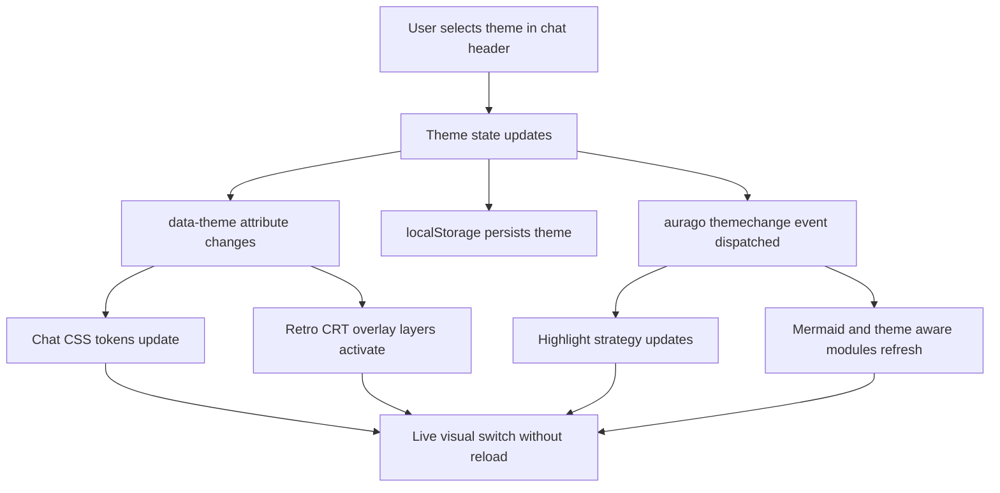

# Chat Theme Plan: Standard, Light, Retro CRT

## Scope

- Only the chat UI is in scope.
- Existing chat features must remain fully functional.
- First expansion step adds a high-quality Retro CRT theme in addition to the current standard and light themes.
- Theme switching must work live without page reload.

## Key decisions

1. Replace the binary theme toggle with named chat themes.
2. Keep theme state in local storage and apply it before first paint.
3. Use a compact header theme picker instead of a simple toggle button.
4. Keep the implementation chat-local, without refactoring the whole web UI theme system.
5. Build CRT visuals as layered, non-blocking overlays so interactions keep working.

## Proposed theme model

- `dark` as the current default standard theme
- `light` as the existing light theme
- `retro-crt` as the new premium terminal-style theme

Suggested state contract:

- `document.documentElement[data-theme]` keeps the active theme name
- `localStorage['aurago-theme']` persists the current chat theme
- `window.dispatchEvent(new CustomEvent('aurago:themechange', ...))` remains the central change signal

## UI changes

### Header control

- Replace the current single button in the chat header with a compact picker
- Show the active theme label or icon state
- Open a small dropdown or popover with:
  - Standard
  - Light
  - Retro CRT
- Preserve current header layout and avoid collisions with session toggle, speaker button, pills, mood widget and logout button

### Theme application

- Apply the chosen theme immediately without reload
- Update CSS variables, component visuals and code highlighting instantly
- Keep streaming output, session navigation and modal interactions uninterrupted during switching

## Styling strategy

### 1. Theme state and infrastructure

- Refactor the logic in the shared theme management so it no longer assumes only dark and light
- Introduce an explicit list of supported chat themes
- Update highlight theme switching logic to support three theme states
- Keep initialization before first paint to avoid flash during page load

### 2. Chat-local theme scoping

- Keep existing default styles as the baseline
- Preserve current light overrides
- Add a dedicated `retro-crt` scope instead of scattering one-off overrides
- Prefer theme-scoped CSS custom properties for:
  - surfaces
  - text brightness levels
  - border glow
  - input chrome
  - code block treatment
  - overlay intensity

### 3. Retro CRT visual language

- Simulate a monochrome green phosphor display
- Represent all semantic colors through brightness levels rather than multiple hues
- Shift the chat look toward a terminal aesthetic:
  - monospace-first typography where appropriate
  - flatter panel geometry or restrained radius
  - terminal-like message framing
  - command-line style composer treatment
  - restrained icon treatment where possible

## CRT simulation plan

The CRT effect should be progressive and layered, not implemented as a single heavy filter.

### Rendering architecture

The Retro CRT theme should be composed as a small visual stack instead of one monolithic effect.

Suggested stack from back to front:

1. **Terminal base plane**
   - background color and phosphor palette
   - terminal typography defaults
   - component chrome converted to monochrome brightness values

2. **Screen surface layer**
   - subtle inner vignette
   - glass curvature suggestion through radial gradients
   - soft edge falloff toward the viewport corners

3. **Raster layer**
   - horizontal scanlines with very low opacity
   - optional slot-mask or phosphor stripe suggestion through faint vertical modulation
   - line spacing tuned to stay believable without reducing readability

4. **Signal imperfection layer**
   - fine noise texture
   - low-amplitude luminance shimmer
   - restrained jitter or distortion on a slow cadence

5. **Luminance response layer**
   - text glow and bloom around bright UI regions
   - slightly elevated glow on active elements, cursor-like surfaces and focused controls
   - stronger treatment for headings, bot output emphasis and terminal accents

6. **Interaction-safe foreground layer**
   - optional overlays on the main chat viewport only
   - zero pointer interception
   - no blocking of text selection, clicks, drag-and-drop or modal interaction

### Base layer

- dark phosphor background
- green luminance palette
- reduced saturation across chat UI
- terminal-style typography and spacing

### Effect layers

- subtle scanlines
- soft vignette
- bloom around brighter text and accents
- micro noise texture
- low-intensity temporal flicker
- slight distortion or curvature feel
- optional ghosting or persistence for bright UI regions if performance allows

### Detailed effect design

#### Scanlines

- Implement via repeating linear gradients rather than image assets where possible
- Keep opacity extremely low so long-form reading remains comfortable
- Increase visibility only in brighter areas through blend or layered alpha, not by making the entire screen dark
- Tone down further on small screens

#### Vignette and screen curvature

- Use radial gradients to fake glass depth before resorting to real transform distortion
- Prefer a perceptual curvature hint over literal warping of all content
- If a stronger barrel effect is added, constrain it to background and overlay layers instead of distorting actual text layout heavily

#### Glow and phosphor bloom

- Glow should come primarily from text shadow and selective outer glows on high-luminance UI tokens
- Use two-stage glow for premium look:
  - tight inner glow for readability
  - broad low-alpha bloom for atmosphere
- Avoid applying blur to entire containers because that tends to muddy text

#### Noise and flicker

- Noise should be slow, subtle and film-like, not a harsh static pattern
- Temporal flicker should modulate opacity or luminance minimally
- Never let flicker alter layout or trigger visible reflow
- Disable or significantly soften these animations under reduced-motion preferences

#### Distortion and signal instability

- Favor occasional low-amplitude horizontal drift or gradient-based shimmer over constant geometric warping
- Keep code blocks and text selection stable enough for actual use
- Distortion should be felt more at the screen surface than in the content model itself

#### Optional persistence and ghosting

- If implemented, use only on bright accent moments such as typing or fresh streamed tokens
- Keep persistence transient and local rather than leaving trails on all text
- Make this the first effect to reduce or disable when performance is constrained

### Technical implementation approach

- Prefer pseudo-elements and dedicated overlay layers on the chat container
- Keep overlays `pointer-events: none`
- Avoid global filters on the whole document when possible
- Apply the strongest effects only to the main chat viewport and not to every floating panel indiscriminately
- Reduce or disable expensive effects on mobile or low-motion environments

### Suggested DOM and CSS attachment points

- Primary host: [`#chat-box`](ui/index.html:129)
- Secondary host for content-local treatment: [`#chat-content`](ui/index.html:130)
- Optional theme wrapper if needed around the chat viewport and composer to separate screen effects from the header

Recommended attachment model:

- `body[data-theme="retro-crt"]` or `html[data-theme="retro-crt"]` enables the theme tokens
- [`#chat-box`](ui/index.html:129) owns the main screen surface and overlay pseudo-elements
- [`#chat-content`](ui/index.html:130) receives typography and message-tone changes
- floating panels such as the session drawer and modals receive CRT-compatible component styling, but not necessarily the full raster overlay stack

### Layer ownership proposal

- `#chat-box::before`
  - vignette
  - curvature hint
  - broad luminance wash

- `#chat-box::after`
  - scanlines
  - noise
  - subtle animated signal shimmer

- component-level styles
  - glow, borders, text luminance, code block treatment

- optional nested wrapper or pseudo-element on message region
  - localized bloom and terminal phosphor treatment for streamed text

### Animation budget and fallback logic

- Keep at most one or two continuously animated overlay layers
- Prefer opacity and transform animations over blur-heavy filter animation
- Under [`prefers-reduced-motion`](plans/chat-retro-theme-plan.md), disable:
  - temporal flicker
  - animated noise drift
  - any distortion oscillation
- On mobile, simplify to:
  - static scanlines
  - static vignette
  - reduced glow
  - no persistence effects

### Interaction and feature safety rules

- Overlay layers must never sit above interactive controls in a way that changes hit-testing
- Selection background, caret visibility and textarea composition must remain readable
- Drag-and-drop overlays, Mermaid modals, image lightboxes and STT overlays must preserve their own z-index behavior
- Streamed token updates must not re-create or thrash overlay layers during every message append
- Theme switching must only change classes, attributes and variables, not rebuild the chat DOM structure

## Component compatibility requirements

All existing chat features must keep working visually and functionally:

- session drawer
- message streaming
- markdown rendering
- code blocks and syntax highlighting
- mermaid rendering and export flow
- drag and drop
- file attachments
- voice recorder and STT overlays
- warnings panel
- mood widget
- composer panel and extra tools
- status pills
- modals and overlays
- dynamically inserted messages and tool results

## Highlighting strategy

- `dark` keeps the current dark highlight.js stylesheet
- `light` keeps the current light stylesheet
- `retro-crt` should use a custom override layer on top of a dark base so code blocks match the phosphor display aesthetic
- Ensure readable contrast for inline code, fenced code, line numbers and headers

## Accessibility and motion rules

- Respect `prefers-reduced-motion`
- Tone down flicker, distortion and animated noise when reduced motion is requested
- Preserve clear focus states and selection visibility
- Avoid readability loss from excessive blur or glow
- Keep text contrast high enough even in the monochrome palette

## Performance rules

- Prefer CSS gradients, opacity, transforms and lightweight layered backgrounds over expensive live filters
- Avoid full-screen animated blur chains when not necessary
- Keep animation amplitudes low and frame-stable
- Provide lighter fallbacks for smaller screens or weaker devices

## Recommended implementation order

1. Refactor chat theme state from binary toggle to named themes
2. Replace the chat header toggle with a compact theme picker
3. Extend highlight handling for three theme modes
4. Introduce Retro CRT design tokens and base terminal layout rules
5. Theme the core chat surfaces, bubbles, composer, pills and modals
6. Add CRT overlay layers and tune scanlines, glow, vignette and noise
7. Integrate theme-change reactions for mermaid and any theme-sensitive modules
8. Run regression checks across all existing chat interactions
9. Polish accessibility and mobile fallbacks

## Mermaid overview

## Acceptance criteria

- Chat page supports Standard, Light and Retro CRT themes
- Theme can be changed on the fly without reload
- Selected theme persists across page reloads
- Retro CRT theme convincingly simulates a premium monochrome green terminal display
- Effects remain subtle, believable and do not harm readability
- Existing chat functionality remains intact
- Theme switching does not break streamed rendering, modals, code blocks or input interactions
