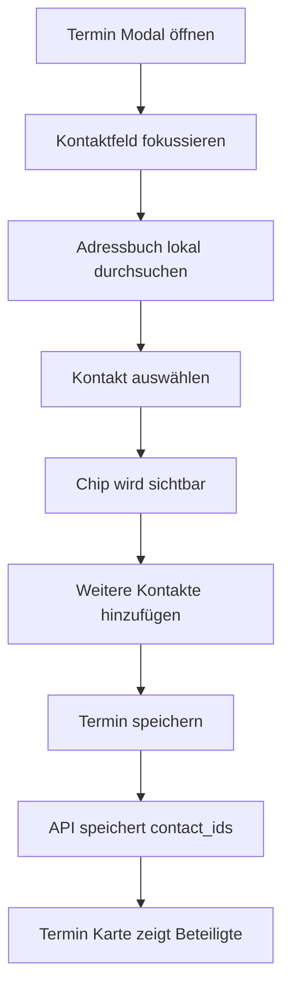

# Plan: Beteiligte Personen für Termine in der Wissenszentrale

## Ziel

Neue und bestehende Termine in der Wissenszentrale sollen ein zusätzliches Feld für beteiligte Personen erhalten. Dieses Feld erlaubt die Mehrfachauswahl aus dem bestehenden Adressbuch. Die Auswahl muss im Termin-Modal sauber bedienbar sein und die gewählten Personen sollen in der Termin-Karte sichtbar erscheinen.

## Bestandsaufnahme

- Termine werden aktuell im Planner-Modell ohne Kontaktverknüpfung gespeichert.
- Die Termin-API verarbeitet Create, Update, Get, List und Delete.
- Das UI für die Wissenszentrale besitzt bereits getrennte Bereiche für Kontakte und Termine.
- Kontakte sind bereits über eine eigene API und ein eigenes Datenmodell verfügbar.

## Geplanter Lösungsansatz

### 1. Datenmodell

Eine relationale Zuordnung zwischen Terminen und Kontakten ist die robusteste Erweiterung.

- Neue Join-Tabelle für Termin-Kontakt-Beziehungen
- Mehrfachzuordnung pro Termin
- Eindeutigkeit pro Termin-Kontakt-Paar, damit keine Duplikate entstehen
- Legacy-Termine bleiben ohne Beteiligte weiterhin gültig

Vorgeschlagene Struktur:

- `appointment_contacts`
  - `appointment_id`
  - `contact_id`
  - optional `position` nur falls später Sortierung im UI erhalten bleiben soll

### 2. Planner-Schema und Migration

Das Planner-Schema sollte um eine neue Migration erweitert werden, die ausschließlich die Zuordnungstabelle und passende Indizes ergänzt.

- Neue Migrationsstufe nach der aktuellen Planner-Version
- Erstellung von `appointment_contacts`
- Fremdschlüssel zu Terminen und Kontakten nur dann direkt verwenden, wenn die DB-Grenzen der bestehenden Struktur das zuverlässig erlauben
- Alternativ relationale Konsistenz im Anwendungscode absichern
- Index auf `appointment_id`
- Index auf `contact_id`
- Unique-Constraint auf `appointment_id + contact_id`

### 3. Backend-Modellierung

Das Terminmodell sollte um zwei getrennte Sichten ergänzt werden:

- `contact_ids` für das Schreiben und Patchen
- `participants` für die lesbare Anzeige im UI

Empfohlene Struktur im API-Output:

- `contact_ids: []string`
- `participants: []ParticipantSummary`

`ParticipantSummary` sollte mindestens enthalten:

- `id`
- `name`
- optional `relationship`
- optional `email`

Damit bleibt das UI einfach, da es nicht selbst IDs gegen Kontakte auflösen muss.

### 4. API-Verhalten

Für [internal/server/handlers_planner.go](internal/server/handlers_planner.go:24) und die Planner-Logik:

- `POST /api/appointments` akzeptiert `contact_ids`
- `PUT /api/appointments/{id}` akzeptiert `contact_ids`
- `GET /api/appointments` liefert Teilnehmerdaten aus
- `GET /api/appointments/{id}` liefert Teilnehmerdaten aus
- Beim Update wird die Zuordnungsliste atomar ersetzt
- Ungültige oder nicht vorhandene Kontakt-IDs werden validiert und klar zurückgemeldet

### 5. UI- und UX-Konzept für das Termin-Modal

Für perfekte UX sollte das neue Feld nicht als gewöhnliches Mehrfach-Select umgesetzt werden, sondern als suchbare Token-Auswahl.

Empfohlenes Verhalten:

- Neues Feldbereich unter Beschreibung oder direkt unter Datum, mit klarer Beschriftung wie Beteiligte Personen
- Klick auf das Feld öffnet eine kompakte Suchliste mit Kontakten
- Tippen filtert lokal nach Name, E-Mail, Telefon und Beziehung
- Auswahl erzeugt sofort sichtbare Chips
- Jeder Chip besitzt Entfernen-Aktion
- Bereits ausgewählte Kontakte verschwinden aus der Vorschlagsliste oder werden als ausgewählt markiert
- Leerer Zustand erklärt kurz, dass Personen aus dem Adressbuch gewählt werden können
- Keine Pflichtauswahl, also Termin kann weiterhin ohne Beteiligte gespeichert werden

Empfohlene UI-Bausteine in [ui/knowledge.html](ui/knowledge.html) und [ui/js/knowledge/appointments.js](ui/js/knowledge/appointments.js:19):

- Suchinput für Kontakte
- Dropdown oder Popover mit Trefferliste
- Chip-Liste der ausgewählten Personen
- Hidden State im JS für `selectedParticipantIds`
- Wiederverwendung geladener Kontaktdaten aus [ui/js/knowledge/main.js](ui/js/knowledge/main.js:108), damit keine unnötigen Requests entstehen

### 6. Darstellung in Termin-Karten

Die Karten im Terminbereich sollten Beteiligte nur dann zeigen, wenn welche vorhanden sind.

Empfohlene Darstellung:

- Zusätzliche Meta-Zeile oder eigener kompakter Abschnitt
- Anzeige von 1 bis 3 Namen direkt
- Bei mehr Personen kompakte Verdichtung wie `Anna, Ben, Carla +2`
- Vollständige Liste im Edit-Modal nach Öffnen des Termins

Ziel ist hohe Informationsdichte ohne visuelle Überladung.

### 7. Verhalten bei Sonderfällen

- Legacy-Termine ohne Beteiligte bleiben vollständig funktionsfähig
- Doppelte Kontakt-IDs werden vor dem Speichern dedupliziert
- Gelöschte Kontakte werden bei bestehenden Terminen beim Lesen still bereinigt oder als nicht mehr verfügbar behandelt
- Leere `contact_ids` entfernen alle Zuordnungen
- Fehlertexte müssen UI-freundlich und nicht technisch formuliert sein

### 8. Such- und Anzeige-Logik im Frontend

Der erste Schritt sollte keine neue Terminfilterung nach Personen einführen, aber die Oberfläche sollte dafür offen gestaltet werden.

- Termin-Suche bleibt zunächst titel- und beschreibungsbasiert
- Beteiligte werden in Karten sichtbar gemacht
- Modal lädt beim Editieren vorhandene Teilnehmer direkt vorbefüllt

### 9. Knowledge-Graph-Auswirkung

Für die erste Ausbaustufe ist keine zwingende Graph-Verknüpfung nötig. Der Plan sollte Implementierung so vorbereiten, dass später Beziehungen wie `participates_in` ergänzt werden können, ohne das UI neu zu bauen.

### 10. Übersetzungen

Neue Texte müssen in allen unterstützten Sprachen ergänzt werden, mindestens für:

- Feldlabel Beteiligte Personen
- Such-Placeholder
- Leerer Zustand im Picker
- Hinweistext zur Mehrfachauswahl
- Fehlertext bei ungültiger Personenauswahl
- Kartenlabel für Teilnehmer

### 11. Tests

Backend:

- Migration erstellt Join-Tabelle korrekt
- Create speichert Teilnehmerzuordnungen
- Update ersetzt Teilnehmerzuordnungen korrekt
- Get und List liefern Teilnehmerdaten korrekt aus
- Leere oder ungültige Kontaktlisten werden korrekt behandelt

Frontend:

- Modal befüllt bestehende Teilnehmer korrekt
- Mehrfachauswahl verhindert Duplikate
- Entfernen von Chips aktualisiert den Payload korrekt
- Kartenanzeige rendert verdichtet und stabil

## Empfohlene Implementierungsreihenfolge

1. Planner-Datenmodell in [internal/planner/planner.go](internal/planner/planner.go:23) erweitern
2. Migration in [internal/planner/planner_schema.go](internal/planner/planner_schema.go:259) ergänzen
3. CRUD-Helfer für Termin-Kontakt-Zuordnungen im Planner ergänzen
4. API-Handler in [internal/server/handlers_planner.go](internal/server/handlers_planner.go:24) auf `contact_ids` und `participants` erweitern
5. UI-Struktur in [ui/knowledge.html](ui/knowledge.html) um den Picker ergänzen
6. Appointment-Logik in [ui/js/knowledge/appointments.js](ui/js/knowledge/appointments.js:87) um Mehrfachauswahl, Vorbelegung und Payload erweitern
7. Karten-Rendering in [ui/js/knowledge/appointments.js](ui/js/knowledge/appointments.js:37) für Teilnehmeranzeige verbessern
8. Sprachdateien für alle unterstützten Sprachen ergänzen
9. Planner- und Server-Tests erweitern

## UX-Skizze

## Abgrenzung für diese Änderung

Nicht Teil des ersten Schritts:

- Neue Kontakte direkt aus dem Termin-Modal anlegen
- Filterung der Terminliste nach Beteiligten
- Vollständige Knowledge-Graph-Beziehungsmodellierung zwischen Kontakt und Termin

