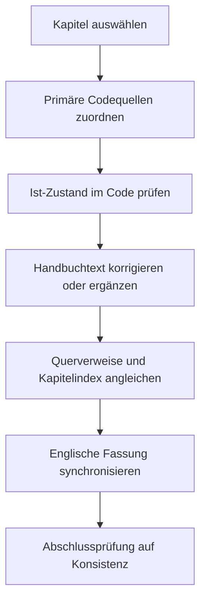

# Plan: Abgleich der Handbücher mit der Codebasis

## Ziel

Alle Handbücher unter `documentation/manual/de/` und `documentation/manual/en/` werden systematisch gegen die aktuelle Codebasis geprüft. Nicht mehr zutreffende Inhalte werden korrigiert, fehlende Inhalte ergänzt und offensichtliche Widersprüche zwischen Handbuch, Web-UI, API, Commands, Integrationen und internen Tools bereinigt.

Die Umsetzung erfolgt in zwei Wellen:

1. **Deutsch zuerst** als führende Arbeitsversion
2. **Englisch danach** als inhaltlich synchronisierte Spiegelung

## Bereits verifizierter Kontext

- `documentation/manuals/README.md` ist nur ein Verweisordner
- Die eigentlichen Handbücher liegen unter `documentation/manual/`
- Beide Sprachversionen enthalten vollständige Kapitelbäume
- Relevante Abgleichsquellen liegen vor allem in:
  - `README.md`
  - `internal/commands/`
  - `internal/server/`
  - `internal/tools/`
  - `ui/cfg/`
  - `prompts/tools_manuals/`
  - ergänzend `config_template.yaml` und einzelne Dateien in `documentation/`

## Früh erkannte Risikobereiche

- Die Übersichtsseiten in `documentation/manual/de/README.md` und `documentation/manual/en/README.md` behaupten teils mehr Chat-Commands als in `internal/commands/` aktuell direkt sichtbar sind
- Die Handbücher sprechen an mehreren Stellen von festen Funktionszahlen wie 50+ Integrationen, 90+ oder 100+ Tools; solche Zählwerte müssen gegen die reale Codebasis validiert oder neutraler formuliert werden
- Web-UI-, API- und Integrationsbeschreibungen können wegen der großen Handler- und Konfigurationsfläche veraltet sein
- Deutsch und Englisch müssen nach der Korrektur inhaltlich deckungsgleich bleiben

## Arbeitsprinzipien für die Umsetzung

1. **Code vor Doku**: Bei Widerspruch gewinnt die aktuelle Implementierung
2. **Deutsch als Quellfassung**: Änderungen zuerst in `documentation/manual/de/`, danach semantisch sauber nach `documentation/manual/en/`
3. **Keine unbestätigten Behauptungen**: Unklare oder schwer belegbare Aussagen werden entweder verifiziert oder neutral formuliert
4. **Kapitelweise arbeiten**: Jedes Kapitel wird gegen klar benannte Codequellen geprüft
5. **Querverweise mitpflegen**: Inhaltsverzeichnisse, README-Dateien, Kapitelverweise und Linkziele werden mit bereinigt

## Systematischer Prüfpfad

## Kapitel zu Quellen zuordnen

### Grundlagen und Produktüberblick

- `documentation/manual/de/README.md`
- `documentation/manual/de/01-einfuehrung.md`
- `documentation/manual/de/02-installation.md`
- `documentation/manual/de/03-schnellstart.md`
- `documentation/manual/de/04-webui.md`
- `documentation/manual/de/05-chatgrundlagen.md`

Primäre Quellen:

- `README.md`
- `Dockerfile`
- `docker-compose.yml`
- `install.sh`
- `install_service_linux.sh`
- `cmd/aurago/`
- `ui/`
- `internal/server/`
- `internal/setup/`

### Tools, Konfiguration, Integrationen

- `documentation/manual/de/06-tools.md`
- `documentation/manual/de/07-konfiguration.md`
- `documentation/manual/de/08-integrations.md`
- `documentation/manual/de/19-skills.md`
- `documentation/manual/de/20-chat-commands.md`
- `documentation/manual/de/21-api-reference.md`
- `documentation/manual/de/22-interne-tools.md`

Primäre Quellen:

- `internal/tools/`
- `prompts/tools_manuals/`
- `internal/commands/`
- `internal/config/`
- `config_template.yaml`
- `internal/server/`
- `ui/cfg/`
- `agent_workspace/tools/manifest.json`

### Memory, Persönlichkeit, Missionen, Co-Agents, Invasion

- `documentation/manual/de/09-memory.md`
- `documentation/manual/de/10-personality.md`
- `documentation/manual/de/11-missions.md`
- `documentation/manual/de/12-invasion.md`
- `documentation/manual/de/15-coagents.md`
- `documentation/manual/de/23-interna.md`

Primäre Quellen:

- `internal/memory/`
- `internal/prompts/`
- `internal/planner/`
- `internal/agent/`
- `internal/invasion/`
- `internal/server/plan_handlers.go`
- `internal/server/mission_v2_handlers.go`
- `internal/server/invasion_handlers.go`
- `internal/a2a/`

### Dashboard, Sicherheit, Troubleshooting, Glossar, Appendix, FAQ

- `documentation/manual/de/13-dashboard.md`
- `documentation/manual/de/14-sicherheit.md`
- `documentation/manual/de/16-troubleshooting.md`
- `documentation/manual/de/17-glossar.md`
- `documentation/manual/de/18-anhang.md`
- `documentation/manual/de/faq.md`

Primäre Quellen:

- `internal/server/dashboard_*`
- `internal/security/`
- `internal/warnings/`
- `internal/logger/`
- `internal/sandbox/`
- `internal/server/auth*.go`
- `internal/server/vault_handlers.go`
- `documentation/`
- `README.md`

## Konkrete Umsetzungsschritte

1. Handbuch-Indizes und Übersichtsseiten in Deutsch prüfen und alle belegbaren Produktaussagen markieren
2. Kapitel 01 bis 05 gegen Produktstart, Installation, Setup, UI und Chat-Verhalten prüfen
3. Kapitel 06 bis 08 gegen Tool-Registry, Tool-Handbücher, Config-Struktur, Integrationen und UI-Konfigurationsseiten prüfen
4. Kapitel 09 bis 15 gegen Memory-, Personality-, Missions-, Invasion- und Co-Agent-Code prüfen
5. Kapitel 16 bis 23 gegen Sicherheit, Dashboard, Troubleshooting, API, interne Tools und Interna prüfen
6. Inkonsistenzen innerhalb der deutschen Kapitel beseitigen, einschließlich Kapitelnummern, Querverweisen, Mengenangaben und Feature-Namen
7. Deutsche Fassung als Referenz auf Englisch spiegeln und sprachlich anpassen, ohne neue inhaltliche Abweichungen einzuführen
8. Zentrale Landingpages `documentation/manual/README.md` und `documentation/manuals/README.md` an den korrigierten Stand anpassen
9. Abschließende Konsistenzprüfung auf kapitelübergreifende Widersprüche, Linkziele, Terminologie und Versionshinweise durchführen
10. Änderungen committen mit klarer Commit-Message

## Validierungsregeln pro Kapitel

Für jedes Kapitel wird geprüft:

- Existiert das beschriebene Feature wirklich im Code?
- Ist der Name im UI oder in der API noch aktuell?
- Stimmen Voraussetzungen, Toggles und Einschränkungen?
- Stimmen Dateipfade, Kapitelverweise und externe Doku-Links?
- Werden Zahlenangaben nur verwendet, wenn sie belastbar sind?
- Gibt es Unterschiede zwischen Deutsch und Englisch?

## Definition of Done

Die Aufgabe ist abgeschlossen, wenn:

- alle Dateien unter `documentation/manual/de/` inhaltlich gegen die Codebasis geprüft sind
- alle Dateien unter `documentation/manual/en/` inhaltlich zur deutschen Fassung synchronisiert sind
- `documentation/manual/README.md` und `documentation/manuals/README.md` auf den korrigierten Stand gebracht wurden
- grobe Falschbehauptungen, veraltete Featurelisten und fehlende Kerninhalte bereinigt wurden
- die Änderungen in einem klar benannten Commit festgehalten wurden

## Empfohlener Ausführungsmodus

Die Umsetzung gehört in den Code-Modus, weil zahlreiche Markdown-Dateien über viele Kapitel hinweg geändert und konsistent nachgezogen werden müssen.
